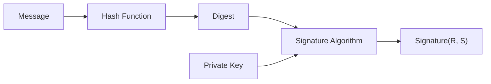

import { SHA256Demo, ModularArithmeticDemo } from '@site/src/components/Interactive';

# Chapter 1: Cryptography Basics

Before diving into ECDSA, we need to understand some fundamental concepts. This chapter introduces symmetric encryption, asymmetric encryption, and hash functions.

## 1.1 Symmetric vs Asymmetric Encryption

### Symmetric Encryption

**One key for one lock** — encryption and decryption use the same key.

```
Plaintext --[Key]--> Ciphertext --[Same Key]--> Plaintext
```

**Common Algorithms**: AES, DES, ChaCha20

**Problem**: How to securely transmit the key to the other party? This is the famous "key distribution problem."

### Asymmetric Encryption

**A pair of keys: one public, one private**:

- **Public Key**: Can be shared with anyone
- **Private Key**: Must be kept strictly confidential

```
Plaintext --[Public Key Encryption]--> Ciphertext --[Private Key Decryption]--> Plaintext
```

**Key Characteristics**:
- Data encrypted with the public key can only be decrypted by the private key
- Data signed with the private key can be verified by the public key

**Common Algorithms**: RSA, ECDSA, EdDSA

:::tip Analogy
Imagine a special mailbox:
- **Public Key** = Mail slot (anyone can drop a letter in)
- **Private Key** = Mailbox key (only you can open it to retrieve letters)
:::

## 1.2 Digital Signatures

The core function of ECDSA is **digital signatures**, not encryption.

### Signature ≠ Encryption

| Feature | Encryption | Signature |
|------|------|------|
| Purpose | Confidentiality | Authenticity + Integrity |
| Who uses Private Key | Decryptor | Signer |
| Who uses Public Key | Encryptor | Verifier |

### Role of Digital Signatures

1. **Authentication**: Proves the message truly comes from the private key holder
2. **Non-repudiation**: The signer cannot deny having signed the message
3. **Integrity**: The signature becomes invalid if the message is tampered with

### Signature Process



## 1.3 Hash Functions

Hash functions are a cornerstone of cryptography.

### What is a Hash?

A hash function converts **arbitrary length** input into **fixed length** output.

```javascript
// Pseudocode example
hash("Hello") = "2cf24dba5fb0a30e26e83b2ac5b9e29e1b161e5c"
hash("Hello!") = "7f83b1657ff1fc53b92dc18148a1d65dfc2d4b1f"  // Completely different!
hash("Hello" * 1000000) = "..." // Still fixed length
```

### Characteristics of Hash Functions

| Characteristic | Description | Importance |
|------|------|--------|
| **Deterministic** | Same input always yields same output | Fundamental requirement |
| **One-way** | Impossible to reverse input from output | Core of security |
| **Avalanche Effect** | Tiny input change causes drastic output change | Tamper resistance |
| **Collision Resistance** | Extremely hard to find two different inputs with same output | Forgery prevention |

### Common Hash Algorithms

| Algorithm | Output Length | Usage |
|------|----------|------|
| SHA-1 | 160 bit | No longer secure, used for compatibility only |
| SHA-256 | 256 bit | Bitcoin, Ethereum |
| Keccak-256 | 256 bit | Ethereum address generation |
| RIPEMD-160 | 160 bit | Bitcoin addresses |

### Try it yourself

<SHA256Demo />

## 1.4 Modular Arithmetic Basics

ECDSA uses modular arithmetic (remainder operation) extensively.

<ModularArithmeticDemo />

### Extended Euclidean Algorithm and Bézout's Identity (Must Know)

The standard GCD algorithm answers one question:
**"What is the greatest common divisor?"**

The Extended Euclidean Algorithm answers:
**"How can this GCD be constructed using a and b?"**

This is **Bézout's Identity**:

```
gcd(a, b) = x·a + y·b
```

In other words, the Extended Euclidean Algorithm not only calculates the GCD but also provides **a pair of x and y**, showing "how the GCD is constructed."

**Example: 30 and 18**

```
gcd(30, 18) = 6
6 = 30 × (-1) + 18 × 2
```

Extended Euclidean = GCD + "Construction."  
In cryptography, the coefficients of this "construction" are key to finding the **modular multiplicative inverse**.

### From Modular Equation to Bézout's Identity (Derivation)

```
a × x ≡ 1 (mod m)
⇔ a × x - 1 is divisible by m
⇔ a × x - 1 = m × y
⇔ a × x + m × y = 1
```

By definition:
```
m × y ≡ 0 (mod m)
```

This is why "finding the modular inverse" eventually turns into a Bézout's Identity.

### Why is there no inverse if gcd ≠ 1?

If $gcd(a, m) = d > 1$, then
```
a × x + m × y
```
No matter what x and y are, the result can only be a **multiple of d**.

Since 1 is not a multiple of d,
```
a × x + m × y = 1
```
cannot hold, so there can be no inverse such that
```
a × x ≡ 1 (mod m)
```

## 1.5 Bits and Number Representation

### Bit Count Determines Security

| Bits | Representable Range | Security |
|--------|-----------------|--------|
| 8 bit | 0 ~ 255 | Extremely insecure |
| 32 bit | 0 ~ 4,294,967,295 | Insecure |
| 128 bit | 0 ~ 3.4×10³⁸ | AES Key |
| 160 bit | 0 ~ 1.46×10⁴⁸ | SHA-1, early ECDSA |
| 256 bit | 0 ~ 1.16×10⁷⁷ | Bitcoin/Ethereum private key |

:::tip Intuition
256-bit security means: even if all computers in the world worked together to brute force it, the time required would far exceed the age of the universe.
:::

### Hexadecimal Representation

Cryptography often uses hexadecimal (hex) to represent large numbers:

```
Binary: 1010 1011 1100 1101
Hexadecimal: A B C D
Decimal: 43981

Private Key Example (256 bit = 64 hex characters):
e8f32e723decf4051aefac8e2c93c9c5b214313817cdb01a1494b917c8436b35
```

## Chapter Summary

| Concept | Key Points |
|------|--------|
| Asymmetric Encryption | Public key is public, private key is secret |
| Digital Signature | Private key signs, public key verifies |
| Hash Function | One-way, fixed length, avalanche effect |
| Modular Arithmetic | Mathematical foundation of ECDSA |

## Review Questions

1. Why can't we sign the original message directly instead of hashing it first?
2. If a hash function has collisions, how does it affect signature security?
3. How many possibilities are there for a 256-bit private key? What is this number comparable to?

---

Next Chapter: [RSA Encryption Algorithm](/docs/cryptography/rsa) - Introduction to Asymmetric Encryption
