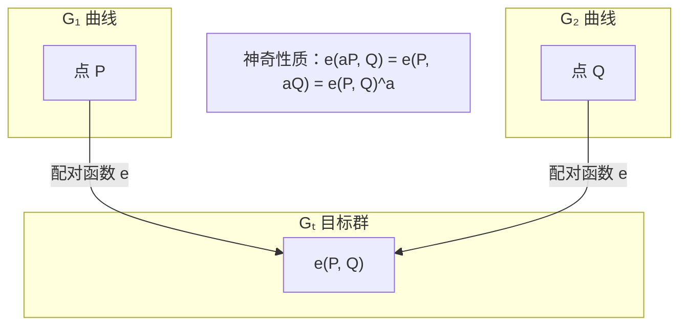
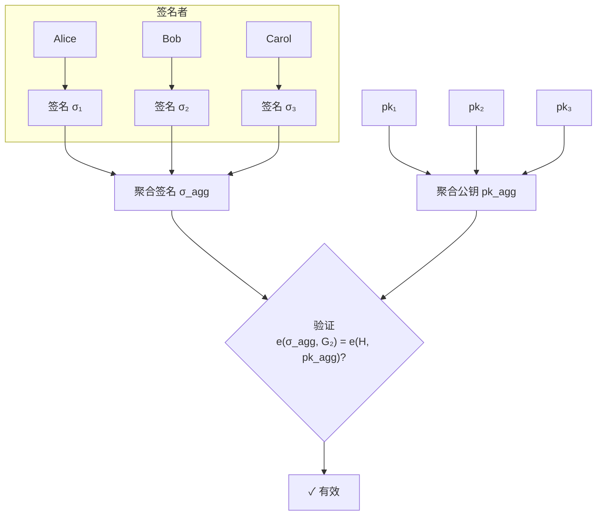
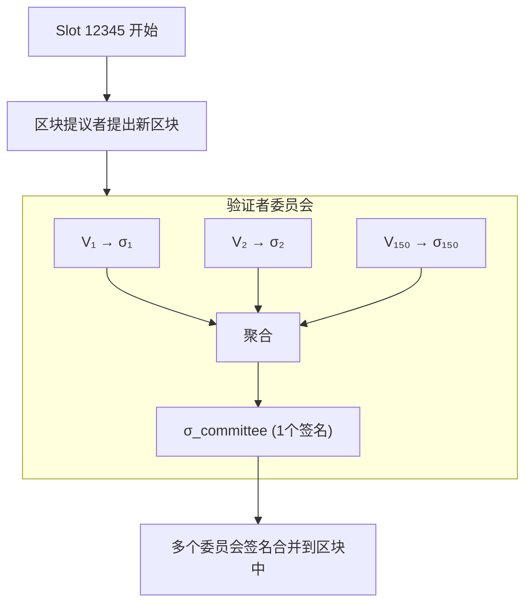

import BLSDemo from '@site/src/components/Interactive/BLSDemo';

# 第八章：BLS 签名与聚合

## 🎮 交互式演示

在学习理论之前，先动手体验一下 BLS 签名聚合的魔力！

<BLSDemo />

BLS 签名是加密货币领域最神奇的签名算法之一。本章将从零开始，带你理解为什么以太坊 2.0 选择了 BLS，以及它的"签名聚合"魔法是如何工作的。

## 7.1 从一个问题开始

### 想象你是以太坊 2.0 的设计者

以太坊 2.0 有一个大问题：

```
每个区块需要验证约 300,000 个验证者的签名

使用 ECDSA:
- 300,000 个签名 × 64 字节 = 19.2 MB 签名数据
- 验证 300,000 次 ≈ 30 秒

这太慢了！区块时间只有 12 秒！
```

### BLS 的魔法

```
使用 BLS 聚合:
- 300,000 个签名 → 压缩成 1 个 = 48 字节
- 验证 1 次 ≈ 几毫秒

压缩了 400,000 倍！
```

:::tip 类比理解
想象 300,000 人要给同一份文件签名：
- **传统方式**：每人签一页，最后有 300,000 页签名
- **BLS 方式**：所有人的签名"融合"成一个，只需要一页
:::

## 7.2 预备知识：配对函数

### 什么是配对函数？

在理解 BLS 之前，需要了解一个关键工具：**配对函数**（Pairing）。

```
普通椭圆曲线：只能在同一条曲线上运算
配对函数：可以"跨曲线"比较

e: G₁ × G₂ → Gₜ

输入：G₁ 上的一个点 和 G₂ 上的一个点
输出：Gₜ 中的一个元素
```

### 配对函数的神奇性质

**双线性**：

```
e(aP, bQ) = e(P, Q)^(ab)

其中：
- a, b 是数字（标量）
- P 是 G₁ 上的点
- Q 是 G₂ 上的点
```

### 直观理解



:::info 为什么这很重要？
配对函数让我们可以在不同的"空间"里验证乘法关系，这是 BLS 签名验证的基础。
:::

## 7.3 BLS 签名：三步走

### 概览

| 步骤 | 操作 | 说明 |
|------|------|------|
| 密钥生成 | pk = sk × G₂ | 公钥在 G₂ 曲线上 |
| 签名 | σ = sk × H(m) | 签名在 G₁ 曲线上 |
| 验证 | e(σ, G₂) = e(H(m), pk)? | 用配对函数验证 |

### Step 1：密钥生成

```python
# BLS 密钥生成（概念代码）
import secrets

# 私钥：一个随机数
sk = secrets.randbelow(n)  # n 是曲线的阶
print(f"私钥 sk = {sk}")

# 公钥：私钥 × G₂ 基点
pk = sk * G2  # G₂ 曲线上的点
print(f"公钥 pk = {pk}")
```

与 ECDSA 类似，但公钥在 G₂ 曲线上（96 字节，比 ECDSA 的 33 字节大）。

### Step 2：签名

```python
def bls_sign(message, sk):
    """BLS 签名 - 超级简单！"""
    
    # 1. 把消息哈希到曲线上的一个点
    H = hash_to_curve(message)  # H 是 G₁ 上的点
    
    # 2. 用私钥乘以这个点
    signature = sk * H  # 就这么简单！
    
    return signature
```

:::tip 对比 ECDSA
```
ECDSA 签名需要：
1. 生成随机数 k
2. 计算 R = kG
3. 计算 r = R.x
4. 计算 s = k⁻¹(z + rd)
5. 返回 (r, s)

BLS 签名只需要：
1. H = hash(message) → 曲线上的点
2. σ = sk × H
```
BLS 签名更简单，而且**不需要随机数**！
:::

### Step 3：验证

```python
def bls_verify(message, signature, pk):
    """BLS 验证"""
    
    # 把消息哈希到曲线
    H = hash_to_curve(message)
    
    # 验证配对等式
    left = pairing(signature, G2)   # e(σ, G₂)
    right = pairing(H, pk)          # e(H, pk)
    
    return left == right
```

### 为什么验证能工作？

让我们手推一遍数学：

```
已知：
- 签名 σ = sk × H
- 公钥 pk = sk × G₂

验证等式：
e(σ, G₂) = e(sk × H, G₂)
         = e(H, G₂)^sk       ← 双线性性质！
         = e(H, sk × G₂)      ← 再次使用双线性
         = e(H, pk)           ← 因为 pk = sk × G₂

所以：e(σ, G₂) = e(H, pk) ✓
```

## 7.4 签名聚合：BLS 的杀手锏

### 问题设置

假设 3 个人要签同一条消息：

```
Alice (sk₁, pk₁) 签名得到 σ₁
Bob   (sk₂, pk₂) 签名得到 σ₂
Carol (sk₃, pk₃) 签名得到 σ₃
```

### 传统方式

```
验证者需要：
- 存储：σ₁, σ₂, σ₃ (3 个签名)
- 验证：3 次验证

如果是 300,000 人？
- 存储：300,000 个签名
- 验证：300,000 次
```

### 为什么签名能"相加"？

在说聚合之前，必须先理解一个关键概念：

:::warning 签名不是数字，是曲线上的"点"！
```
常见误解：σ₁ + σ₂ = 12 + 20 = 32  ❌

实际含义：σ₁ + σ₂ = 两个椭圆曲线点相加  ✅
```
:::

**椭圆曲线点的"加法"**

```
椭圆曲线有一个神奇性质：

     P                                   
     •                                   
          •  Q      P + Q = R      •     
     •              •         •       • R
                                         

几何意义：过 P 和 Q 画直线，与曲线的第三个交点的"镜像"就是 P+Q

这个加法有数学保证：
- P + Q 还在曲线上（封闭性）
- (P + Q) + R = P + (Q + R)（结合律）
- P + O = P（有单位元）
```

**关键性质：点乘满足分配律**

```
这是签名能聚合的核心！

sk₁ × H + sk₂ × H + sk₃ × H = (sk₁ + sk₂ + sk₃) × H

就像普通乘法一样：
3 × 5 + 7 × 5 + 2 × 5 = (3 + 7 + 2) × 5 = 60

区别是：
- 普通乘法：数字 × 数字
- 椭圆曲线：数字 × 曲线上的点

但分配律同样适用！
```

### BLS 聚合方式

**聚合签名**：直接把签名加起来！

```python
# 聚合就是点加法
agg_signature = σ₁ + σ₂ + σ₃
# 结果是 G₁ 曲线上的一个新点
```

**聚合公钥**（如果消息相同）：

```python
# 公钥也是点，也可以加起来
agg_pk = pk₁ + pk₂ + pk₃
# 结果是 G₂ 曲线上的一个新点
```

**验证**：

```python
# 只需一次验证！
is_valid = pairing(agg_signature, G2) == pairing(H, agg_pk)
```

### 图解聚合过程



### 为什么聚合验证能工作？

```
聚合签名：σ_agg = σ₁ + σ₂ + σ₃
                = sk₁×H + sk₂×H + sk₃×H
                = (sk₁ + sk₂ + sk₃) × H

聚合公钥：pk_agg = pk₁ + pk₂ + pk₃
                 = sk₁×G₂ + sk₂×G₂ + sk₃×G₂
                 = (sk₁ + sk₂ + sk₃) × G₂

验证：
e(σ_agg, G₂) = e((sk₁+sk₂+sk₃)×H, G₂)
             = e(H, G₂)^(sk₁+sk₂+sk₃)
             = e(H, (sk₁+sk₂+sk₃)×G₂)
             = e(H, pk_agg) ✓
```

### 聚合效率对比

| 签名数量 | 传统存储 | BLS 聚合存储 | 压缩率 |
|----------|----------|--------------|--------|
| 10 | 640 B | 48 B | 13× |
| 1,000 | 64 KB | 48 B | 1,333× |
| 100,000 | 6.4 MB | 48 B | 133,333× |
| 300,000 | 19.2 MB | 48 B | 400,000× |

## 7.5 小数值手算示例

让我们用小数字走一遍完整流程：

### 设定（简化版）

```
为了演示，我们假设一个极简的配对设置：
- 私钥范围：[1, 10]
- 配对函数简化为乘法（实际复杂得多）

Alice: sk₁ = 3
Bob:   sk₂ = 5
Carol: sk₃ = 7
```

### Step 1：生成公钥

```
假设 G₂ = 2（简化基点）

pk₁ = sk₁ × G₂ = 3 × 2 = 6
pk₂ = sk₂ × G₂ = 5 × 2 = 10
pk₃ = sk₃ × G₂ = 7 × 2 = 14
```

### Step 2：签名消息

```
消息 m = "Hello"
假设 H(m) = 4（简化哈希到曲线结果）

σ₁ = sk₁ × H = 3 × 4 = 12
σ₂ = sk₂ × H = 5 × 4 = 20
σ₃ = sk₃ × H = 7 × 4 = 28
```

### Step 3：聚合

```
聚合签名：σ_agg = σ₁ + σ₂ + σ₃ = 12 + 20 + 28 = 60
聚合公钥：pk_agg = pk₁ + pk₂ + pk₃ = 6 + 10 + 14 = 30
```

### Step 4：验证（简化配对）

```
假设简化配对：e(a, b) = a × b

左边：e(σ_agg, G₂) = e(60, 2) = 120
右边：e(H, pk_agg) = e(4, 30) = 120

左边 = 右边 ✓ 签名有效！
```

:::info 实际情况
真正的 BLS 使用复杂的椭圆曲线配对，数学运算涉及有限域扩展和 Miller 算法，但核心思想就是这样！
:::

## 7.6 以太坊 2.0 中的 BLS

### 验证者签名流程



### 效率对比

```
每 Epoch（32 slots）:
- 活跃验证者：~500,000
- 如果不聚合：500,000 × 64B = 32 MB 签名数据
- 使用 BLS 聚合：~2,048 个聚合签名 = 100 KB

节省了 99.7% 的空间！
```

## 7.7 安全性：Rogue Key Attack

### 攻击原理

有一个针对 BLS 的经典攻击：

```
场景：
- Alice 公钥是 pk_a
- Mallory（攻击者）想冒充 Alice

攻击：
1. Mallory 设置自己的"公钥"为：pk_m = pk_fake - pk_a
2. 聚合公钥：pk_agg = pk_a + pk_m = pk_fake
3. Mallory 用 sk_fake 单独签名
4. 看起来像 Alice 和 Mallory 共同签名的！
```

### 防护措施

**方法 1：证明知道私钥 (PoP)**

```python
def register_validator(pk):
    """注册验证者时需要证明持有私钥"""
    
    # 对自己的公钥签名作为证明
    pop_message = pk.serialize()
    pop_signature = bls_sign(pop_message, sk)
    
    # 注册时验证 PoP
    if not bls_verify(pop_message, pop_signature, pk):
        raise Error("必须证明你知道私钥！")
    
    # 通过验证，注册成功
    register(pk)
```

**方法 2：消息绑定公钥**

```python
def sign_with_pk_binding(message, sk, pk):
    """签名时绑定公钥"""
    augmented_message = pk.serialize() + message
    return bls_sign(augmented_message, sk)
```

:::danger 重要安全提示
以太坊 2.0 要求每个验证者在注册时提交 PoP，防止 Rogue Key Attack。
:::

## 7.8 BLS12-381 曲线

### 为什么叫 BLS12-381？

```
BLS12-381:
- BLS: 曲线类型（Barreto-Lynn-Scott）
- 12: 嵌入度（embedding degree）
- 381: 素数 p 的位数
```

### 关键参数

| 参数 | 大小 | 说明 |
|------|------|------|
| G₁ 点 | 48 字节（压缩） | 签名放在这里 |
| G₂ 点 | 96 字节（压缩） | 公钥放在这里 |
| 安全强度 | ~128 位 | 与 secp256k1 相当 |

### 为什么签名在 G₁？

```
设计选择：
- 签名数量多，所以放在小的 G₁（48 B）
- 公钥数量少，可以放在大的 G₂（96 B）

如果反过来：
- 签名 96 B × 300,000 = 28.8 MB
- 现在：签名 48 B × 聚合后 1 个 = 48 B
```

## 7.9 Python 实现示例

```python
# 使用 py_ecc 库演示 BLS 签名
# pip install py_ecc

from py_ecc.bls import G2ProofOfPossession as bls

def bls_demo():
    """BLS 签名演示"""
    
    # ========== 1. 密钥生成 ==========
    print("=== 密钥生成 ===")
    
    # 私钥（实际应该用安全随机数）
    sk1 = 12345
    sk2 = 67890
    sk3 = 11111
    
    # 生成公钥
    pk1 = bls.SkToPk(sk1)
    pk2 = bls.SkToPk(sk2)
    pk3 = bls.SkToPk(sk3)
    
    print(f"公钥1: {pk1.hex()[:32]}...")
    print(f"公钥2: {pk2.hex()[:32]}...")
    print(f"公钥3: {pk3.hex()[:32]}...")
    
    # ========== 2. 签名 ==========
    print("\n=== 签名 ===")
    
    message = b"Hello, BLS!"
    
    sig1 = bls.Sign(sk1, message)
    sig2 = bls.Sign(sk2, message)
    sig3 = bls.Sign(sk3, message)
    
    print(f"签名1: {sig1.hex()[:32]}...")
    print(f"签名2: {sig2.hex()[:32]}...")
    print(f"签名3: {sig3.hex()[:32]}...")
    
    # ========== 3. 单独验证 ==========
    print("\n=== 单独验证 ===")
    
    valid1 = bls.Verify(pk1, message, sig1)
    print(f"签名1 验证: {valid1}")
    
    # ========== 4. 聚合签名 ==========
    print("\n=== 聚合签名 ===")
    
    # 聚合签名
    agg_sig = bls.Aggregate([sig1, sig2, sig3])
    print(f"聚合签名: {agg_sig.hex()[:32]}...")
    print(f"聚合签名大小: {len(agg_sig)} 字节")
    print(f"原始签名总大小: {len(sig1) + len(sig2) + len(sig3)} 字节")
    
    # ========== 5. 聚合验证 ==========
    print("\n=== 聚合验证 ===")
    
    # 同消息聚合验证（快速）
    public_keys = [pk1, pk2, pk3]
    valid_agg = bls.FastAggregateVerify(public_keys, message, agg_sig)
    print(f"聚合签名验证: {valid_agg}")
    
    # ========== 6. 篡改测试 ==========
    print("\n=== 篡改测试 ===")
    
    tampered_message = b"Hello, BLS?"  # 改了一个字符
    valid_tampered = bls.FastAggregateVerify(public_keys, tampered_message, agg_sig)
    print(f"篡改消息验证: {valid_tampered}")

if __name__ == "__main__":
    bls_demo()
```

输出示例：

```
=== 密钥生成 ===
公钥1: b5c7f4e8a3d2c1b0...
公钥2: a8f3e2d1c0b9a8f7...
公钥3: d4c3b2a1f0e9d8c7...

=== 签名 ===
签名1: 8a7b6c5d4e3f2a1b...
签名2: 1a2b3c4d5e6f7a8b...
签名3: f1e2d3c4b5a6f7e8...

=== 单独验证 ===
签名1 验证: True

=== 聚合签名 ===
聚合签名: 9f8e7d6c5b4a3f2e...
聚合签名大小: 48 字节
原始签名总大小: 144 字节

=== 聚合验证 ===
聚合签名验证: True

=== 篡改测试 ===
篡改消息验证: False
```

## 7.10 BLS vs 其他签名算法

| 特性 | ECDSA | Schnorr | EdDSA | BLS |
|------|-------|---------|-------|-----|
| 签名聚合 | ✗ | 需交互 | ✗ | **原生支持** |
| 签名大小 | 64-72 B | 64 B | 64 B | **48 B** |
| 公钥大小 | 33 B | 33 B | 32 B | 96 B |
| 需要随机数 | 是 | 是 | 否 | **否** |
| 签名速度 | 快 | 快 | 快 | 慢 |
| 验证速度 | 中 | 中 | 快 | 慢（单个）|
| 批量验证 | 中 | 快 | 快 | **极快** |

### 什么时候用 BLS？

- ✅ 需要聚合大量签名（以太坊 2.0）
- ✅ 需要阈值签名（跨链桥）
- ✅ 空间受限（区块链存储）
- ✗ 需要极快的单签名验证
- ✗ 公钥大小敏感

## 本章小结

| 概念 | 要点 |
|------|------|
| **配对函数** | e(aP, Q) = e(P, aQ) = e(P, Q)^a |
| **BLS 签名** | σ = sk × H(m)，超级简单 |
| **BLS 验证** | e(σ, G₂) = e(H, pk) |
| **签名聚合** | σ_agg = Σσᵢ，公钥可以一起聚合 |
| **安全性** | 需要 PoP 防止 Rogue Key Attack |

## 思考题

1. BLS 签名不需要随机数，为什么比 ECDSA 更安全？
2. 如果 3 个人对不同消息签名，还能聚合吗？验证时有什么不同？
3. 为什么以太坊 2.0 把签名放在 G₁ 而不是 G₂？

## 练习

### 手算练习（简化版）

假设简化系统：
- G₂ = 3（基点）
- H("Test") = 5（哈希结果）
- 配对函数 e(a, b) = a × b

两个用户：
- Alice: sk = 7
- Bob: sk = 11

1. 计算 Alice 和 Bob 的公钥
2. 计算各自对 "Test" 的签名
3. 聚合签名和公钥
4. 验证聚合签名

---

下一章：[零知识证明入门](/docs/cryptography/zkp)
