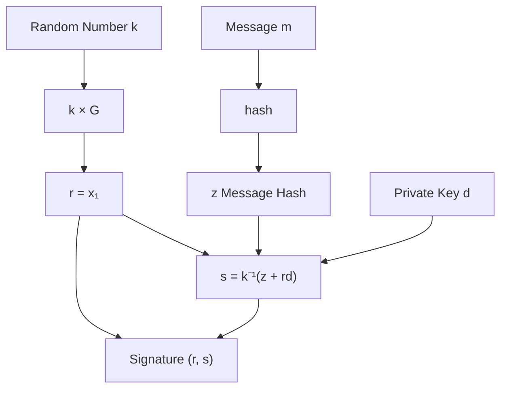
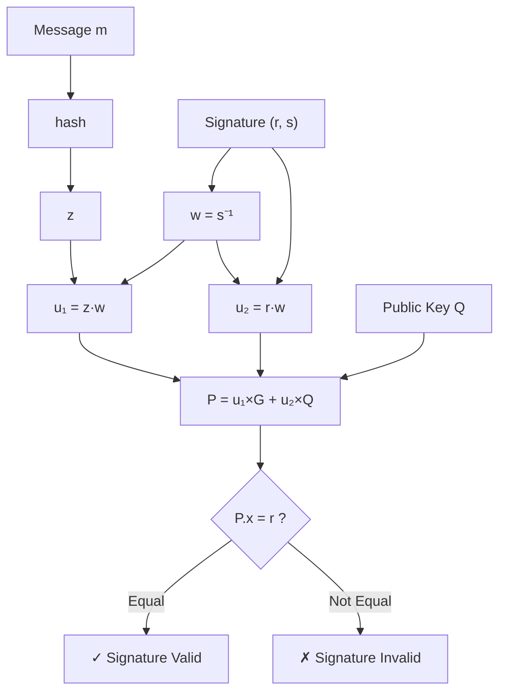

import { ECDSADemo } from '@site/src/components/Interactive';

# Chapter 4: ECDSA Signature Algorithm

This chapter is the core of the course, where we will walk through the complete ECDSA signing and verification process.

## 3.1 ECDSA Overview

**ECDSA** = **E**lliptic **C**urve **D**igital **S**ignature **A**lgorithm

### Purpose of Signatures

| Function | Description |
|------|------|
| **Authentication** | Proves the signer holds the private key |
| **Non-repudiation** | The signer cannot deny the signature |
| **Integrity** | The signature becomes invalid if the message is tampered with |

### Core Components

| Category | Parameter | Description |
|------|------|------|
| **System Parameters** | Curve | y² = x³ + ax + b (mod p) |
| | Base Point G | Generator |
| | Order n | Order of G, nG = O |
| **Key Pair** | Private Key d | d ∈ [1, n-1], a random integer |
| | Public Key Q | Q = d × G, a point on the curve |
| **Signature** | (r, s) | Two integers |

## 3.2 Key Generation

### Steps

1. Select a random number d ∈ [1, n-1] as the **private key**
2. Calculate Q = d × G as the **public key**

### Interactive Demo: Complete ECDSA Process

Use the following interactive component to experience the complete process of key generation, signing, and verification.
We use simplified small-value parameters (similar to the finite field example in the previous chapter) for easier visualization.

<ECDSADemo />

### secp256k1 Real-world Example

```python
import secrets

# Generate a 256-bit random private key
private_key = secrets.randbits(256)
# Ensure it's within the valid range
n = 0xFFFFFFFFFFFFFFFFFFFFFFFFFFFFFFFEBAAEDCE6AF48A03BBFD25E8CD0364141
private_key = private_key % n
if private_key == 0:
    private_key = 1

print(f"Private Key: {hex(private_key)}")
# Output similar to: 0xe8f32e723decf4051aefac8e2c93c9c5b214313817cdb01a1494b917c8436b35
```

## 3.3 Signature Generation

### Signature Algorithm Steps

Given message m and private key d:

```
1. Calculate message hash: z = hash(m)
2. Select a random number: k ∈ [1, n-1] (Critical! Must be truly random)
3. Calculate point: (x₁, y₁) = k × G
4. Calculate r: r = x₁ mod n (If r = 0, choose a new k)
5. Calculate s: s = k⁻¹(z + r·d) mod n (If s = 0, choose a new k)
6. Output signature: (r, s)
```

### Signature Process Diagram



### Small-value Complete Example

(Please refer to the interactive demo above to observe the calculation process of r and s)

**Manual Calculation Example:**

1. z = hash("Hello") = (72+101+108+108+111) % 100 = 500 % 100 = 0 → Use z = 5
2. k = 10
3. k × G = 10 × (5, 1) → Needs calculation...
4. Assume 10G = (7, 11), then r = 7
5. k⁻¹ mod 19: 10 × 2 = 20 ≡ 1 (mod 19), so k⁻¹ = 2
6. s = 2 × (5 + 7 × 7) mod 19 = 2 × 54 mod 19 = 108 mod 19 = 13

**Signature: (r=7, s=13)**

## 3.4 Signature Verification

### Verification Algorithm Steps

Given message m, signature (r, s), and public key Q:

```
1. Check r, s ∈ [1, n-1]
2. Calculate message hash: z = hash(m)
3. Calculate: w = s⁻¹ mod n
4. Calculate: u₁ = z·w mod n
5. Calculate: u₂ = r·w mod n
6. Calculate point: P = u₁×G + u₂×Q
7. Verify: r ≡ P.x (mod n)
```

### Verification Process Diagram



### Verification Demo

(Please refer to the interactive demo above for verification operations)

## 3.5 Mathematical Proof: Why Verification Works?

### Derivation Process

Known signature formula:
$$
s = k^{-1}(z + rd) \mod n
$$

Calculation during verification:
$$
P = u_1G + u_2Q = (zw)G + (rw)Q
$$

Where $w = s^{-1}$ and $Q = dG$

Substitute:
$$
P = zwG + rwdG = w(z + rd)G
$$

Since $w = s^{-1}$:
$$
P = s^{-1}(z + rd)G
$$

And because $s = k^{-1}(z + rd)$, so $s^{-1} = k(z + rd)^{-1}$：
$$
P = k(z + rd)^{-1}(z + rd)G = kG
$$

**Conclusion**: The verification point P is the same as the point kG from signing, so P.x = r ✓

## 3.6 Security Analysis

### Why is it secure?

To forge a signature, an attacker needs to:
- Know the private key d → **ECDLP problem**
- Or know the random number k → **Equivalent to knowing the private key**

### Importance of Random Number k

:::danger Severe Warning
**k must be truly random and must be different for every signature!**

If two signatures use the same k:
- Both signatures will have the same r value
- An attacker can calculate the private key!
:::

### PS3 Private Key Leak Incident

In 2010, the ECDSA implementation of Sony's PS3 was cracked.

**Reason**: Sony used the **same k value** for all signatures!

**Attack Method**:

Given two signatures $(r, s_1)$ and $(r, s_2)$ (note that r is the same!):

$$
s_1 = k^{-1}(z_1 + rd) \mod n
$$
$$
s_2 = k^{-1}(z_2 + rd) \mod n
$$

Subtract:
$$
s_1 - s_2 = k^{-1}(z_1 - z_2) \mod n
$$

Solve for k:
$$
k = \frac{z_1 - z_2}{s_1 - s_2} \mod n
$$

After knowing k, solve for d from either signature formula:
$$
d = \frac{sk - z}{r} \mod n
$$

**Consequence**: Anyone could sign "official" PS3 firmware!

```python
def recover_private_key(z1, s1, z2, s2, r, n):
    """Recover private key from two signatures using the same k"""
    # Calculate k
    k = ((z1 - z2) * pow(s1 - s2, -1, n)) % n
    
    # Calculate private key d
    d = ((s1 * k - z1) * pow(r, -1, n)) % n
    
    return d, k

# Example
z1, z2 = 12, 34  # Hashes of two messages
s1, s2 = 8, 15   # s values of two signatures
r = 7            # Same r value!
n = 19

d, k = recover_private_key(z1, s1, z2, s2, r, n)
print(f"Recovered Private Key: d = {d}")
print(f"Recovered Random Number: k = {k}")
```

### Other Security Considerations

| Risk | Consequence | Protection |
|------|------|------|
| k Reuse | Private key leak | Use RFC 6979 deterministic k |
| k Predictability | Private key leak | Use CSPRNG |
| Side-channel attack | Private key leak | Constant-time implementation |
| Hash collision | Signature forgery | Use secure hashes (SHA-256+) |

## 3.7 Complete Implementation

### Complete Python Code

```python
import hashlib
import secrets

class ECDSA:
    """Simplified ECDSA implementation (for educational purposes)"""
    
    def __init__(self, a, b, p, G, n):
        self.a = a
        self.b = b
        self.p = p
        self.G = G
        self.n = n
    
    def point_add(self, P, Q):
        """Elliptic curve point addition"""
        if P is None:
            return Q
        if Q is None:
            return P
        
        x1, y1 = P
        x2, y2 = Q
        
        if x1 == x2 and (y1 + y2) % self.p == 0:
            return None
        
        if P == Q:
            lam = (3 * x1 * x1 + self.a) * pow(2 * y1, -1, self.p) % self.p
        else:
            lam = (y2 - y1) * pow(x2 - x1, -1, self.p) % self.p
        
        x3 = (lam * lam - x1 - x2) % self.p
        y3 = (lam * (x1 - x3) - y1) % self.p
        
        return (x3, y3)
    
    def scalar_mult(self, k, P):
        """Scalar multiplication"""
        result = None
        addend = P
        
        while k:
            if k & 1:
                result = self.point_add(result, addend)
            addend = self.point_add(addend, addend)
            k >>= 1
        
        return result
    
    def generate_keypair(self):
        """Generate key pair"""
        d = secrets.randbelow(self.n - 1) + 1
        Q = self.scalar_mult(d, self.G)
        return d, Q
    
    def sign(self, message, d):
        """Sign"""
        z = int(hashlib.sha256(message.encode()).hexdigest(), 16) % self.n
        
        while True:
            k = secrets.randbelow(self.n - 1) + 1
            R = self.scalar_mult(k, self.G)
            r = R[0] % self.n
            
            if r == 0:
                continue
            
            k_inv = pow(k, -1, self.n)
            s = (k_inv * (z + r * d)) % self.n
            
            if s == 0:
                continue
            
            return (r, s)
    
    def verify(self, message, signature, Q):
        """Verify"""
        r, s = signature
        
        if not (1 <= r < self.n and 1 <= s < self.n):
            return False
        
        z = int(hashlib.sha256(message.encode()).hexdigest(), 16) % self.n
        w = pow(s, -1, self.n)
        
        u1 = (z * w) % self.n
        u2 = (r * w) % self.n
        
        P1 = self.scalar_mult(u1, self.G)
        P2 = self.scalar_mult(u2, Q)
        P = self.point_add(P1, P2)
        
        if P is None:
            return False
        
        return r == P[0] % self.n


# Usage Example
if __name__ == "__main__":
    # Test with small parameters
    ecdsa = ECDSA(
        a=2, b=2, p=17,
        G=(5, 1), n=19
    )
    
    # Generate key pair
    private_key, public_key = ecdsa.generate_keypair()
    print(f"Private Key: {private_key}")
    print(f"Public Key: {public_key}")
    
    # Sign
    message = "Hello, ECDSA!"
    signature = ecdsa.sign(message, private_key)
    print(f"Signature: {signature}")
    
    # Verify
    is_valid = ecdsa.verify(message, signature, public_key)
    print(f"Verification Result: {is_valid}")
    
    # Verify after tampering with the message
    is_valid_tampered = ecdsa.verify("Hello, ECDSA?", signature, public_key)
    print(f"Tampered Message Verification Result: {is_valid_tampered}")
```

## Chapter Summary

| Step | Key Operation |
|------|----------|
| **Key Generation** | Q = d × G |
| **Signing** | r = (kG).x, s = k⁻¹(z + rd) |
| **Verification** | P = s⁻¹zG + s⁻¹rQ, check P.x = r |
| **Security Core** | ECDLP problem + random number k |

## Review Questions

1. Why do we need to choose a new k if r = 0 or s = 0?
2. If a signer denies signing a message, can the verifier prove they did?
3. How does RFC 6979 generate a deterministic k? Is it secure?

---

Next Chapter: [Cryptocurrency Applications](/docs/cryptography/crypto-applications)
