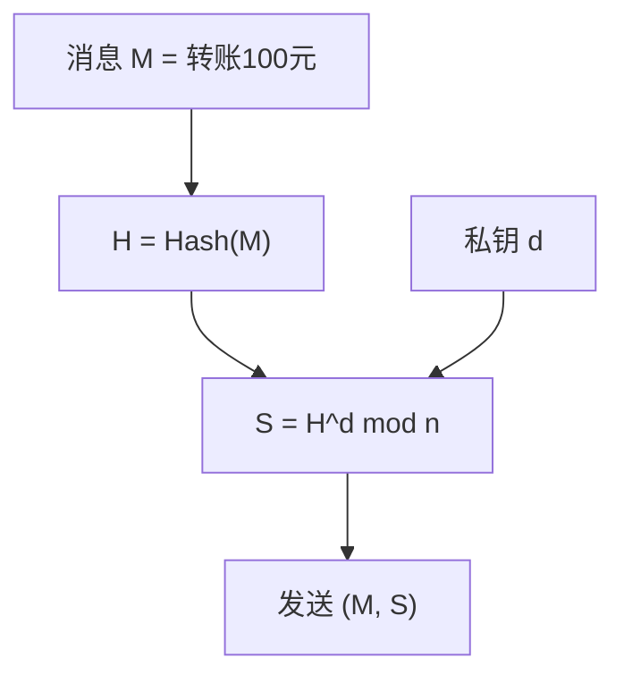
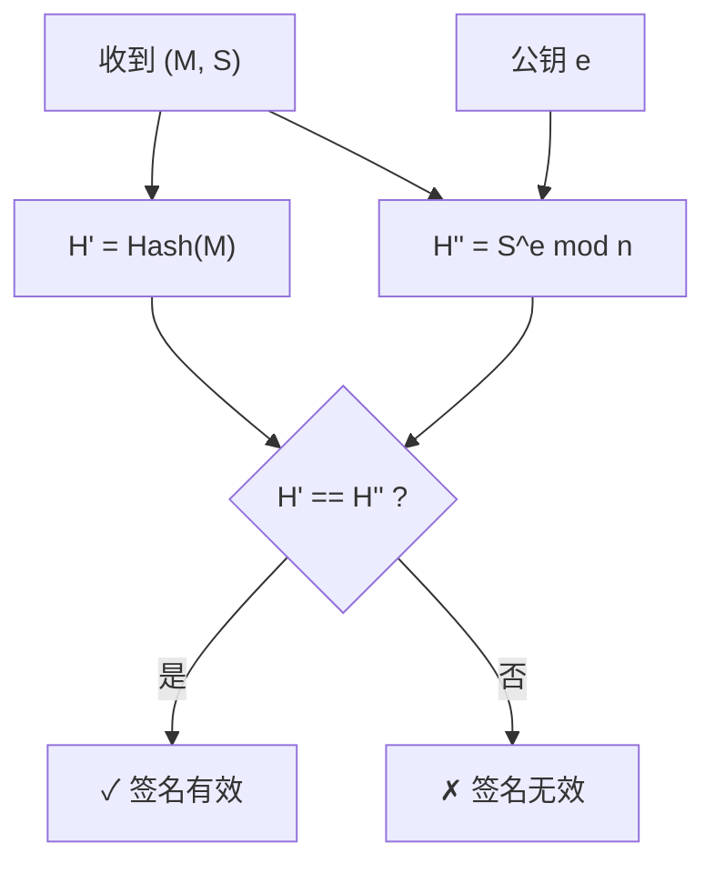

import RSADemo from '@site/src/components/Interactive/RSADemo';

# 第二章：RSA 加密算法

RSA 是最著名的非对称加密算法，也是理解公钥密码学的最佳入门。它的安全性基于一个简单的数学事实：**大数分解很难**。

## 🎮 交互式演示

先动手体验 RSA 的工作原理！你可以：
- 选择素数生成密钥
- 加密解密消息
- 创建和验证数字签名

<RSADemo />

---

## 2.1 为什么需要非对称加密？

### 对称加密的困境

回顾上一章的对称加密：

```
Alice 和 Bob 需要共享同一把密钥
问题：如何安全地传递这把密钥？

      🔑 ─────── ??? ──────→ 🔑
     Alice                  Bob
   
如果有人窃听，密钥就泄露了！
```

这就是著名的**密钥分发问题**。

### 非对称加密的思路

```
每个人有两把密钥：
- 公钥 🔓：可以公开给任何人
- 私钥 🔐：只有自己知道

加密：用对方的公钥加密
解密：只有对方的私钥能解密

      Alice                           Bob
       🔐                             🔐  
    私钥(保密)                      私钥(保密)
       🔓                             🔓
    公钥(公开) ←──── 互相交换 ────→ 公钥(公开)
```

即使有人窃听到公钥，也无法解密消息！

### 类比：邮箱

```
非对称加密就像一个特殊的邮箱：

🔓 公钥 = 邮箱投递口
   任何人都可以往里投信

🔐 私钥 = 邮箱钥匙  
   只有你能打开取信

即使攻击者知道投递口的位置，
他也无法取出里面的信！
```

## 2.2 RSA 的数学基础

### 需要的数学知识

别担心，只需要这些简单概念：

| 概念 | 说明 | 例子 |
|------|------|------|
| **素数** | 只能被 1 和自己整除的数 | 2, 3, 5, 7, 11, 13... |
| **模运算** | 取余数 | 17 mod 5 = 2 |
| **互素** | 最大公约数为 1 | gcd(8, 15) = 1 |
| **模逆元** | a × b ≡ 1 (mod n) | 3 × 7 ≡ 1 (mod 10) |

### 欧拉定理（RSA 的数学基础）

```
如果 gcd(a, n) = 1，则：

a^φ(n) ≡ 1 (mod n)

其中 φ(n) 是欧拉函数：
- φ(p) = p - 1（p 是素数）
- φ(p×q) = (p-1)(q-1)（p, q 是不同素数）
```

### 为什么 RSA 能工作？

```
设 n = p × q，e × d ≡ 1 (mod φ(n))

加密: C = M^e mod n
解密: C^d = M^(ed) mod n

因为 ed = 1 + k×φ(n)，所以：
M^(ed) = M^(1 + k×φ(n))
       = M × (M^φ(n))^k
       = M × 1^k          ← 欧拉定理！
       = M ✓
```

## 2.3 RSA 密钥生成

### 五步生成密钥

```
Step 1: 选择两个大素数 p 和 q
        例: p = 61, q = 53

Step 2: 计算 n = p × q
        n = 61 × 53 = 3233

Step 3: 计算欧拉函数 φ(n) = (p-1)(q-1)
        φ(3233) = 60 × 52 = 3120

Step 4: 选择公钥指数 e（与 φ(n) 互素）
        e = 17 (常用值: 3, 17, 65537)

Step 5: 计算私钥指数 d（e 的模逆元）
        d × 17 ≡ 1 (mod 3120)
        d = 2753
```

### 手算模逆元

使用扩展欧几里得算法：

```
求 17 的模 3120 逆元：

3120 = 17 × 183 + 9
17 = 9 × 1 + 8
9 = 8 × 1 + 1
8 = 1 × 8 + 0

回代：
1 = 9 - 8 × 1
  = 9 - (17 - 9) × 1
  = 9 × 2 - 17
  = (3120 - 17 × 183) × 2 - 17
  = 3120 × 2 - 17 × 367

所以 -367 × 17 ≡ 1 (mod 3120)
d = 3120 - 367 = 2753 ✓
```

### 生成的密钥

| 密钥类型 | 值 | 说明 |
|----------|-----|------|
| 🔓 **公钥** | (e, n) = (17, 3233) | 可以公开给任何人 |
| 🔐 **私钥** | (d, n) = (2753, 3233) | 必须保密！ |
| 临时参数 | p=61, q=53 | 用完后销毁 |

## 2.4 加密和解密

### 加密公式

```
C = M^e mod n

M = 明文（必须 < n）
e = 公钥指数
n = 模数
C = 密文
```

### 解密公式

```
M = C^d mod n

C = 密文
d = 私钥指数
n = 模数
M = 明文
```

### 完整示例

加密消息 "Hi"：

```
H = ASCII 72, i = ASCII 105

加密 H:
C₁ = 72^17 mod 3233

使用快速幂：
72^1 = 72
72^2 = 5184 mod 3233 = 1951
72^4 = 1951^2 mod 3233 = 2319
72^8 = 2319^2 mod 3233 = 1636
72^16 = 1636^2 mod 3233 = 2605

72^17 = 72^16 × 72^1 mod 3233
      = 2605 × 72 mod 3233
      = 187560 mod 3233
      = 3000

所以 C₁ = 3000

类似地，C₂ = 105^17 mod 3233 = 136
```

解密：

```
M₁ = 3000^2753 mod 3233 = 72 = 'H'
M₂ = 136^2753 mod 3233 = 105 = 'i'

解密成功！
```

## 2.5 数字签名

RSA 不仅能加密，还能签名！

### 签名 vs 加密

```
加密：用对方公钥加密，对方私钥解密
      目的：保密性

签名：用自己私钥签名，任何人用公钥验证
      目的：身份认证 + 不可否认
```

### 签名流程

**生成签名：**



**验证签名：**



### 为什么签名有效？

```
签名: S = H^d mod n
验证: S^e = H^(de) = H mod n

只有知道私钥 d 的人才能生成有效签名！

而且签名和消息绑定：
- 修改消息 → H 变化 → 签名验证失败
- 无法伪造签名 → 不知道 d 就算不出 S
```

## 2.6 RSA 的安全性

### 安全性来源

```
攻击者知道: n, e（公钥）
攻击者不知道: d, p, q

要计算 d，需要知道 φ(n) = (p-1)(q-1)
要知道 φ(n)，需要分解 n = p × q

大数分解是困难问题！
```

### 分解难度

| n 的位数 | 分解时间 |
|----------|----------|
| 100 位 | 几小时 |
| 200 位 | 几年 |
| 512 位 | 不可行 |
| 1024 位 | 理论不安全 |
| 2048 位 | 当前推荐 |
| 4096 位 | 高安全需求 |

### 历史上被破解的 RSA

```
1991: RSA-100 (100位) 被分解
1999: RSA-155 (512位) 被分解
2005: RSA-200 (200位) 被分解
2009: RSA-768 (768位) 被分解（耗时2年）
2020: RSA-250 (250位) 被分解

RSA-1024 和 RSA-2048 尚未被分解
```

## 2.7 RSA vs ECC

为什么加密货币不用 RSA？

| 特性 | RSA-2048 | ECC-256 |
|------|----------|---------|
| 安全强度 | 112 位 | 128 位 |
| 公钥大小 | 256 字节 | 33 字节 |
| 签名大小 | 256 字节 | 64 字节 |
| 签名速度 | 较慢 | 较快 |
| 验证速度 | 较快 | 较慢 |

```
区块链需要存储大量签名和公钥
ECC 节省 80%+ 的空间！

比特币选择 secp256k1（ECC）
以太坊也使用 secp256k1
```

## 2.8 RSA 在实际中的应用

虽然区块链不用 RSA 做签名，但 RSA 仍然广泛使用：

| 应用 | 用途 |
|------|------|
| HTTPS/TLS | 密钥交换（握手阶段） |
| SSH | 服务器身份验证 |
| 代码签名 | 软件发布验证 |
| 电子邮件 | PGP/GPG 加密 |
| 数字证书 | CA 签名 |

## 本章小结

| 概念 | 要点 |
|------|------|
| **非对称加密** | 公钥加密，私钥解密 |
| **RSA 密钥** | n = p×q, e 与 φ(n) 互素, d = e⁻¹ mod φ(n) |
| **加密** | C = M^e mod n |
| **解密** | M = C^d mod n |
| **签名** | S = H^d mod n |
| **安全性** | 基于大数分解困难 |

## 思考题

1. 为什么 e 必须与 φ(n) 互素？
2. 如果 p 和 q 选得太接近会有什么问题？
3. RSA 加密的消息为什么必须 < n？

## 练习

### 手算练习

使用 p = 11, q = 13：

1. 计算 n 和 φ(n)
2. 选择 e = 7，验证 gcd(7, φ(n)) = 1
3. 计算 d（7 的模 φ(n) 逆元）
4. 加密 M = 5，计算 C = 5^7 mod n
5. 解密 C，验证得到 M = 5

---

下一章：[椭圆曲线入门](/docs/cryptography/elliptic-curves) - 区块链使用的更高效加密方案
