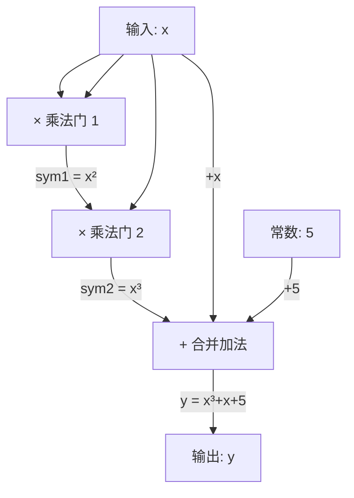
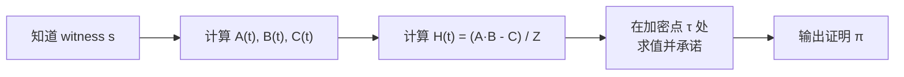
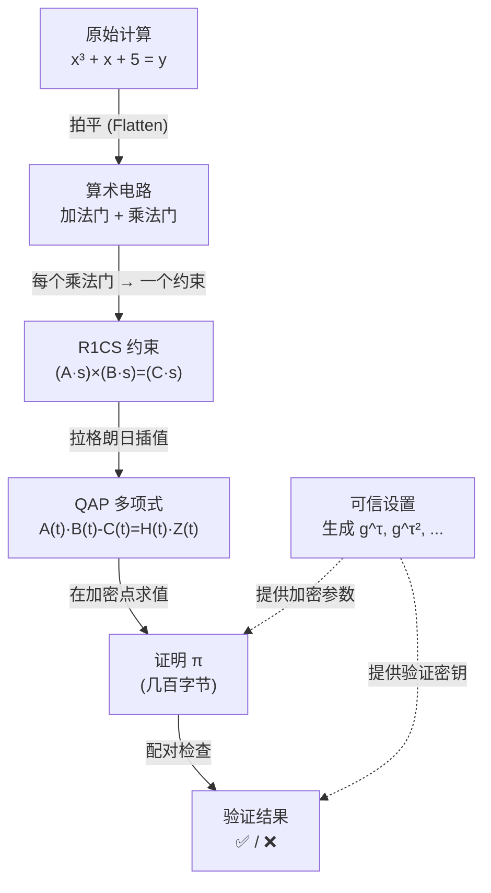

import R1CSDemo from '@site/src/components/Interactive/R1CSDemo';

# 第十章：零知识证明深入 — 从电路到证明

## 🎮 交互式演示

先动手玩一玩，直观感受算术电路和 R1CS 约束系统！

<R1CSDemo />

---

上一章介绍了零知识证明的基本概念和 zk-SNARKs 的工作流程概览。本章将深入这条 **计算 → 算术电路 → R1CS → QAP → 证明** 的完整流水线，手把手带你理解每一步的数学原理。

## 10.1 从计算到算术电路

### 什么是算术电路？

算术电路是一种将任意计算表示为**加法门**和**乘法门**组成的有向无环图（DAG）。每个门接受两个输入，产生一个输出。

```
加法门：  a + b = c
乘法门：  a × b = c
```

:::info 为什么要用电路？
零知识证明系统不能直接处理 "if-else"、循环等高级语言结构。通过把计算转换为算术电路，我们得到了一种**统一的、数学化的表示方式**，方便后续转换为约束系统。
:::

### 示例：拍平 $x^3 + x + 5 = y$

目标：将 $x^3 + x + 5 = y$ 拆解为只含基本运算的门操作。

**Step 1：引入中间变量**

一个门只能做一次乘法或加法，因此需要把复合运算拆开：

$$
\begin{aligned}
\text{sym}_1 &= x \times x & \quad \text{(第 1 个乘法门)} \\
\text{sym}_2 &= \text{sym}_1 \times x & \quad \text{(第 2 个乘法门)} \\
y &= \text{sym}_2 + x + 5 & \quad \text{(加法，可合并)}
\end{aligned}
$$

**Step 2：画出电路图**



**关键点：**
- 乘法门是电路的"核心"——每个乘法门对应一个 R1CS 约束
- 加法门是"免费"的——可以合并到乘法门的输入/输出中
- 这个电路有 **2 个乘法门** + 1 个合并约束 = **3 个 R1CS 约束**

## 10.2 R1CS（Rank-1 Constraint System）

### 从电路到约束

R1CS 用矩阵形式表达电路的约束。对于每个约束，格式为：

$$
(\vec{a} \cdot \vec{s}) \times (\vec{b} \cdot \vec{s}) = (\vec{c} \cdot \vec{s})
$$

其中：
- $\vec{s}$ 是 **witness 向量**，包含所有变量的值
- $\vec{a}, \vec{b}, \vec{c}$ 是系数向量，定义了这个约束的结构
- $\cdot$ 表示向量点积

### 构造 witness 向量

对于 $x^3 + x + 5 = y$，我们的 witness 向量包含：

$$
\vec{s} = [1, \; x, \; y, \; \text{sym}_1, \; \text{sym}_2]
$$

第一个元素固定为 1，用于引入常数项。

:::tip 以 x = 3 为例
$$
\vec{s} = [1, \; 3, \; 35, \; 9, \; 27]
$$

因为：$\text{sym}_1 = 3^2 = 9$，$\text{sym}_2 = 9 \times 3 = 27$，$y = 27 + 3 + 5 = 35$
:::

### 手算 R1CS 矩阵

**约束 1：$x \times x = \text{sym}_1$**

| | 1 | x | y | sym₁ | sym₂ |
|---|---|---|---|------|------|
| **A** | 0 | 1 | 0 | 0 | 0 |
| **B** | 0 | 1 | 0 | 0 | 0 |
| **C** | 0 | 0 | 0 | 1 | 0 |

验证：$(A \cdot s) \times (B \cdot s) = x \times x = x^2 = \text{sym}_1 = (C \cdot s)$ ✓

**约束 2：$\text{sym}_1 \times x = \text{sym}_2$**

| | 1 | x | y | sym₁ | sym₂ |
|---|---|---|---|------|------|
| **A** | 0 | 0 | 0 | 1 | 0 |
| **B** | 0 | 1 | 0 | 0 | 0 |
| **C** | 0 | 0 | 0 | 0 | 1 |

验证：$(A \cdot s) \times (B \cdot s) = \text{sym}_1 \times x = x^3 = \text{sym}_2 = (C \cdot s)$ ✓

**约束 3：$(\text{sym}_2 + x + 5) \times 1 = y$**

这里加法被"折叠"进了左操作数，乘以常数 1：

| | 1 | x | y | sym₁ | sym₂ |
|---|---|---|---|------|------|
| **A** | 5 | 1 | 0 | 0 | 1 |
| **B** | 1 | 0 | 0 | 0 | 0 |
| **C** | 0 | 0 | 1 | 0 | 0 |

验证：$(5 \cdot 1 + 1 \cdot x + 1 \cdot \text{sym}_2) \times 1 = \text{sym}_2 + x + 5 = y = (C \cdot s)$ ✓

### 完整的 A, B, C 矩阵

$$
A = \begin{bmatrix}
0 & 1 & 0 & 0 & 0 \\
0 & 0 & 0 & 1 & 0 \\
5 & 1 & 0 & 0 & 1
\end{bmatrix}, \quad
B = \begin{bmatrix}
0 & 1 & 0 & 0 & 0 \\
0 & 1 & 0 & 0 & 0 \\
1 & 0 & 0 & 0 & 0
\end{bmatrix}, \quad
C = \begin{bmatrix}
0 & 0 & 0 & 1 & 0 \\
0 & 0 & 0 & 0 & 1 \\
0 & 0 & 1 & 0 & 0
\end{bmatrix}
$$

## 10.3 从 R1CS 到 QAP

### 为什么需要 QAP？

R1CS 是逐个约束检查的——有多少个乘法门就要验证多少次。QAP（Quadratic Arithmetic Program）将所有约束"压缩"成**一个多项式等式**，让验证一步到位。

### 拉格朗日插值

核心思路：把 A, B, C 矩阵的每一**列**转换为一个多项式。

以 A 矩阵的第 2 列（对应变量 $x$）为例：

$$
A_{x} = \begin{bmatrix} 1 \\ 0 \\ 1 \end{bmatrix}
$$

在三个点 $\{1, 2, 3\}$（对应三个约束）上的值分别为 $1, 0, 1$。

用拉格朗日插值找到通过这些点的多项式 $A_x(t)$：

$$
A_x(t) = 1 \cdot \frac{(t-2)(t-3)}{(1-2)(1-3)} + 0 \cdot \frac{(t-1)(t-3)}{(2-1)(2-3)} + 1 \cdot \frac{(t-1)(t-2)}{(3-1)(3-2)}
$$

$$
A_x(t) = \frac{(t-2)(t-3)}{2} + \frac{(t-1)(t-2)}{2} = t^2 - 3t + 3
$$

对 A, B, C 的每一列都做同样的操作，得到多项式组。

### QAP 核心等式

将所有列多项式与 witness 向量组合：

$$
A(t) = \sum_i s_i \cdot A_i(t), \quad B(t) = \sum_i s_i \cdot B_i(t), \quad C(t) = \sum_i s_i \cdot C_i(t)
$$

如果 witness 满足所有 R1CS 约束，那么：

$$
A(t) \cdot B(t) - C(t) = H(t) \cdot Z(t)
$$

其中 $Z(t) = (t-1)(t-2)(t-3)$ 是"消没多项式"（vanishing polynomial），在每个约束点处为零。$H(t)$ 是商多项式。

:::info 直觉理解
- 在 $t = 1$ 处：$A(1) \cdot B(1) - C(1) = 0$，正好是约束 1 满足
- 在 $t = 2$ 处：$A(2) \cdot B(2) - C(2) = 0$，正好是约束 2 满足
- 在 $t = 3$ 处：$A(3) \cdot B(3) - C(3) = 0$，正好是约束 3 满足

所以 $A(t) \cdot B(t) - C(t)$ 在 $t = 1, 2, 3$ 处全为零，意味着它能被 $(t-1)(t-2)(t-3)$ 整除！
:::

### 为什么多项式形式更高效？

```
R1CS：逐个检查 n 个约束    → O(n) 次验证
QAP：检查一个多项式整除关系 → O(1) 次验证（配合配对运算）
```

**Schwartz-Zippel 引理**告诉我们：如果两个多项式在一个随机点处的值相等，那么它们极大概率是同一个多项式。所以验证者只需在一个（加密的）随机点检查等式即可！

## 10.4 证明生成与验证

### Prover 怎样生成证明？



1. Prover 知道完整的 witness $\vec{s}$（包含秘密输入）
2. 用 witness 构造多项式 $A(t), B(t), C(t)$
3. 计算 $H(t) = \frac{A(t) \cdot B(t) - C(t)}{Z(t)}$
4. 在可信设置提供的加密点 $\tau$ 处对多项式求值
5. 输出简洁的证明 $\pi$

### Verifier 如何验证？

Verifier **不知道** witness，但可以：

1. 用公开输入重建部分多项式
2. 用**双线性配对**（bilinear pairing）检查加密状态下的多项式等式

$$
e(\pi_A, \pi_B) = e(\pi_C, g) \cdot e(\pi_H, \pi_Z)
$$

验证只需要几次配对运算，与电路大小无关——这就是 "succinct" 的含义！

### 可信设置（Trusted Setup）

可信设置生成加密参数，让 Prover 能在不暴露 witness 的情况下证明多项式关系：

```
设置阶段：
1. 选择随机秘密 τ（"有毒废料"）
2. 计算 g^τ, g^(τ²), g^(τ³), ... 并公开
3. 销毁 τ

为什么安全：
- Prover 能用 g^(τⁱ) 计算 "g^(P(τ))"，但不知道 τ 是多少
- 椭圆曲线离散对数困难 → 无法从 g^τ 反推 τ
```

:::warning 可信设置的风险
如果 $\tau$ 没有被真正销毁，知道 $\tau$ 的人可以伪造证明！这就是为什么 Zcash 的 Powers of Tau 仪式需要上千人参与——只要有一人诚实销毁了自己的份额，整个系统就是安全的。
:::

### 配对（Pairing）的直觉解释

双线性配对 $e(P, Q)$ 是椭圆曲线上的一种特殊运算，它有一个关键性质：

$$
e(aG, bG) = e(G, G)^{ab}
$$

这意味着我们可以**在加密状态下**检查乘法关系！

```
不用配对：
  验证 A(τ) × B(τ) = C(τ) + H(τ) × Z(τ)
  → 需要知道 τ 的值（不安全！）

用配对：
  验证 e(g^A(τ), g^B(τ)) = e(g^C(τ), g) · e(g^H(τ), g^Z(τ))
  → 只用加密后的值，无需知道 τ（安全！）
```

## 10.5 完整 Pipeline 串讲



### 与 Circom / snarkjs 工具链的对应关系

| Pipeline 步骤 | 数学对象 | Circom/snarkjs 工具 |
|---|---|---|
| 编写计算逻辑 | 算术电路 | `circom` 编写 `.circom` 文件 |
| 编译电路 | R1CS | `circom --r1cs` 生成 `.r1cs` 文件 |
| 计算 witness | witness 向量 $\vec{s}$ | `circom --wasm` + `snarkjs wtns calculate` |
| 可信设置 | $g^{\tau^i}$ 等参数 | `snarkjs groth16 setup` 生成 `.zkey` |
| 生成证明 | QAP → $\pi$ | `snarkjs groth16 prove` |
| 验证 | 配对检查 | `snarkjs groth16 verify` |
| 链上验证 | Solidity 合约 | `snarkjs zkey export solidityverifier` |

### 完整命令行示例

```bash
# 1. 编译电路 → 得到 R1CS 和 WASM
circom circuit.circom --r1cs --wasm --sym

# 2. 查看电路信息
snarkjs r1cs info circuit.r1cs
# Constraints: 3 (对应我们的 3 个约束)

# 3. 可信设置 (使用 Powers of Tau)
snarkjs groth16 setup circuit.r1cs pot12_final.ptau circuit.zkey

# 4. 提供输入，计算 witness
echo '{"x": 3}' > input.json
snarkjs wtns calculate circuit.wasm input.json witness.wtns

# 5. 生成证明
snarkjs groth16 prove circuit.zkey witness.wtns proof.json public.json
# proof.json → 证明 π
# public.json → 公开输出 [35]（即 y = x³+x+5 = 35）

# 6. 验证
snarkjs groth16 verify verification_key.json public.json proof.json
# → snarkjs: OK!
```

## 10.6 思考题 & 练习

### 思考题

1. 为什么 R1CS 只需要关注乘法门，而加法门是"免费"的？
   > 提示：想想 R1CS 约束的形式 $(A \cdot s) \times (B \cdot s) = (C \cdot s)$——加法可以怎样被吸收？

2. 如果一个电路有 $n$ 个乘法门，R1CS 有多少个约束？QAP 的消没多项式 $Z(t)$ 的次数是多少？

3. 为什么 Verifier 只需要检查一个随机点就能确信多项式等式成立？
   > 提示：Schwartz-Zippel 引理说了什么？

4. 如果可信设置的 $\tau$ 泄露了，攻击者可以做什么？他能获取其他人的 witness 吗？

### 手算练习

对于 $x^2 + x + 1 = y$：

1. 将计算拍平为门操作，写出中间变量
2. 构造 witness 向量（以 $x = 4$ 为例）
3. 写出 R1CS 的 A, B, C 矩阵
4. 验证所有约束是否满足

<details>
<summary>参考答案</summary>

**拍平：**
- $\text{sym}_1 = x \times x$
- $y = \text{sym}_1 + x + 1$

**Witness：** $\vec{s} = [1, x, y, \text{sym}_1] = [1, 4, 21, 16]$

**R1CS（2 个约束）：**

约束 1：$x \times x = \text{sym}_1$

$$A_1 = [0,1,0,0], \; B_1 = [0,1,0,0], \; C_1 = [0,0,0,1]$$

约束 2：$(\text{sym}_1 + x + 1) \times 1 = y$

$$A_2 = [1,1,0,1], \; B_2 = [1,0,0,0], \; C_2 = [0,0,1,0]$$

**验证（$x = 4$）：**
- 约束 1：$4 \times 4 = 16$ ✓
- 约束 2：$(16 + 4 + 1) \times 1 = 21 = y$ ✓

</details>

---

下一章：[Merkle 树与 SPV 验证](/docs/cryptography/merkle)
