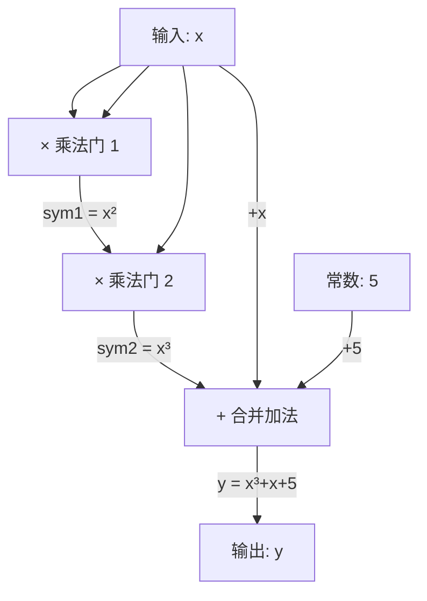

import { CircuitBuilderDemo } from '@site/src/components/Interactive';

# 10.1 从计算到算术电路

## 交互式演示

先动手玩一玩，直观感受如何把复杂计算"拍平"为算术电路！

<CircuitBuilderDemo />

---

## 什么是算术电路？

算术电路是一种将任意计算表示为**加法门**和**乘法门**组成的有向无环图（DAG）。每个门接受两个输入，产生一个输出。

```
加法门：  a + b = c
乘法门：  a × b = c
```

:::info 为什么要用电路？
零知识证明系统不能直接处理 "if-else"、循环等高级语言结构。通过把计算转换为算术电路，我们得到了一种**统一的、数学化的表示方式**，方便后续转换为约束系统。
:::

## 示例：拍平 $x^3 + x + 5 = y$

目标：将 $x^3 + x + 5 = y$ 拆解为只含基本运算的门操作。

**Step 1：引入中间变量**

一个门只能做一次乘法或加法，因此需要把复合运算拆开：

$$
\begin{aligned}
\text{sym}_1 &= x \times x & \quad \text{(第 1 个乘法门)} \\
\text{sym}_2 &= \text{sym}_1 \times x & \quad \text{(第 2 个乘法门)} \\
y &= \text{sym}_2 + x + 5 & \quad \text{(加法，可合并)}
\end{aligned}
$$

**Step 2：画出电路图**



**关键点：**
- 乘法门是电路的"核心"——每个乘法门对应一个 R1CS 约束
- 加法门是"免费"的——可以合并到乘法门的输入/输出中
- 这个电路有 **2 个乘法门** + 1 个合并约束 = **3 个 R1CS 约束**

---

下一节：[R1CS 约束系统](./r1cs)
