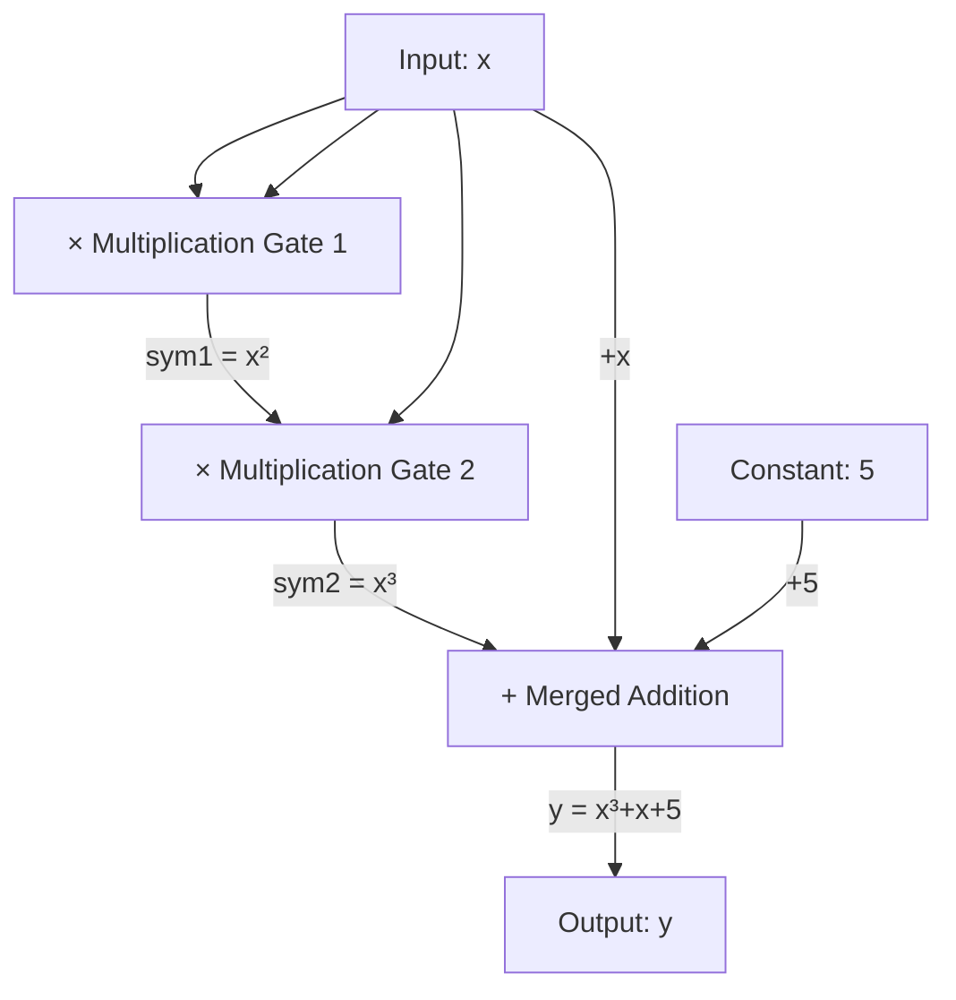

import { CircuitBuilderDemo } from '@site/src/components/Interactive';

# 10.1 From Computation to Arithmetic Circuits

## Interactive Demo

Try it out first to get an intuitive feel for how complex computations are "flattened" into arithmetic circuits!

<CircuitBuilderDemo />

---

## What is an Arithmetic Circuit?

An arithmetic circuit is a directed acyclic graph (DAG) that represents any computation as a series of **addition gates** and **multiplication gates**. Each gate takes two inputs and produces one output.

```
Addition gate:       a + b = c
Multiplication gate: a × b = c
```

:::info Why use circuits?
Zero-knowledge proof systems cannot directly process high-level language structures like "if-else" or loops. By converting computations into arithmetic circuits, we get a **unified, mathematical representation** that is easy to convert into constraint systems later.
:::

## Example: Flattening $x^3 + x + 5 = y$

Goal: Decompose $x^3 + x + 5 = y$ into gate operations containing only basic operations.

**Step 1: Introduce intermediate variables**

A gate can only perform one multiplication or addition at a time, so composite operations need to be broken down:

$$
\begin{aligned}
\text{sym}_1 &= x \times x & \quad \text{(1st multiplication gate)} \\
\text{sym}_2 &= \text{sym}_1 \times x & \quad \text{(2nd multiplication gate)} \\
y &= \text{sym}_2 + x + 5 & \quad \text{(Addition, can be merged)}
\end{aligned}
$$

**Step 2: Draw the circuit diagram**



**Key Points:**
- Multiplication gates are the "core" of the circuit—each multiplication gate corresponds to one R1CS constraint
- Addition gates are "free"—they can be merged into the inputs/outputs of multiplication gates
- This circuit has **2 multiplication gates** + 1 merged constraint = **3 R1CS constraints**

---

Next section: [R1CS Constraint System](./r1cs)
