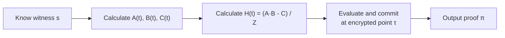
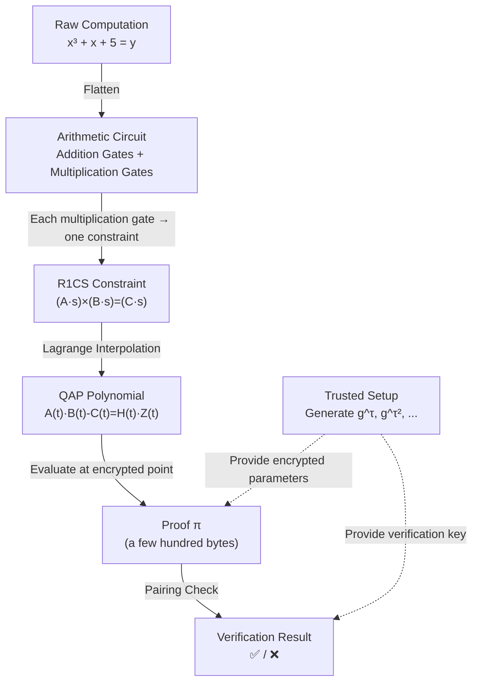

import { ProofPipelineDemo } from '@site/src/components/Interactive';

# 10.4 Proof Generation and Verification

## Interactive Demo

Click play to see how data step-by-step transforms from raw computation into a succinct zero-knowledge proof!

<ProofPipelineDemo />

---

## How does the Prover generate a proof?



1. Prover knows the complete witness $\vec{s}$ (including secret inputs)
2. Construct polynomials $A(t), B(t), C(t)$ using the witness
3. Calculate $H(t) = \frac{A(t) \cdot B(t) - C(t)}{Z(t)}$
4. Evaluate the polynomials at the encrypted point $\tau$ provided by the trusted setup
5. Output the succinct proof $\pi$

## How does the Verifier verify?

The Verifier **does not know** the witness, but can:

1. Reconstruct parts of the polynomials using public inputs
2. Check the polynomial equation in the encrypted state using **bilinear pairing**

$$
e(\pi_A, \pi_B) = e(\pi_C, g) \cdot e(\pi_H, \pi_Z)
$$

Verification only requires a few pairing operations, regardless of the circuit size—this is what "succinct" means!

## Trusted Setup

The trusted setup generates encrypted parameters that allow the Prover to prove polynomial relations without revealing the witness:

```
Setup Phase:
1. Choose a random secret τ ("toxic waste")
2. Calculate g^τ, g^(τ²), g^(τ³), ... and make them public
3. Destroy τ

Why it's secure:
- The Prover can use g^(τⁱ) to calculate "g^(P(τ))", but doesn't know what τ is
- Discrete logarithm problem on elliptic curves is hard → cannot reverse τ from g^τ
```

:::warning Risks of Trusted Setup
If $\tau$ is not truly destroyed, anyone who knows $\tau$ can forge proofs! This is why Zcash's Powers of Tau ceremony requires thousands of participants—as long as one person honestly destroys their share, the entire system is secure.
:::

## Intuitive Explanation of Pairing

Bilinear pairing $e(P, Q)$ is a special operation on elliptic curves with a key property:

$$
e(aG, bG) = e(G, G)^{ab}
$$

This means we can check multiplication relations **in the encrypted state**!

```
Without pairing:
  Verify A(τ) × B(τ) = C(τ) + H(τ) × Z(τ)
  → Need to know the value of τ (insecure!)

With pairing:
  Verify e(g^A(τ), g^B(τ)) = e(g^C(τ), g) · e(g^H(τ), g^Z(τ))
  → Use only encrypted values, no need to know τ (secure!)
```

## Complete Pipeline Overview



## Mapping to Circom / snarkjs Toolchain

| Pipeline Step | Mathematical Object | Circom/snarkjs Tool |
|---|---|---|
| Write computation logic | Arithmetic Circuit | `circom` write `.circom` file |
| Compile circuit | R1CS | `circom --r1cs` generate `.r1cs` file |
| Calculate witness | Witness vector $\vec{s}$ | `circom --wasm` + `snarkjs wtns calculate` |
| Trusted setup | $g^{\tau^i}$ etc. parameters | `snarkjs groth16 setup` generate `.zkey` |
| Generate proof | QAP → $\pi$ | `snarkjs groth16 prove` |
| Verify | Pairing check | `snarkjs groth16 verify` |
| On-chain verification | Solidity contract | `snarkjs zkey export solidityverifier` |

## Full Command Line Example

```bash
# 1. Compile circuit → get R1CS and WASM
circom circuit.circom --r1cs --wasm --sym

# 2. View circuit info
snarkjs r1cs info circuit.r1cs
# Constraints: 3 (corresponding to our 3 constraints)

# 3. Trusted setup (using Powers of Tau)
snarkjs groth16 setup circuit.r1cs pot12_final.ptau circuit.zkey

# 4. Provide input, calculate witness
echo '{"x": 3}' > input.json
snarkjs wtns calculate circuit.wasm input.json witness.wtns

# 5. Generate proof
snarkjs groth16 prove circuit.zkey witness.wtns proof.json public.json
# proof.json → proof π
# public.json → public output [35] (i.e., y = x³+x+5 = 35)

# 6. Verify
snarkjs groth16 verify verification_key.json public.json proof.json
# → snarkjs: OK!
```

---

Next section: [Thinking Questions and Exercises](./exercises)

