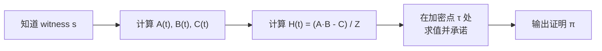
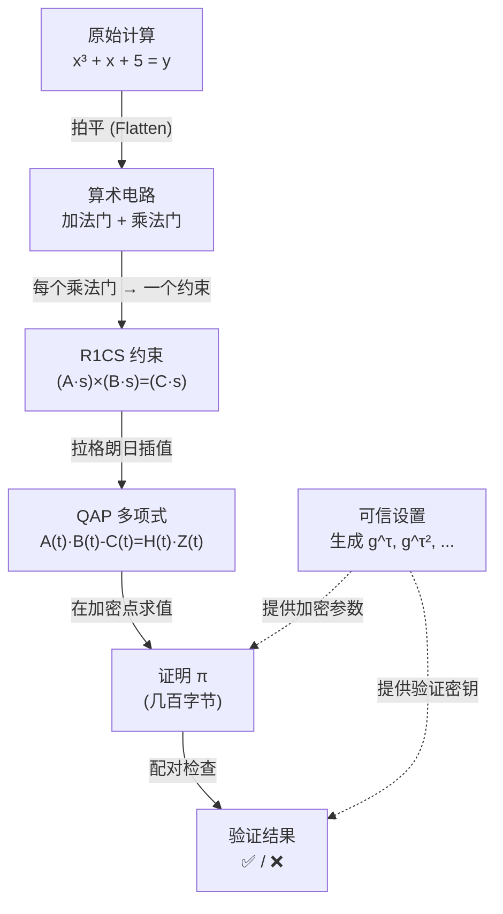

import { ProofPipelineDemo } from '@site/src/components/Interactive';

# 10.4 证明生成与验证

## 交互式演示

点击播放，看看数据如何从原始计算一步步变成简洁的零知识证明！

<ProofPipelineDemo />

---

## Prover 怎样生成证明？



1. Prover 知道完整的 witness $\vec{s}$（包含秘密输入）
2. 用 witness 构造多项式 $A(t), B(t), C(t)$
3. 计算 $H(t) = \frac{A(t) \cdot B(t) - C(t)}{Z(t)}$
4. 在可信设置提供的加密点 $\tau$ 处对多项式求值
5. 输出简洁的证明 $\pi$

## Verifier 如何验证？

Verifier **不知道** witness，但可以：

1. 用公开输入重建部分多项式
2. 用**双线性配对**（bilinear pairing）检查加密状态下的多项式等式

$$
e(\pi_A, \pi_B) = e(\pi_C, g) \cdot e(\pi_H, \pi_Z)
$$

验证只需要几次配对运算，与电路大小无关——这就是 "succinct" 的含义！

## 可信设置（Trusted Setup）

可信设置生成加密参数，让 Prover 能在不暴露 witness 的情况下证明多项式关系：

```
设置阶段：
1. 选择随机秘密 τ（"有毒废料"）
2. 计算 g^τ, g^(τ²), g^(τ³), ... 并公开
3. 销毁 τ

为什么安全：
- Prover 能用 g^(τⁱ) 计算 "g^(P(τ))"，但不知道 τ 是多少
- 椭圆曲线离散对数困难 → 无法从 g^τ 反推 τ
```

:::warning 可信设置的风险
如果 $\tau$ 没有被真正销毁，知道 $\tau$ 的人可以伪造证明！这就是为什么 Zcash 的 Powers of Tau 仪式需要上千人参与——只要有一人诚实销毁了自己的份额，整个系统就是安全的。
:::

## 配对（Pairing）的直觉解释

双线性配对 $e(P, Q)$ 是椭圆曲线上的一种特殊运算，它有一个关键性质：

$$
e(aG, bG) = e(G, G)^{ab}
$$

这意味着我们可以**在加密状态下**检查乘法关系！

```
不用配对：
  验证 A(τ) × B(τ) = C(τ) + H(τ) × Z(τ)
  → 需要知道 τ 的值（不安全！）

用配对：
  验证 e(g^A(τ), g^B(τ)) = e(g^C(τ), g) · e(g^H(τ), g^Z(τ))
  → 只用加密后的值，无需知道 τ（安全！）
```

## 完整 Pipeline 串讲



## 与 Circom / snarkjs 工具链的对应关系

| Pipeline 步骤 | 数学对象 | Circom/snarkjs 工具 |
|---|---|---|
| 编写计算逻辑 | 算术电路 | `circom` 编写 `.circom` 文件 |
| 编译电路 | R1CS | `circom --r1cs` 生成 `.r1cs` 文件 |
| 计算 witness | witness 向量 $\vec{s}$ | `circom --wasm` + `snarkjs wtns calculate` |
| 可信设置 | $g^{\tau^i}$ 等参数 | `snarkjs groth16 setup` 生成 `.zkey` |
| 生成证明 | QAP → $\pi$ | `snarkjs groth16 prove` |
| 验证 | 配对检查 | `snarkjs groth16 verify` |
| 链上验证 | Solidity 合约 | `snarkjs zkey export solidityverifier` |

## 完整命令行示例

```bash
# 1. 编译电路 → 得到 R1CS 和 WASM
circom circuit.circom --r1cs --wasm --sym

# 2. 查看电路信息
snarkjs r1cs info circuit.r1cs
# Constraints: 3 (对应我们的 3 个约束)

# 3. 可信设置 (使用 Powers of Tau)
snarkjs groth16 setup circuit.r1cs pot12_final.ptau circuit.zkey

# 4. 提供输入，计算 witness
echo '{"x": 3}' > input.json
snarkjs wtns calculate circuit.wasm input.json witness.wtns

# 5. 生成证明
snarkjs groth16 prove circuit.zkey witness.wtns proof.json public.json
# proof.json → 证明 π
# public.json → 公开输出 [35]（即 y = x³+x+5 = 35）

# 6. 验证
snarkjs groth16 verify verification_key.json public.json proof.json
# → snarkjs: OK!
```

---

下一节：[思考题与练习](./exercises)
