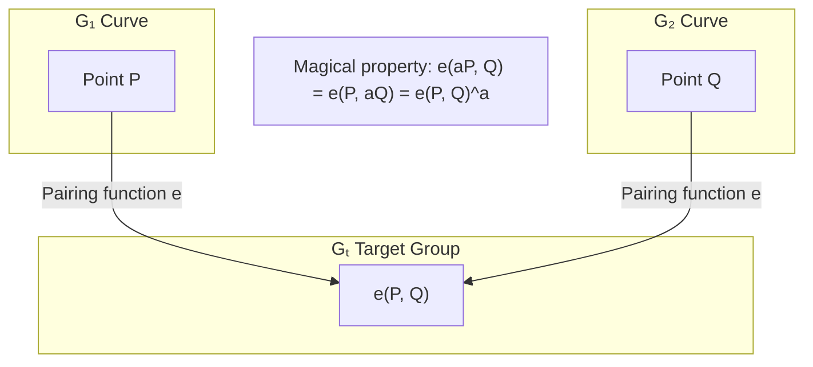
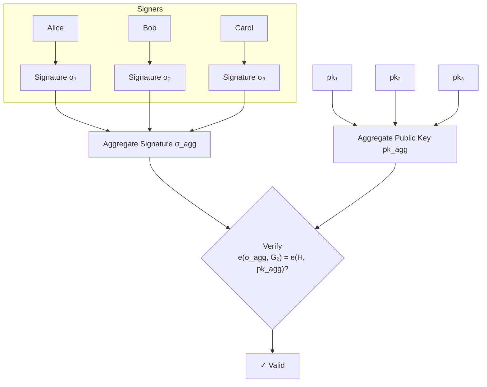
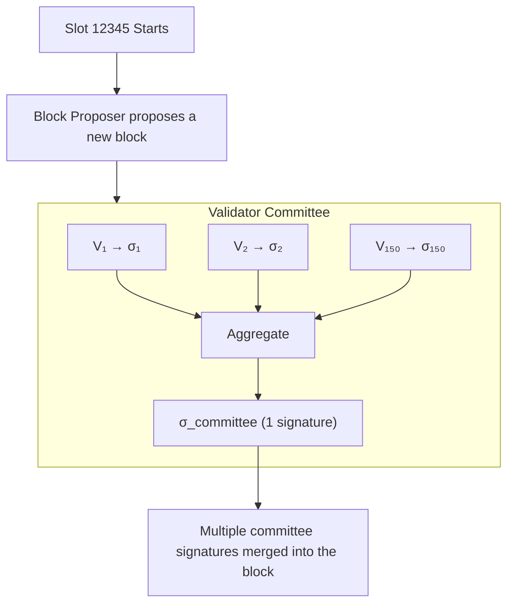

import BLSDemo from '@site/src/components/Interactive/BLSDemo';
import PairingDemo from '@site/src/components/Interactive/PairingDemo';

# Chapter 8: BLS Signatures and Aggregation

## 🎮 Interactive Demo

Before we get into the theory, try out the magic of BLS signature aggregation!

<BLSDemo client:only="react" />

BLS signatures are one of the most fascinating signature algorithms in the cryptocurrency world. This chapter will help you understand why Ethereum 2.0 chose BLS and how its "signature aggregation" magic works.

## 8.1 Starting with a Question

### Imagine You Are an Ethereum 2.0 Designer

Ethereum 2.0 has a big problem:

```
Each block needs to verify about 300,000 validator signatures.

Using ECDSA:
- 300,000 signatures × 64 bytes = 19.2 MB of signature data
- Verifying 300,000 times ≈ 30 seconds

This is too slow! The block time is only 12 seconds!
```

### The Magic of BLS

```
Using BLS Aggregation:
- 300,000 signatures → compressed into 1 = 48 bytes
- Verifying 1 time ≈ a few milliseconds

Compressed by 400,000 times!
```

:::tip Analogy
Imagine 300,000 people need to sign the same document:
- **Traditional way**: Each person signs a page, resulting in 300,000 pages of signatures.
- **BLS way**: All signatures "merge" into one, requiring only one page.
:::

## 8.2 Prerequisites: Pairing Functions

### What is a Pairing Function?

Before understanding BLS, you need to know a key tool: the **Pairing Function**.

```
Normal elliptic curves: Operations only happen on the same curve.
Pairing functions: Can compare "across curves."

e: G₁ × G₂ → Gₜ

Input: A point on G₁ and a point on G₂.
Output: An element in Gₜ.
```

### Simple Explanation + Example

Think of G₁ and G₂ as two playgrounds, and P and Q as toys in those playgrounds.  
A **pairing function** is like a "composite camera": it takes a photo of toys from both playgrounds together.  
This photo is stored in a third place, Gₜ, where we can use it to "compare relationships."

**Toy Example (for understanding only, real cases are more complex):**

```
Suppose e(a, b) = a × b

If a = 2, b = 3:
e(2, 3) = 6

If we double a:
e(4, 3) = 12
The result also doubles.
```

So you can think of a pairing function as: **"The magnification on both sides can be moved around, and the result remains correct."**

### Magical Properties of Pairing Functions

**Bilinearity**:

```
e(aP, bQ) = e(P, Q)^(ab)

Where:
- a, b are numbers (scalars)
- P is a point on G₁
- Q is a point on G₂
```

### Visual Understanding



### Interactive Experience (Simplified)

The **BLS Interactive Demo** at the top of this page has built-in pairing verification.  
Click "Show Verification Process" to see:

```
e(σ_agg, G₂) = e(H, pk_agg)
```

The page uses "multiplication" to simulate the pairing function, helping you see how **bilinearity** makes the equation hold.

<PairingDemo client:only="react" />

:::info Why does this matter?
Pairing functions let us verify multiplication relationships in different "spaces," which is the foundation of BLS signature verification.
:::

## 8.3 BLS Signatures: Three Steps

### Overview

| Step | Operation | Description |
|------|------|------|
| Key Generation | pk = sk × G₂ | Public key is on the G₂ curve |
| Signing | σ = sk × H(m) | Signature is on the G₁ curve |
| Verification | e(σ, G₂) = e(H(m), pk)? | Verify using the pairing function |

### Step 1: Key Generation

```python
# BLS Key Generation (Conceptual Code)
import secrets

# Private key: a random number
sk = secrets.randbelow(n)  # n is the order of the curve
print(f"Private key sk = {sk}")

# Public key: private key × G₂ base point
pk = sk * G2  # A point on the G₂ curve
print(f"Public key pk = {pk}")
```

Similar to ECDSA, but the public key is on the G₂ curve (96 bytes, larger than ECDSA's 33 bytes).

### Step 2: Signing

```python
def bls_sign(message, sk):
    """BLS Signing - Super simple!"""
    
    # 1. Hash the message to a point on the curve
    H = hash_to_curve(message)  # H is a point on G₁
    
    # 2. Multiply this point by the private key
    signature = sk * H  # It's that simple!
    
    return signature
```

:::tip Comparison with ECDSA
```
ECDSA signing requires:
1. Generating a random number k
2. Calculating R = kG
3. Calculating r = R.x
4. Calculating s = k⁻¹(z + rd)
5. Returning (r, s)

BLS signing only needs:
1. H = hash(message) → point on the curve
2. σ = sk × H
```
BLS signing is simpler and **doesn't require random numbers**!
:::

### Step 3: Verification

```python
def bls_verify(message, signature, pk):
    """BLS Verification"""
    
    # Hash the message to the curve
    H = hash_to_curve(message)
    
    # Verify the pairing equation
    left = pairing(signature, G2)   # e(σ, G₂)
    right = pairing(H, pk)          # e(H, pk)
    
    return left == right
```

### Why Does Verification Work?

Let's walk through the math:

```
Given:
- Signature σ = sk × H
- Public key pk = sk × G₂

Verification equation:
e(σ, G₂) = e(sk × H, G₂)
          = e(H, G₂)^sk       ← Bilinearity property!
          = e(H, sk × G₂)      ← Using bilinearity again
          = e(H, pk)           ← Because pk = sk × G₂

So: e(σ, G₂) = e(H, pk) ✓
```

## 8.4 Signature Aggregation: BLS's Killer Feature

### Problem Setup

Suppose 3 people want to sign the same message:

```
Alice (sk₁, pk₁) signs to get σ₁
Bob   (sk₂, pk₂) signs to get σ₂
Carol (sk₃, pk₃) signs to get σ₃
```

### Traditional Way

```
The verifier needs to:
- Store: σ₁, σ₂, σ₃ (3 signatures)
- Verify: 3 separate verifications

What if there are 300,000 people?
- Store: 300,000 signatures
- Verify: 300,000 times
```

### Why Can Signatures Be "Added"?

Before talking about aggregation, we must understand a key concept:

:::warning Signatures are not numbers; they are "points" on a curve!
```
Common misconception: σ₁ + σ₂ = 12 + 20 = 32  ❌

Actual meaning: σ₁ + σ₂ = Adding two elliptic curve points  ✅
```
:::

**Elliptic Curve Point "Addition"**

```
Elliptic curves have a magical property:

      P                                   
      •                                   
           •  Q      P + Q = R      •     
      •              •         •       • R
                                          

Geometric meaning: Draw a line through P and Q; the "mirror" of the third intersection with the curve is P+Q.

This addition is mathematically guaranteed:
- P + Q is still on the curve (closure)
- (P + Q) + R = P + (Q + R) (associativity)
- P + O = P (identity element exists)
```

**Key Property: Scalar Multiplication Satisfies the Distributive Law**

```
This is the core of signature aggregation!

sk₁ × H + sk₂ × H + sk₃ × H = (sk₁ + sk₂ + sk₃) × H

Just like normal multiplication:
3 × 5 + 7 × 5 + 2 × 5 = (3 + 7 + 2) × 5 = 60

The difference is:
- Normal multiplication: number × number
- Elliptic curve: number × point on the curve

But the distributive law still applies!
```

### BLS Aggregation Method

**Aggregate Signature**: Just add the signatures together!

```python
# Aggregation is point addition
agg_signature = σ₁ + σ₂ + σ₃
# The result is a new point on the G₁ curve
```

**Aggregate Public Key** (if the message is the same):

```python
# Public keys are also points and can be added
agg_pk = pk₁ + pk₂ + pk₃
# The result is a new point on the G₂ curve
```

**Verification**:

```python
# Only one verification needed!
is_valid = pairing(agg_signature, G2) == pairing(H, agg_pk)
```

### Visualizing the Aggregation Process



### Why Does Aggregate Verification Work?

```
Aggregate Signature: σ_agg = σ₁ + σ₂ + σ₃
                            = sk₁×H + sk₂×H + sk₃×H
                            = (sk₁ + sk₂ + sk₃) × H

Aggregate Public Key: pk_agg = pk₁ + pk₂ + pk₃
                              = sk₁×G₂ + sk₂×G₂ + sk₃×G₂
                              = (sk₁ + sk₂ + sk₃) × G₂

Verification:
e(σ_agg, G₂) = e((sk₁+sk₂+sk₃)×H, G₂)
              = e(H, G₂)^(sk₁+sk₂+sk₃)
              = e(H, (sk₁+sk₂+sk₃)×G₂)
              = e(H, pk_agg) ✓
```

### Aggregation Efficiency Comparison

| Number of Signatures | Traditional Storage | BLS Aggregate Storage | Compression Ratio |
|----------|----------|--------------|--------|
| 10 | 640 B | 48 B | 13× |
| 1,000 | 64 KB | 48 B | 1,333× |
| 100,000 | 6.4 MB | 48 B | 133,333× |
| 300,000 | 19.2 MB | 48 B | 400,000× |

## 8.5 Small Value Hand-calculation Example

Let's walk through the full process with small numbers:

### Setup (Simplified)

```
For demonstration, we assume a minimal pairing setup:
- Private key range: [1, 10]
- Pairing function simplified to multiplication (it's much more complex in reality)

Alice: sk₁ = 3
Bob:   sk₂ = 5
Carol: sk₃ = 7
```

### Step 1: Generate Public Keys

```
Assume G₂ = 2 (simplified base point)

pk₁ = sk₁ × G₂ = 3 × 2 = 6
pk₂ = sk₂ × G₂ = 5 × 2 = 10
pk₃ = sk₃ × G₂ = 7 × 2 = 14
```

### Step 2: Sign Message

```
Message m = "Hello"
Assume H(m) = 4 (simplified hash-to-curve result)

σ₁ = sk₁ × H = 3 × 4 = 12
σ₂ = sk₂ × H = 5 × 4 = 20
σ₃ = sk₃ × H = 7 × 4 = 28
```

### Step 3: Aggregate

```
Aggregate Signature: σ_agg = σ₁ + σ₂ + σ₃ = 12 + 20 + 28 = 60
Aggregate Public Key: pk_agg = pk₁ + pk₂ + pk₃ = 6 + 10 + 14 = 30
```

### Step 4: Verify (Simplified Pairing)

```
Assume simplified pairing: e(a, b) = a × b

Left side: e(σ_agg, G₂) = e(60, 2) = 120
Right side: e(H, pk_agg) = e(4, 30) = 120

Left = Right ✓ Signature is valid!
```

:::info Reality Check
Real BLS uses complex elliptic curve pairings. The math involves finite field extensions and the Miller algorithm, but the core idea is exactly this!
:::

## 8.6 BLS in Ethereum 2.0

### Validator Signing Process



### Efficiency Comparison

```
Per Epoch (32 slots):
- Active validators: ~500,000
- Without aggregation: 500,000 × 64B = 32 MB of signature data
- With BLS aggregation: ~2,048 aggregate signatures = 100 KB

Saved 99.7% of space!
```

## 8.7 Security: Rogue Key Attack

### How the Attack Works

There is a classic attack against BLS:

```
Scenario:
- Alice's public key is pk_a
- Mallory (attacker) wants to impersonate Alice

Attack:
1. Mallory sets her "public key" to: pk_m = pk_fake - pk_a
2. Aggregate public key: pk_agg = pk_a + pk_m = pk_fake
3. Mallory signs alone using sk_fake
4. It looks like Alice and Mallory signed together!
```

### Protective Measures

**Method 1: Proof of Possession (PoP)**

```python
def register_validator(pk):
    """Validators must prove they hold the private key when registering"""
    
    # Sign their own public key as proof
    pop_message = pk.serialize()
    pop_signature = bls_sign(pop_message, sk)
    
    # Verify PoP during registration
    if not bls_verify(pop_message, pop_signature, pk):
        raise Error("You must prove you know the private key!")
    
    # Verification passed, registration successful
    register(pk)
```

**Method 2: Message Binding to Public Key**

```python
def sign_with_pk_binding(message, sk, pk):
    """Bind the public key during signing"""
    augmented_message = pk.serialize() + message
    return bls_sign(augmented_message, sk)
```

:::danger Important Security Note
Ethereum 2.0 requires each validator to submit a PoP during registration to prevent Rogue Key Attacks.
:::

## 8.8 BLS12-381 Curve

### Why is it called BLS12-381?

```
BLS12-381:
- BLS: Curve type (Barreto-Lynn-Scott)
- 12: Embedding degree
- 381: Number of bits in the prime p
```

### Key Parameters

| Parameter | Size | Description |
|------|------|------|
| G₁ Point | 48 bytes (compressed) | Signatures are placed here |
| G₂ Point | 96 bytes (compressed) | Public keys are placed here |
| Security Strength | ~128 bits | Comparable to secp256k1 |

### Why are signatures in G₁?

```
Design choice:
- There are many signatures, so they are placed in the smaller G₁ (48 B).
- There are fewer public keys, so they can be placed in the larger G₂ (96 B).

If reversed:
- Signatures: 96 B × 300,000 = 28.8 MB
- Currently: Signatures: 48 B × 1 after aggregation = 48 B
```

## 8.9 Python Implementation Example

```python
# Using the py_ecc library to demonstrate BLS signatures
# pip install py_ecc

from py_ecc.bls import G2ProofOfPossession as bls

def bls_demo():
    """BLS Signature Demo"""
    
    # ========== 1. Key Generation ==========
    print("=== Key Generation ===")
    
    # Private keys (should use secure random numbers in practice)
    sk1 = 12345
    sk2 = 67890
    sk3 = 11111
    
    # Generate public keys
    pk1 = bls.SkToPk(sk1)
    pk2 = bls.SkToPk(sk2)
    pk3 = bls.SkToPk(sk3)
    
    print(f"Public Key 1: {pk1.hex()[:32]}...")
    print(f"Public Key 2: {pk2.hex()[:32]}...")
    print(f"Public Key 3: {pk3.hex()[:32]}...")
    
    # ========== 2. Signing ==========
    print("\n=== Signing ===")
    
    message = b"Hello, BLS!"
    
    sig1 = bls.Sign(sk1, message)
    sig2 = bls.Sign(sk2, message)
    sig3 = bls.Sign(sk3, message)
    
    print(f"Signature 1: {sig1.hex()[:32]}...")
    print(f"Signature 2: {sig2.hex()[:32]}...")
    print(f"Signature 3: {sig3.hex()[:32]}...")
    
    # ========== 3. Individual Verification ==========
    print("\n=== Individual Verification ===")
    
    valid1 = bls.Verify(pk1, message, sig1)
    print(f"Signature 1 Verification: {valid1}")
    
    # ========== 4. Signature Aggregation ==========
    print("\n=== Signature Aggregation ===")
    
    # Aggregate signatures
    agg_sig = bls.Aggregate([sig1, sig2, sig3])
    print(f"Aggregate Signature: {agg_sig.hex()[:32]}...")
    print(f"Aggregate Signature Size: {len(agg_sig)} bytes")
    print(f"Total Original Signature Size: {len(sig1) + len(sig2) + len(sig3)} bytes")
    
    # ========== 5. Aggregate Verification ==========
    print("\n=== Aggregate Verification ===")
    
    # Aggregate verification for the same message (fast)
    public_keys = [pk1, pk2, pk3]
    valid_agg = bls.FastAggregateVerify(public_keys, message, agg_sig)
    print(f"Aggregate Signature Verification: {valid_agg}")
    
    # ========== 6. Tamper Test ==========
    print("\n=== Tamper Test ===")
    
    tampered_message = b"Hello, BLS?"  # Changed one character
    valid_tampered = bls.FastAggregateVerify(public_keys, tampered_message, agg_sig)
    print(f"Tampered Message Verification: {valid_agg}")

if __name__ == "__main__":
    bls_demo()
```

Example Output:

```
=== Key Generation ===
Public Key 1: b5c7f4e8a3d2c1b0...
Public Key 2: a8f3e2d1c0b9a8f7...
Public Key 3: d4c3b2a1f0e9d8c7...

=== Signing ===
Signature 1: 8a7b6c5d4e3f2a1b...
Signature 2: 1a2b3c4d5e6f7a8b...
Signature 3: f1e2d3c4b5a6f7e8...

=== Individual Verification ===
Signature 1 Verification: True

=== Signature Aggregation ===
Aggregate Signature: 9f8e7d6c5b4a3f2e...
Aggregate Signature Size: 48 bytes
Total Original Signature Size: 144 bytes

=== Aggregate Verification ===
Aggregate Signature Verification: True

=== Tamper Test ===
Tampered Message Verification: False
```

## 8.10 BLS vs Other Signature Algorithms

| Feature | ECDSA | Schnorr | EdDSA | BLS |
|------|-------|---------|-------|-----|
| Signature Aggregation | ✗ | Requires interaction | ✗ | **Native Support** |
| Signature Size | 64-72 B | 64 B | 64 B | **48 B** |
| Public Key Size | 33 B | 33 B | 32 B | 96 B |
| Requires Randomness | Yes | Yes | No | **No** |
| Signing Speed | Fast | Fast | Fast | Slow |
| Verification Speed | Medium | Medium | Fast | Slow (Individual) |
| Batch Verification | Medium | Fast | Fast | **Extremely Fast** |

### When to Use BLS?

- ✅ Need to aggregate many signatures (Ethereum 2.0)
- ✅ Need threshold signatures (cross-chain bridges)
- ✅ Space-constrained (blockchain storage)
- ✗ Need extremely fast individual signature verification
- ✗ Sensitive to public key size

## Summary

| Concept | Key Points |
|------|------|
| **Pairing Function** | e(aP, Q) = e(P, aQ) = e(P, Q)^a |
| **BLS Signature** | σ = sk × H(m), super simple |
| **BLS Verification** | e(σ, G₂) = e(H, pk) |
| **Signature Aggregation** | σ_agg = Σσᵢ, public keys can also be aggregated |
| **Security** | Requires PoP to prevent Rogue Key Attacks |

## Thinking Questions

1. BLS signatures don't require random numbers. Why is this safer than ECDSA?
2. If 3 people sign different messages, can they still be aggregated? How does verification change?
3. Why does Ethereum 2.0 put signatures in G₁ instead of G₂?

## Exercises

### Hand-calculation Exercise (Simplified)

Assume a simplified system:
- G₂ = 3 (base point)
- H("Test") = 5 (hash result)
- Pairing function e(a, b) = a × b

Two users:
- Alice: sk = 7
- Bob: sk = 11

1. Calculate Alice's and Bob's public keys.
2. Calculate their respective signatures for "Test".
3. Aggregate the signatures and public keys.
4. Verify the aggregate signature.

---

Next Chapter: [Introduction to Zero-Knowledge Proofs](/docs/cryptography/zkp)
