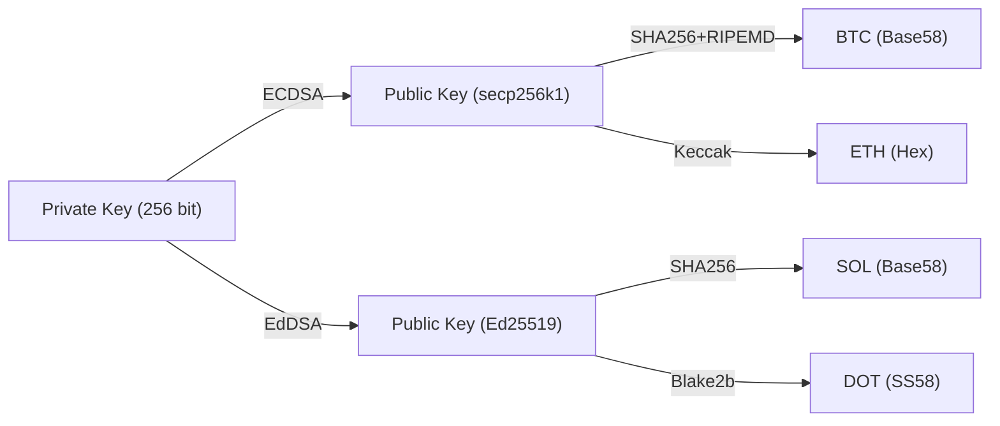
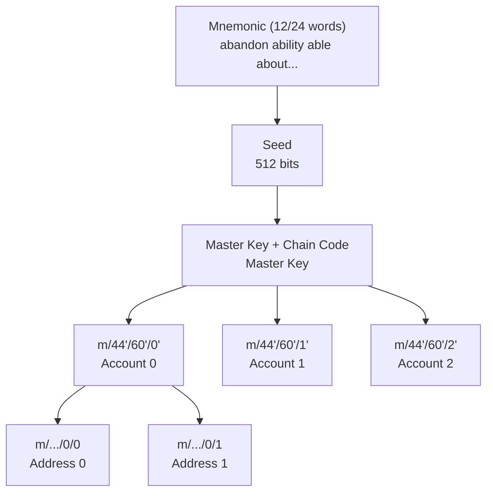
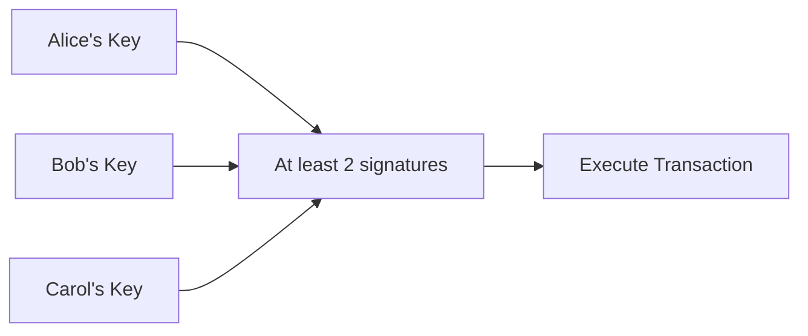

import { CryptoAppsDemo } from '@site/src/components/Interactive';

# Chapter 5: Cryptocurrency Applications

## 🎮 Interactive Demo

This chapter applies ECDSA knowledge to real-world cryptocurrency scenarios. Use the interactive tool below to experience the core processes:

<CryptoAppsDemo client:only="react" />

---

## 4.1 Multi-chain Address Generation

### Why does the same private key correspond to different addresses?

Different blockchains use different:
1.  **Signature Algorithms**: e.g., Bitcoin/Ethereum use ECDSA (secp256k1), while Solana/Polkadot use EdDSA (Ed25519).
2.  **Hash Algorithms**: e.g., SHA256, Keccak-256, Blake2b, etc.
3.  **Address Formats**: e.g., Base58Check, Bech32, Hex, SS58.

Experience this in the **"🔑 Multi-chain Address Generation"** tab of the demo above: see how the **same 256-bit private key** generates completely different addresses on different chains. This illustrates that the private key is the ultimate control over assets, while addresses are just different representations of the public key.

**Mainstream Chain Address Characteristics:**
- **Bitcoin**: `1...` (Legacy), `bc1...` (Segwit)
- **Ethereum**: `0x...` (40-character Hex)
- **Solana**: 44-character Base58
- **Polkadot**: `1...` (SS58)
- **Tron**: `T...`

## 4.2 Transaction Signing

In blockchain, every transfer requires a digital signature from the sender. Experience this in the **"📝 Transaction Signing"** tab of the demo.

### Signing Process

1.  **Construct Transaction**: Includes fields like nonce, gas, recipient, amount, etc.
2.  **Serialization**: Pack fields using RLP (Recursive Length Prefix) encoding.
3.  **Hashing**: Perform Keccak-256 hash on the RLP-encoded data.
4.  **Signing**: Use the private key to perform an ECDSA signature on the hash value, resulting in `(r, s, v)`.

### Meaning of the v Value

In addition to `r` and `s`, the signature result includes a `v` value (Recovery ID).
The role of `v` is to tell the verifier which point on the elliptic curve to use when recovering the public key (whether y is positive or negative). This allows Ethereum to recover the sender's address directly from the signature without requiring the sender's public key, saving on-chain space.

## 4.3 Signature Verification and Public Key Recovery

ECDSA has a special property: the signer's public key can be recovered from the signature! This is the principle behind the `ecrecover` function in smart contracts.

From signature (r, s) and message hash z:
1. Calculate point R: r is the x-coordinate of R.
2. Use the v value to determine the y-coordinate of R.
3. Calculate: $Q = r^{-1}(sR - zG)$.
4. The recovered Q is the public key, from which the address can be calculated.

## 4.4 HD Wallets (Hierarchical Deterministic Wallets)

### Problem and Solution

If you create a new address for every payment (for privacy), you would need to back up hundreds or thousands of private keys, which is very easy to lose.
HD wallets allow you to generate an infinite number of key pairs from a single set of **mnemonic phrases** (12 or 24 words). Try this in the **"🌳 HD Wallet"** tab of the demo.

## 4.5 Multi-signature

A normal account is controlled by a single private key (single point of failure). Multi-signature (MultiSig) requires $n$ signatures out of $m$ keys to execute a transaction ($m$-of-$n$).

**2-of-3 MultiSig Example:**

In the **"🤝 Multi-signature"** tab of the demo, you can simulate the process of Alice, Bob, and Carol co-managing funds.

## Chapter Summary

| Application | Key Technology |
|------|----------|
| **Address Generation** | Public Key Hash + Encoding (Base58/Hex) |
| **Transaction Signing** | RLP Encoding + ECDSA + Chain ID Replay Protection |
| **HD Wallet** | Mnemonic (BIP-39) + Path Derivation (BIP-32/44) |
| **Multi-signature** | Smart Contract Logic Control |

## Exercises

1.  Manually calculate the Base58Check encoding for a Bitcoin address
2.  Explain why Ethereum transactions need a chainId
3.  Design a 3-of-5 MultiSig fund management scheme

## Further Reading

- [BIP-32: Hierarchical Deterministic Wallets](https://github.com/bitcoin/bips/blob/master/bip-0032.mediawiki)
- [EIP-155: Replay Attack Protection](https://eips.ethereum.org/EIPS/eip-155)
- [EIP-712: Typed Structured Data Hashing](https://eips.ethereum.org/EIPS/eip-712)

---

Congratulations on completing the course! You have now mastered:
- Basic Cryptography Concepts
- RSA Asymmetric Encryption
- Elliptic Curve Mathematical Principles
- ECDSA Signature Algorithm
- Practical Cryptocurrency Applications

---

Next Chapter: [Schnorr Signature Algorithm](/docs/cryptography/schnorr) - A simpler and more efficient signature scheme
