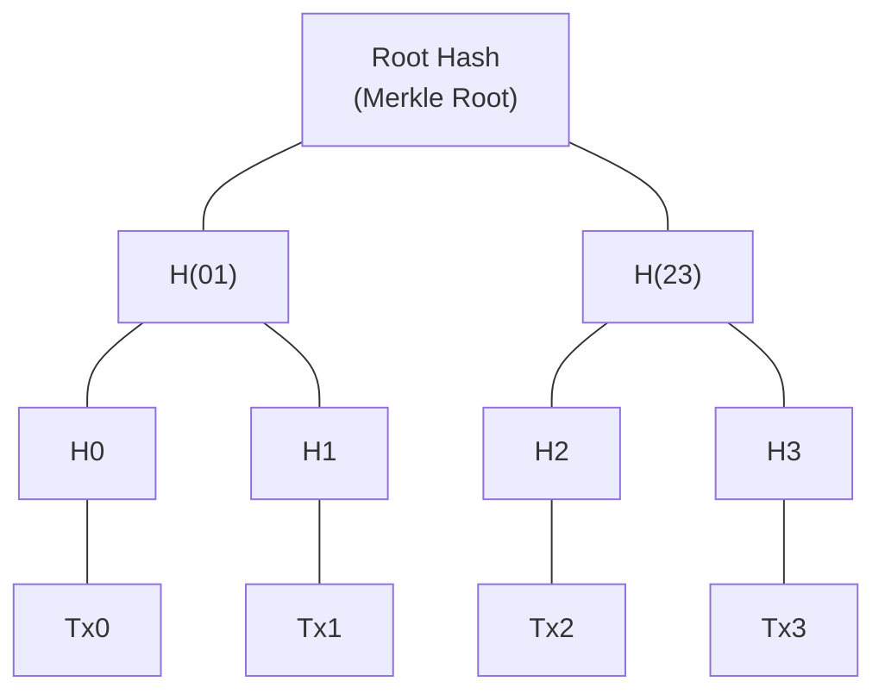
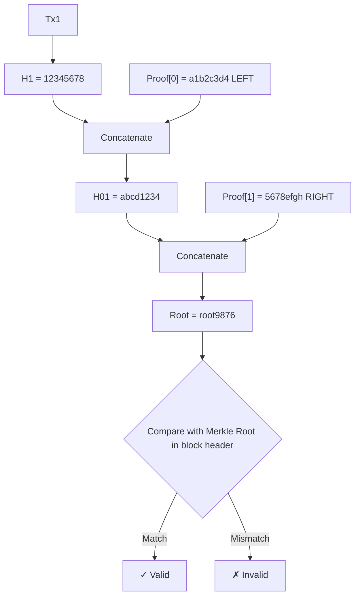
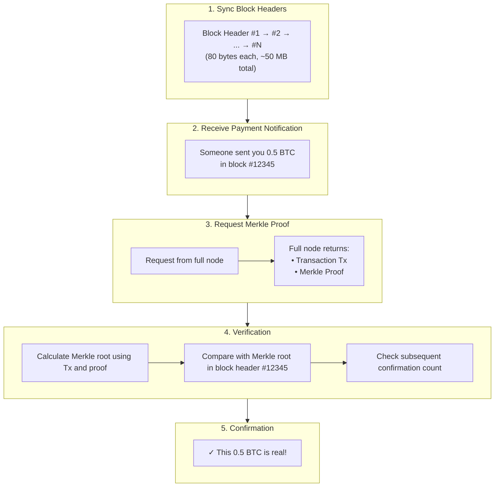

import MerkleTreeBuilder from '../../../../src/components/Interactive/MerkleTreeBuilder';

# Chapter 10: Merkle Trees and SPV Verification

## 🎮 Interactive Demo

Try building a Merkle tree yourself to see how it works!

<MerkleTreeBuilder client:only="react" />

---

Merkle trees are one of the most important data structures in blockchain. They allow your mobile wallet to verify transactions securely without downloading hundreds of gigabytes of blockchain data. This chapter uses a complete manual calculation example to help you understand this clever data structure.

## 9.1 Starting with a Question

### How does your mobile wallet work?

```
Bitcoin Full Node:
- Downloads all block data: ~500 GB
- Verifies every transaction
- Stores the complete blockchain

But your mobile wallet:
- Stores only a few dozen MB
- Yet can securely verify "you received 0.5 BTC"
- How is this possible?
```

The answer is: **Merkle Trees + SPV (Simplified Payment Verification)**

### Core Idea

```
Instead of downloading all transactions, only verify "a specific transaction is indeed in the block"

Analogy:
You don't need to read the whole book. You only need to check the table of contents to confirm a chapter exists.
```

## 9.2 What is a Merkle Tree?

### Basic Structure

A Merkle tree is a special binary tree where every node is a hash value:



```
H0 = Hash(Tx0)
H1 = Hash(Tx1)
H01 = Hash(H0 + H1)  // Hash after concatenation
...
Root = Hash(H01 + H23)
```

### Core Characteristics

| Feature | Description | Benefit |
|------|------|------|
| **Unique Root** | Any transaction change changes the root hash | Fast tamper detection |
| **O(log n) Verification** | 4 transactions only need 2 hashes to verify | Lightweight verification |
| **Incremental Updates** | Only update the changed path | Efficient updates |

## 9.3 Building a Merkle Tree by Hand

### Example: 4 Transactions

Let's build a complete Merkle tree step by step.

**Transaction Data:**

```
Tx0 = "Alice -> Bob: 10 BTC"
Tx1 = "Bob -> Carol: 5 BTC"
Tx2 = "Carol -> Dave: 3 BTC"
Tx3 = "Dave -> Eve: 1 BTC"
```

### Step 1: Calculate Leaf Node Hashes

```python
import hashlib

def sha256(data):
    """Simplified hash function"""
    return hashlib.sha256(data.encode()).hexdigest()[:16]  # Take first 16 chars for display
    
# Calculate hash for each transaction
H0 = sha256("Alice -> Bob: 10 BTC")   # Assume = "a1b2c3d4e5f6g7h8"
H1 = sha256("Bob -> Carol: 5 BTC")    # Assume = "1234567890abcdef"
H2 = sha256("Carol -> Dave: 3 BTC")   # Assume = "fedcba0987654321"
H3 = sha256("Dave -> Eve: 1 BTC")     # Assume = "0123456789abcdef"

print(f"H0 = {H0}")
print(f"H1 = {H1}")
print(f"H2 = {H2}")
print(f"H3 = {H3}")
```

**Results (Simplified):**

```
H0 = a1b2c3d4
H1 = 12345678
H2 = fedcba09
H3 = 01234567
```

### Step 2: Calculate the Second Layer

```
H01 = Hash(H0 + H1) = Hash("a1b2c3d4" + "12345678") = "abcd1234"
H23 = Hash(H2 + H3) = Hash("fedcba09" + "01234567") = "5678efgh"
```

### Step 3: Calculate the Root Hash

```
Root = Hash(H01 + H23) = Hash("abcd1234" + "5678efgh") = "root9876"
```

### Complete Tree Structure

```
                    root9876
                   /        \
            abcd1234        5678efgh
            /     \         /      \
      a1b2c3d4  12345678  fedcba09  01234567
          │         │         │         │
         Tx0       Tx1       Tx2       Tx3
      Alice→Bob  Bob→Carol Carol→Dave Dave→Eve
```

:::tip Key Point
The **Merkle Root** is a 32-byte hash value (simplified here) that uniquely represents all 4 transactions.
If even a single character in any transaction changes, the root hash will be completely different!
:::

## 9.4 Handling Odd Number of Transactions

What if the number of transactions is odd?

```
Transactions: Tx0, Tx1, Tx2 (only 3)

Method: Duplicate the last one

           Root
          /    \
       H01      H22
      /   \      │
    H0    H1    H2
     │     │     │
   Tx0   Tx1   Tx2

H22 = Hash(H2 + H2)  // Concatenate H2 with itself
```

## 9.5 Merkle Proofs

### What is a Merkle Proof?

**Question**: How can you prove Tx1 is in the block while providing the minimum amount of data to the verifier?

**Answer**: You only need to provide the sibling nodes on the "path" from Tx1 to the root.

```
                    root9876  ← Verification endpoint
                   /        \
            abcd1234        [5678efgh] ← Need this
            /     \
      [a1b2c3d4]  12345678  ← Hash of Tx1
            ↑         │
        Need this    Tx1 ← To be proven
```

**Merkle Proof = [a1b2c3d4, 5678efgh]**

Only 2 hashes are needed, instead of all 4 transactions.

### Verification Process (Manual Calculation)

The verifier receives:
- Transaction Tx1 = "Bob -> Carol: 5 BTC"
- Merkle Proof = [(a1b2c3d4, LEFT), (5678efgh, RIGHT)]
- Expected Root = root9876

**Step 1: Calculate the hash of Tx1**

```
H1 = Hash("Bob -> Carol: 5 BTC") = 12345678
```

**Step 2: Combine with the first proof node**

```
Proof[0] = (a1b2c3d4, LEFT)
Meaning: The sibling node is on the left

H01 = Hash(a1b2c3d4 + 12345678) = abcd1234
```

**Step 3: Combine with the second proof node**

```
Proof[1] = (5678efgh, RIGHT)
Meaning: The sibling node is on the right

Root = Hash(abcd1234 + 5678efgh) = root9876
```

**Step 4: Compare root hashes**

```
Calculated root root9876 == Expected root root9876 ✓

Verification passed! Tx1 is indeed in the block!
```

### Visualizing the Verification Process



## 9.6 Proof Size Analysis

### Why is it O(log n)?

```
Number of Tx    Tree Height    Proof Size (Number of Hashes)
4               2              2
8               3              3
16              4              4
1,000           10             10
1,000,000       20             20
```

| Tx per Block | Proof Size | Compared to downloading all |
|------------|----------|--------------|
| 1,000 | 10 × 32 B = 320 B | 500 KB |
| 10,000 | 14 × 32 B = 448 B | 5 MB |
| 1,000,000 | 20 × 32 B = 640 B | 500 MB |

**One million transactions can be verified with just 20 hashes (640 bytes)!**

## 9.7 SPV (Simplified Payment Verification)

### What is SPV?

**SPV = Simplified Payment Verification**

This is the light client verification method described by Satoshi Nakamoto in the Bitcoin whitepaper.

```
Full Node                       SPV Node (Light Wallet)
─────────                       ──────────────────
Downloads all blocks (~500 GB)  Only downloads block headers (~50 MB)
Verifies all transactions       Verifies own transactions with Merkle proofs
Stores complete UTXO set        Stores own transactions and keys
```

### Bitcoin Block Header Structure

| Field | Size | Description |
|------|------|------|
| Version | 4 bytes | Block version number |
| Previous Block Hash | 32 bytes | Points to the previous block |
| **Merkle Root** | 32 bytes | **Crucial!** Represents all transactions |
| Timestamp | 4 bytes | Block creation time |
| Difficulty Target | 4 bytes | Mining difficulty |
| Nonce | 4 bytes | Proof of Work random number |
| **Total** | **80 bytes** | Block headers are very small! |

The Merkle root is part of the block header. This is why SPV works.

### SPV Verification Flow



### SPV Security Analysis

| Attack Type | Difficulty | Protection Measure |
|----------|------|----------|
| Forge Transaction | Requires breaking SHA256 | Impossible |
| Forge Block Header | Requires massive hash power | Protected by Proof of Work |
| Hide Transaction | Miners can do this | Connect to multiple nodes |
| Double Spend Attack | Requires 51% hash power | Wait for enough confirmations (6 blocks) |

:::danger SPV Limitations
SPV relies on the "longest chain is honest" assumption. If an attacker has 51% hash power, they can deceive SPV nodes. Full nodes can verify every transaction independently and are not subject to this limit.
:::

## 9.8 Ethereum's Merkle Patricia Trie

### Why doesn't Ethereum use a standard Merkle tree?

```
Bitcoin: Each block contains a batch of transactions, organized with a Merkle tree.

Ethereum: Needs to store "state" (all account balances, contract storage).
- Needs fast lookup for a specific account.
- Needs efficient updates for a single account.
- Needs to prove an account "does not exist".

A standard Merkle tree cannot do these things!
```

### Merkle Patricia Trie

Ethereum uses MPT = Merkle Tree + Patricia Trie.

```
Patricia Trie (Prefix Tree):
- Efficient key lookup
- Shared prefixes save space

Merkle:
- Cryptographic verification
- Tamper-proof
```

### Three Trees in Ethereum Block Header

| Field | Description |
|------|------|
| stateRoot | Root of the state tree, all account states |
| transactionsRoot | Root of the transaction tree, transactions in the block |
| receiptsRoot | Root of the receipt tree, transaction execution results |

### State Proof Example

```python
# Use eth_getProof RPC to get account proof
proof = eth.get_proof(
    address="0x1234...",
    storage_keys=[],
    block="latest"
)

# Returns:
# - Account data (balance, nonce, code hash, storage root)
# - Merkle proof path
# - Can be used to prove to others "this account has X ETH in a specific block"
```

## 9.9 Practical Application: Merkle Airdrop

### Traditional Airdrop vs. Merkle Airdrop

```
Traditional Method:
- Contract stores all eligible addresses
- 10,000 addresses mean massive storage costs
- Every added address costs Gas

Merkle Method:
- Contract only stores one 32-byte Merkle root
- Users provide proof when claiming
- On-chain cost remains the same regardless of address count!
```

### Solidity Implementation

```solidity
// SPDX-License-Identifier: MIT
pragma solidity ^0.8.0;

contract MerkleAirdrop {
    bytes32 public merkleRoot;
    mapping(address => bool) public claimed;
    
    constructor(bytes32 _merkleRoot) {
        merkleRoot = _merkleRoot;
    }
    
    function claim(
        uint256 amount,
        bytes32[] calldata proof
    ) external {
        require(!claimed[msg.sender], "Already claimed");
        
        // Construct leaf node
        bytes32 leaf = keccak256(abi.encodePacked(msg.sender, amount));
        
        // Verify Merkle proof
        require(verify(proof, merkleRoot, leaf), "Invalid proof");
        
        // Mark as claimed
        claimed[msg.sender] = true;
        
        // Send tokens
        // token.transfer(msg.sender, amount);
    }
    
    function verify(
        bytes32[] memory proof,
        bytes32 root,
        bytes32 leaf
    ) internal pure returns (bool) {
        bytes32 hash = leaf;
        
        for (uint256 i = 0; i < proof.length; i++) {
            bytes32 proofElement = proof[i];
            
            if (hash < proofElement) {
                hash = keccak256(abi.encodePacked(hash, proofElement));
            } else {
                hash = keccak256(abi.encodePacked(proofElement, hash));
            }
        }
        
        return hash == root;
    }
}
```

### Generating Proof (Off-chain)

```python
from merkle_tree import MerkleTree

# Whitelist
whitelist = [
    ("0x1111...", 100),  # Address, airdrop amount
    ("0x2222...", 200),
    ("0x3333...", 150),
    # ... can have thousands
]

# Build Merkle tree
leaves = [keccak256(addr + amount) for addr, amount in whitelist]
tree = MerkleTree(leaves)

# Only the root is needed during deployment
merkle_root = tree.get_root()  # 32 bytes

# Generate proof when user claims
user_address = "0x2222..."
proof = tree.get_proof(user_index=1)
```

## 9.10 Full Python Implementation

```python
import hashlib
from typing import List, Tuple, Optional

def sha256(data: str) -> str:
    """SHA256 Hash"""
    if isinstance(data, str):
        data = data.encode()
    return hashlib.sha256(data).hexdigest()

class MerkleTree:
    """Complete Merkle Tree Implementation"""
    
    def __init__(self, transactions: List[str]):
        self.transactions = transactions
        self.tree: List[List[str]] = []
        self.root = self._build_tree()
    
    def _build_tree(self) -> str:
        """Build Merkle Tree"""
        if not self.transactions:
            return sha256("")
        
        # Level 0: Leaf nodes
        level = [sha256(tx) for tx in self.transactions]
        self.tree.append(level)
        
        print("=== Building Merkle Tree ===")
        print(f"Leaf nodes (Level 0):")
        for i, h in enumerate(level):
            print(f"  H{i} = {h[:16]}...")
        
        # Move up layer by layer
        level_num = 1
        while len(level) > 1:
            # If odd number of nodes, duplicate the last one
            if len(level) % 2 == 1:
                level.append(level[-1])
            
            # Calculate parent nodes
            next_level = []
            for i in range(0, len(level), 2):
                parent = sha256(level[i] + level[i + 1])
                next_level.append(parent)
            
            level = next_level
            self.tree.append(level)
            
            print(f"\nLevel {level_num}:")
            for i, h in enumerate(level):
                print(f"  H = {h[:16]}...")
            level_num += 1
        
        print(f"\nRoot Hash: {level[0][:16]}...")
        return level[0]
    
    def get_proof(self, index: int) -> List[Tuple[str, str]]:
        """Get Merkle proof for a specific transaction"""
        proof = []
        
        for level in self.tree[:-1]:  # Exclude root
            # Find sibling node
            if index % 2 == 0:
                sibling_index = index + 1
                position = 'RIGHT'
            else:
                sibling_index = index - 1
                position = 'LEFT'
            
            if sibling_index < len(level):
                proof.append((level[sibling_index], position))
            else:
                # Odd case, pair with itself
                proof.append((level[index], 'RIGHT'))
            
            # Move to parent node
            index = index // 2
        
        return proof
    
    def verify(self, tx: str, proof: List[Tuple[str, str]], root: str) -> bool:
        """Verify Merkle proof"""
        current = sha256(tx)
        print(f"\n=== Verifying Merkle Proof ===")
        print(f"Transaction Hash: {current[:16]}...")
        
        for i, (sibling, position) in enumerate(proof):
            if position == 'LEFT':
                current = sha256(sibling + current)
                print(f"Step {i+1}: Hash(LEFT + current) = {current[:16]}...")
            else:
                current = sha256(current + sibling)
                print(f"Step {i+1}: Hash(current + RIGHT) = {current[:16]}...")
        
        print(f"\nCalculated Root: {current[:16]}...")
        print(f"Expected Root:   {root[:16]}...")
        print(f"Verification Result: {'✓ Passed' if current == root else '✗ Failed'}")
        
        return current == root


def main():
    # Create transactions
    transactions = [
        "Alice -> Bob: 10 BTC",
        "Bob -> Carol: 5 BTC",
        "Carol -> Dave: 3 BTC",
        "Dave -> Eve: 1 BTC"
    ]
    
    print("Transaction List:")
    for i, tx in enumerate(transactions):
        print(f"  Tx{i}: {tx}")
    print()
    
    # Build Merkle tree
    tree = MerkleTree(transactions)
    
    # Generate and verify proof
    print("\n" + "=" * 50)
    print("Verifying Tx1 (Bob -> Carol: 5 BTC)")
    
    proof = tree.get_proof(1)
    print(f"\nMerkle Proof:")
    for i, (h, pos) in enumerate(proof):
        print(f"  [{i}] {pos}: {h[:16]}...")
    
    is_valid = tree.verify(transactions[1], proof, tree.root)
    
    # Try tampering
    print("\n" + "=" * 50)
    print("Attempting to verify tampered transaction")
    fake_tx = "Bob -> Carol: 500 BTC"  # Amount tampered
    tree.verify(fake_tx, proof, tree.root)


if __name__ == "__main__":
    main()
```

**Example Output:**

```
Transaction List:
  Tx0: Alice -> Bob: 10 BTC
  Tx1: Bob -> Carol: 5 BTC
  Tx2: Carol -> Dave: 3 BTC
  Tx3: Dave -> Eve: 1 BTC

=== Building Merkle Tree ===
Leaf nodes (Level 0):
  H0 = 7a8b3c4d5e6f7890...
  H1 = 1234567890abcdef...
  H2 = fedcba0987654321...
  H3 = 0123456789abcdef...

Level 1:
  H = abcd1234efgh5678...
  H = 5678efgh1234abcd...

Level 2:
  H = root987654321abc...

Root Hash: root987654321abc...

==================================================
Verifying Tx1 (Bob -> Carol: 5 BTC)

Merkle Proof:
  [0] LEFT: 7a8b3c4d5e6f7890...
  [1] RIGHT: 5678efgh1234abcd...

=== Verifying Merkle Proof ===
Transaction Hash: 1234567890abcdef...
Step 1: Hash(LEFT + current) = abcd1234efgh5678...
Step 2: Hash(current + RIGHT) = root987654321abc...

Calculated Root: root987654321abc...
Expected Root:   root987654321abc...
Verification Result: ✓ Passed

==================================================
Attempting to verify tampered transaction

=== Verifying Merkle Proof ===
Transaction Hash: 9999999999999999...
Step 1: Hash(LEFT + current) = xxxxxxxxxxxx...
Step 2: Hash(current + RIGHT) = yyyyyyyyyyyy...

Calculated Root: yyyyyyyyyyyy...
Expected Root:   root987654321abc...
Verification Result: ✗ Failed
```

## Chapter Summary

| Concept | Key Points |
|------|------|
| **Merkle Tree** | Binary hash tree, root uniquely represents all data |
| **Merkle Proof** | O(log n) size, verifies data existence |
| **SPV** | Light wallets use Merkle proofs to verify transactions |
| **Block Header** | Contains Merkle root, only 80 bytes |
| **MPT** | Ethereum state tree, supports lookup and proofs |

| Use Case | Purpose |
|----------|------|
| Bitcoin | Block transaction verification |
| Ethereum | State, transaction, and receipt proofs |
| Airdrop | Low-cost on-chain verification |
| NFT Whitelist | Efficient minting permission control |

## Thinking Questions

1. If a block has 1024 transactions, how many hashes are needed for a Merkle proof?
2. Why do SPV wallets wait for 6 confirmations before considering a transaction safe?
3. Why does Ethereum use MPT instead of a standard Merkle tree?

## Exercises

### Manual Calculation Exercise

Given hashes for 4 transactions (simplified to 4 digits):

```
H0 = 1234
H1 = 5678
H2 = abcd
H3 = efgh
```

Assume Hash(A + B) = Take the 1st and 3rd characters of A and B to form a new hash.

1. Calculate H01 = Hash(H0 + H1)
2. Calculate H23 = Hash(H2 + H3)
3. Calculate the root hash
4. Write the Merkle proof to verify the existence of H1
5. Manually verify if the proof is correct

---

Congratulations! You have completed all chapters of the Introduction to Cryptocurrency Cryptography course! 🎉

Back to: [Course Home](/docs/)
