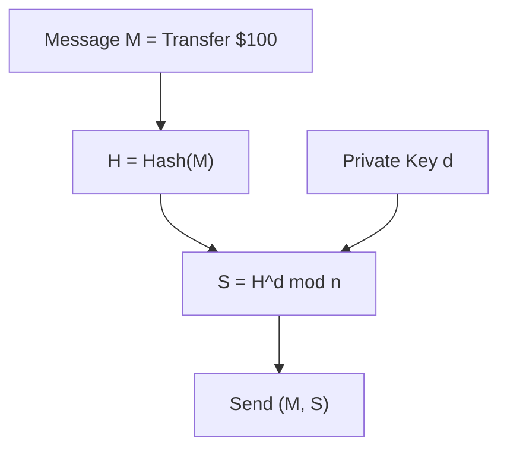
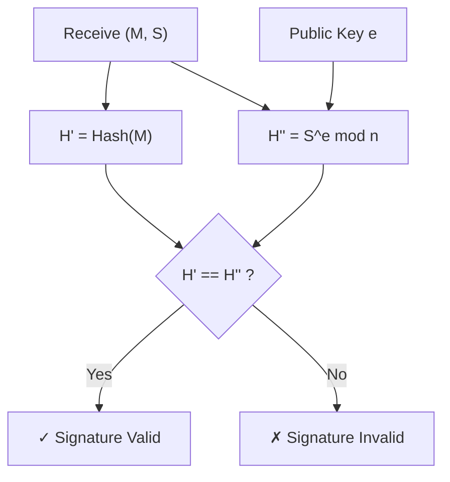

import RSADemo from '@site/src/components/Interactive/RSADemo';

# Chapter 2: RSA Encryption Algorithm

RSA is the most famous asymmetric encryption algorithm and the best entry point for understanding public key cryptography. Its security is based on a simple mathematical fact: **large number factorization is hard**.

## 🎮 Interactive Demo

Experience how RSA works firsthand! You can:
- Choose prime numbers to generate keys
- Encrypt and decrypt messages
- Create and verify digital signatures

<RSADemo client:only="react" />

---

## 2.1 Why Do We Need Asymmetric Encryption?

### The Symmetric Encryption Dilemma

Recall symmetric encryption from the previous chapter:

```
Alice and Bob need to share the same key
Problem: How to securely transmit this key?

      🔑 ─────── ??? ──────→ 🔑
     Alice                  Bob
   
If someone eavesdrops, the key is leaked!
```

This is the famous **key distribution problem**.

### The Asymmetric Encryption Idea

```
Everyone has two keys:
- Public Key 🔓: Can be shared with anyone
- Private Key 🔐: Known only to yourself

Encryption: Use the recipient's public key
Decryption: Only the recipient's private key can decrypt

      Alice                           Bob
       🔐                             🔐  
    Private Key (Secret)           Private Key (Secret)
       🔓                             🔓
    Public Key (Public) ←──── Exchange ────→ Public Key (Public)
```

Even if someone eavesdrops on the public key, they cannot decrypt the message!

### Analogy: The Mailbox

```
Asymmetric encryption is like a special mailbox:

🔓 Public Key = Mail Slot
   Anyone can drop a letter in

🔐 Private Key = Mailbox Key
   Only you can open it to retrieve letters

Even if an attacker knows where the slot is,
they cannot take out the letters inside!
```

## 2.2 Mathematical Foundations of RSA

### Required Knowledge

Don't worry, you only need these simple concepts:

| Concept | Description | Example |
|------|------|------|
| **Prime Number** | A number divisible only by 1 and itself | 2, 3, 5, 7, 11, 13... |
| **Modular Arithmetic** | Finding the remainder | 17 mod 5 = 2 |
| **Coprime** | Greatest common divisor (gcd) is 1 | gcd(8, 15) = 1 |
| **Modular Inverse** | a × b ≡ 1 (mod n) | 3 × 7 ≡ 1 (mod 10) |

### The World of Mod n: Returning to the Start

Think of **mod n** as a "digital clock" with only **0 to n-1** positions:

```
n = 10
0 → 1 → 2 → 3 → 4 → 5 → 6 → 7 → 8 → 9 → Back to 0
```

In the **world of mod n**, no matter how you add or multiply, numbers are "folded back" between 0 and n-1.  
**No matter how far you go, you will eventually return to the origin.**

This is the essence of "reversibility" in asymmetric encryption:
- Public key encryption involves repeated multiplication in the **mod n world** (e.g., $M^e \pmod n$)
- Since this world has finite positions, walking will eventually "loop"
- The private key is the "correct number of steps" that brings you back to the original message

In short: **Mod n turns the world into a finite circle; the public key is the forward path, and the private key is the backward path.**

### Euler's Theorem (The Foundation of RSA)

```
If gcd(a, n) = 1, then:

a^φ(n) ≡ 1 (mod n)

Where φ(n) is Euler's totient function:
- φ(p) = p - 1 (if p is prime)
- φ(p×q) = (p-1)(q-1) (if p, q are distinct primes)
```

**Notation:**  
$a^b$ is read as "a to the power of b", meaning **a multiplied by itself b times**.

**Note:**  
$M^{\phi(n)} \equiv 1 \pmod n$ means "the remainder is 1", not that the large number itself equals 1. It just lands on the same position as 1 in the mod n world.

### A Simple Intuition

Think of **mod n** as a circular track with n slots.  
When a and n are coprime, the action of "jumping a slots each time" will visit slots without getting stuck early.  
If you jump **$\phi(n)$ times**, you are guaranteed to return to the starting point:

```
a^φ(n) ≡ 1 (mod n)
```

**Small Example (n = 10, a = 3):**

```
3^1 ≡ 3
3^2 ≡ 9
3^3 ≡ 7
3^4 ≡ 1  ← Back to start
```

Here $\phi(10) = 4$, so $3^4 \equiv 1 \pmod{10}$.  
This is the mathematical version of "returning to the origin".

**Why is $\phi(10) = 4$?**

$10 = 2 \times 5$, and 2 and 5 are coprime.  
For two coprime numbers:

```
φ(2×5) = φ(2) × φ(5)
```

Since 2 and 5 are primes:

```
φ(2) = 1
φ(5) = 4
```

Therefore:

```
φ(10) = φ(2×5) = φ(2)×φ(5) = 1×4 = 4
```

**Prime Example (n = 7, a = 3):**

Since 7 is prime, numbers 1 through 6 are all coprime to 7, so $\phi(7) = 6$.

```
3^1 ≡ 3
3^2 ≡ 2
3^3 ≡ 6
3^4 ≡ 4
3^5 ≡ 5
3^6 ≡ 1  ← Back to start
```

So $3^6 \equiv 1 \pmod 7$, which corresponds exactly to $\phi(7)=6$.

### Why Does RSA Work?

### The Intuitive Explanation

Think of RSA as a two step process of "**locking**" and "**unlocking**":

1) **Public key e is the locking action**: Move the plaintext M "many steps forward" in the mod n circle.  
2) **Private key d is the unlocking action**: Move "d steps forward" again, and you return to the original M.

The key is that e and d are designed as a pair of "mutually canceling" steps.  
Mathematically:

```
e × d = 1 + k × φ(n)
```

Meaning: **You took 1 step and circled the track k more times**.  
"Returning to the origin" is Euler's theorem at work:

```
M^(φ(n)) ≡ 1 (mod n)
```

So:

```
M^(ed) = M^(1 + kφ(n))
       = M × (M^φ(n))^k
       = M × 1^k
       = M
```

This is why locking and then unlocking returns the original message.

```
Let n = p × q, e × d ≡ 1 (mod φ(n))

Encryption: C = M^e mod n
Decryption: C^d = M^(ed) mod n

Since ed = 1 + k×φ(n):
M^(ed) = M^(1 + k×φ(n))
       = M × (M^φ(n))^k
       = M × 1^k          ← Euler's Theorem!
       = M ✓
```

## 2.3 RSA Key Generation

### Five Steps to Generate Keys

```
Step 1: Choose two large primes p and q
        Example: p = 61, q = 53

Step 2: Calculate n = p × q
        n = 61 × 53 = 3233

Step 3: Calculate Euler's totient function φ(n) = (p-1)(q-1)
        φ(3233) = 60 × 52 = 3120

Step 4: Choose public exponent e (coprime to φ(n))
        e = 17 (Common values: 3, 17, 65537)

Step 5: Calculate private exponent d (modular inverse of e)
        d × 17 ≡ 1 (mod 3120)
        d = 2753
```

### Calculating the Modular Inverse Manually

Use the Extended Euclidean Algorithm:

#### What does the Extended Euclidean Algorithm actually do?

The standard gcd algorithm only answers:
**"What is the greatest common divisor?"**

The Extended Euclidean Algorithm answers:
**"How can this gcd be constructed using a and b?"**

This is **Bézout's identity**:

```
gcd(a, b) = x·a + y·b
```

The algorithm provides the coefficients **x and y** that show how the gcd is "built".

#### A Simple Example: 30 and 18

```
The gcd of 30 and 18 is 6

Bézout's identity tells you:
6 = 30 × ( -1 ) + 18 × ( 2 )
```

Check: $30 \times (-1) + 18 \times 2 = -30 + 36 = 6$ ✓

**Conclusion: Extended Euclidean = gcd + "Construction Method"**

In RSA, we need the coefficient from this construction (it is the key to the modular inverse).

```
Find the inverse of 17 modulo 3120:

3120 = 17 × 183 + 9
17 = 9 × 1 + 8
9 = 8 × 1 + 1
8 = 1 × 8 + 0

Back-substitution:
1 = 9 - 8 × 1
  = 9 - (17 - 9) × 1
  = 9 × 2 - 17
  = (3120 - 17 × 183) × 2 - 17
  = 3120 × 2 - 17 × 367

So -367 × 17 ≡ 1 (mod 3120)
d = 3120 - 367 = 2753 ✓
```

### Generated Keys

| Key Type | Value | Description |
|----------|-----|------|
| 🔓 **Public Key** | (e, n) = (17, 3233) | Can be shared with anyone |
| 🔐 **Private Key** | (d, n) = (2753, 3233) | Must be kept secret! |
| Temporary Params | p=61, q=53 | Destroy after use |

## 2.4 Encryption and Decryption

### Encryption Formula

```
C = M^e mod n

M = Plaintext (must be < n)
e = Public exponent
n = Modulus
C = Ciphertext
```

### Decryption Formula

```
M = C^d mod n

C = Ciphertext
d = Private exponent
n = Modulus
M = Plaintext
```

### Full Example

Encrypting the message "Hi":

```
H = ASCII 72, i = ASCII 105

Encrypt H:
C₁ = 72^17 mod 3233

Using modular exponentiation:
72^1 = 72
72^2 = 5184 mod 3233 = 1951
72^4 = 1951^2 mod 3233 = 2319
72^8 = 2319^2 mod 3233 = 1636
72^16 = 1636^2 mod 3233 = 2605

72^17 = 72^16 × 72^1 mod 3233
      = 2605 × 72 mod 3233
      = 187560 mod 3233
      = 3000

So C₁ = 3000

Similarly, C₂ = 105^17 mod 3233 = 136
```

Decryption:

```
M₁ = 3000^2753 mod 3233 = 72 = 'H'
M₂ = 136^2753 mod 3233 = 105 = 'i'

Decryption successful!
```

## 2.5 Digital Signatures

RSA can be used for signatures as well as encryption!

### Signature vs. Encryption

```
Encryption: Use recipient's public key, recipient's private key decrypts
            Purpose: Confidentiality

Signature: Use your own private key, anyone uses your public key to verify
            Purpose: Authentication + Non-repudiation
```

### Signature Process

**Generating a Signature:**



**Verifying a Signature:**



### Why is the Signature Valid?

```
Signature: S = H^d mod n
Verification: S^e = H^(de) = H mod n

Only someone who knows the private key d can generate a valid signature!

The signature is bound to the message:
- Modify message → H changes → Verification fails
- Cannot forge signature → Cannot calculate S without d
```

## 2.6 RSA Security

### Source of Security

```
Attacker knows: n, e (Public Key)
Attacker doesn't know: d, p, q

To calculate d, one needs φ(n) = (p-1)(q-1)
To know φ(n), one needs to factor n = p × q

Factoring large numbers is a hard problem!
```

### Factorization Difficulty

| Bits in n | Factorization Time |
|----------|----------|
| 100 bits | A few hours |
| 200 bits | A few years |
| 512 bits | Infeasible |
| 1024 bits | Theoretically insecure |
| 2048 bits | Currently recommended |
| 4096 bits | High security requirements |

### Historically Cracked RSA

```
1991: RSA-100 (100 digits) factored
1999: RSA-155 (512 bits) factored
2005: RSA-200 (200 digits) factored
2009: RSA-768 (768 bits) factored (took 2 years)
2020: RSA-250 (250 digits) factored

RSA-1024 and RSA-2048 have not yet been factored
```

## 2.7 RSA vs. ECC

Why don't cryptocurrencies use RSA?

| Feature | RSA-2048 | ECC-256 |
|------|----------|---------|
| Security Strength | 112 bits | 128 bits |
| Public Key Size | 256 bytes | 33 bytes |
| Signature Size | 256 bytes | 64 bytes |
| Signing Speed | Slower | Faster |
| Verification Speed | Faster | Slower |

```
Blockchains need to store many signatures and public keys
ECC saves over 80% of space!

Bitcoin chose secp256k1 (ECC)
Ethereum also uses secp256k1
```

## 2.8 RSA in Practice

While blockchains don't use RSA for signatures, it is still widely used:

| Application | Use Case |
|------|------|
| HTTPS/TLS | Key exchange (handshake phase) |
| SSH | Server authentication |
| Code Signing | Software release verification |
| Email | PGP/GPG encryption |
| Digital Certificates | CA signatures |

## Chapter Summary

| Concept | Key Points |
|------|------|
| **Asymmetric Encryption** | Public key encrypts, private key decrypts |
| **RSA Keys** | n = p×q, e is coprime to φ(n), d = e⁻¹ mod φ(n) |
| **Encryption** | C = M^e mod n |
| **Decryption** | M = C^d mod n |
| **Signature** | S = H^d mod n |
| **Security** | Based on the difficulty of large number factorization |

## Thinking Questions

1. Why must e be coprime to φ(n)?
2. What happens if p and q are chosen too close to each other?
3. Why must the message M be less than n in RSA encryption?

## Exercises

### Manual Calculation Exercise

Using p = 11, q = 13:

1. Calculate n and φ(n)
2. Choose e = 7, verify that gcd(7, φ(n)) = 1
3. Calculate d (the modular inverse of 7 modulo φ(n))
4. Encrypt M = 5, calculate C = 5^7 mod n
5. Decrypt C and verify that you get M = 5

---

Next Chapter: [Introduction to Elliptic Curves](/docs/cryptography/elliptic-curves) - The more efficient encryption scheme used by blockchains
