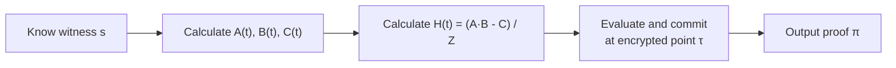
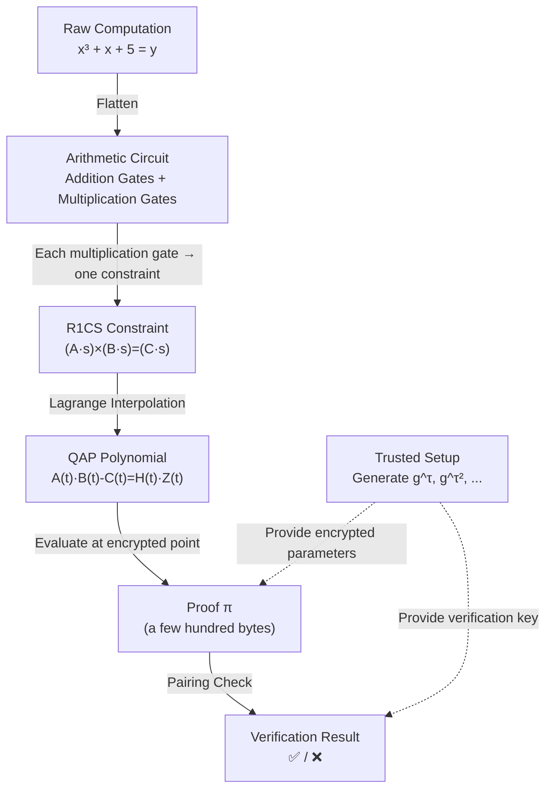

---
sidebar:
  order: 4
title: "Proof Generation and Verification"
---

import { ProofPipelineDemo } from '../../../../../src/components/Interactive';

# 10.4 Proof Generation and Verification

## Interactive Demo

Click play to see how data step-by-step transforms from raw computation into a succinct zero-knowledge proof!

<ProofPipelineDemo client:only="react" />

---

## 这一章到底要解决什么问题？

前面我们已经走到这里：

- 电路 → 变成 R1CS
- R1CS → 变成 QAP
- QAP → 变成一个“多项式关系是否成立”的问题

现在还差最后一步：

> **证明者怎么把“我知道正确答案”变成一份很短的证明？**
> **验证者怎么在不知道秘密输入的情况下，快速确认这份证明是真的？**

这就是这一章要讲的内容。

---

## 先用一句话讲完整个流程

你可以把 zk-SNARK 想成下面这个故事：

1. **证明者（Prover）** 手里真的有完整答案
2. 他把完整答案加工成一份**很短的证明**
3. **验证者（Verifier）** 不看完整答案
4. 只检查这份短证明有没有满足几个固定规则
5. 如果满足，就相信“你真的算对了”

所以重点不是“把答案给别人看”，而是：

> **把“我真的知道答案”压缩成一个别人能快速检查的小证明。**

:::info 小学生类比
像数学老师让你做 100 道题：
- **普通做法**：把 100 道题的过程都交上去
- **zk-SNARK 做法**：你交一张“魔法证明卡”
- 老师不用逐题看，也能高概率确认你真的都做对了
:::

---

## 三个角色先分清

### 1. Prover（证明者）

他知道完整的 witness，也就是所有中间值、秘密输入、最终输出。

比如：
- 知道秘密 $x=3$
- 知道 $x^2=9$
- 知道 $x^3=27$
- 知道最后输出 $y=35$

### 2. Verifier（验证者）

他**不知道秘密输入**，但他知道：
- 电路长什么样
- 公开输入是什么
- 公开输出应该是什么
- 验证规则是什么

### 3. Setup（初始化阶段）

它提前生成一批“特殊参数”，让后面的证明和验证可以进行。

你可以先把它理解成：

> **提前准备好的专用工具箱。**

---

## Prover 到底做了什么？

先看整体流程图：



用人话重新说一遍：

### 第 1 步：手里先有完整答案

证明者知道 witness $\vec{s}$。

这很关键，因为如果你连完整答案都不知道，就没法构造正确的证明。

### 第 2 步：把答案带进多项式

上一章我们学了：

$$
A(t),\; B(t),\; C(t)
$$

这些是从 R1CS 变过来的“总多项式”。

证明者把 witness 代进去，就能得到真正属于这道题的那组多项式关系。

### 第 3 步：算出“误差被谁整除”

QAP 的核心关系是：

$$
A(t) \cdot B(t) - C(t) = H(t) \cdot Z(t)
$$

如果 witness 是正确的，那么左边就一定能被 $Z(t)$ 整除。

所以证明者可以算出：

$$
H(t) = \frac{A(t) \cdot B(t) - C(t)}{Z(t)}
$$

这里的意思不是“多出来一个神秘多项式”，而是：

> **如果所有约束都真的成立，那左边一定能整除，除完以后就会得到一个正常的商多项式 $H(t)$。**

如果除不尽，说明中间一定有某条约束错了。

### 第 4 步：把这些多项式变成“加密状态下的证明”

这一步最重要，也最容易让人懵。

证明者**不会直接把** $A(t), B(t), C(t), H(t)$ 的真实值交给验证者。

他做的是：

> **在一个隐藏的点 $\tau$ 上，对这些多项式做“加密求值”。**

比如你可以先粗略理解成：
- 想知道 $A(\tau)$
- 但又不能真的告诉别人 $\tau$ 是多少
- 于是只给出一种“加密后的 $A(\tau)$”

最后产出一个很短的证明：

$$
\pi
$$

这就是 proof。

---

## 为什么 proof 可以很短？

因为 proof 不是把所有计算步骤都装进去。

它装进去的更像是：

> **“我已经在隐藏点上，把所有该满足的关系都对齐了。”**

所以它不是“完整答案文件”，而是一种“压缩后的关系证明”。

这就是 **succinct（简洁）** 的意思。

- 电路可能有几千、几万条约束
- 但 proof 仍然只有几百字节到几 KB

:::tip 重点直觉
proof 很短，不是因为计算少了。

而是因为：
**大量计算都被压缩进了代数结构里。**
:::

---

## Verifier 到底做了什么？

验证者**不知道** witness，但可以做两件事：

1. 用公开输入恢复该恢复的部分
2. 检查 proof 是否满足那几个关键代数关系

最经典的检查会写成类似：

$$
e(\pi_A, \pi_B) = e(\pi_C, g) \cdot e(\pi_H, \pi_Z)
$$

这个式子看起来很吓人，但你现在不用记细节。

你只要知道它在干嘛：

> **它是在检查：证明者交上来的那些“加密后的值”，是否仍然满足原来的乘法关系。**

换句话说：
- 明文世界里，我们要检查：

$$
A(\tau) \cdot B(\tau) = C(\tau) + H(\tau) \cdot Z(\tau)
$$

- 加密世界里，验证者不能直接看到这些数
- 所以要借助 pairing，在**看不到明文的情况下**检查这个乘法关系

验证者真正厉害的地方在于：

> **他不用知道 witness，也不用知道 $\tau$，却仍然可以检查关系对不对。**

---

## Trusted Setup 是什么？

Trusted setup 会先生成一批特殊参数，供后续所有人使用。

```text
Setup Phase:
1. Choose a random secret τ ("toxic waste")
2. Calculate g^τ, g^(τ²), g^(τ³), ... and make them public
3. Destroy τ
```

先翻译成人话：

### 第 1 步：偷偷选一个随机数 $\tau$

这个 $\tau$ 非常关键。

它像考试答案本身对应的“隐藏考点”。
任何人都不能知道它。

### 第 2 步：公布和 $\tau$ 有关的“加密参数”

比如：

$$
g^\tau,\; g^{\tau^2},\; g^{\tau^3}, \dots
$$

这些值会被公开。

为什么公开这些不会泄露 $\tau$？

因为椭圆曲线上的离散对数问题很难：

> 已知 $g^\tau$，很难反推出 $\tau$。

### 第 3 步：彻底销毁 $\tau$

这一步是 trusted setup 的灵魂。

因为如果有人偷偷保留了 $\tau$，那他就能伪造证明。

所以 $\tau$ 也被叫做：

> **toxic waste（有毒废料）**

意思是：生成完参数以后，必须彻底销毁，不能留着。

:::warning Risks of Trusted Setup
If $\tau$ is not truly destroyed, anyone who knows $\tau$ can forge proofs. This is why Zcash's Powers of Tau ceremony requires many participants: as long as at least one participant honestly destroys their contribution, the setup remains secure.
:::

---

## 为什么 setup 给的参数能帮助 Prover？

关键点在于：

证明者虽然不知道 $\tau$，但他拿到了：

$$
g^\tau, g^{\tau^2}, g^{\tau^3}, \dots
$$

所以他可以把一个多项式：

$$
P(t)=a_0 + a_1 t + a_2 t^2 + \cdots
$$

变成：

$$
g^{P(\tau)}
$$

而且**不需要知道 $\tau$ 本身**。

你可以把它理解成：

> setup 已经把“在隐藏点求值”这件事，预先做成了一个工具箱。

证明者拿着这个工具箱，就能把自己的多项式转换成“隐藏点上的加密结果”。

---

## Pairing 为什么这么神奇？

pairing 的核心性质是：

$$
e(aG, bG) = e(G, G)^{ab}
$$

这句话如果直接看，还是会头大。

先只看它表达的能力：

> **它能把“两个隐藏数的乘法关系”变成“一个可以公开检查的关系”。**

这就是 pairing 最宝贵的地方。

### 没有 pairing 的世界

如果我们想检查：

$$
A(\tau) \times B(\tau) = C(\tau) + H(\tau) \times Z(\tau)
$$

那你就得真的知道：
- $\tau$ 是多少
- $A(\tau)$ 是多少
- $B(\tau)$ 是多少

这显然不安全。

### 有 pairing 的世界

我们可以只检查加密形式：

```text
e(g^A(τ), g^B(τ)) = e(g^C(τ), g) · e(g^H(τ), g^Z(τ))
```

这样做的好处是：
- 不用暴露 $\tau$
- 不用暴露 witness
- 仍然可以验证乘法关系是否成立

:::info 小学生类比
pairing 像一种“魔法秤”：
- 你不能打开两个盒子看里面的数
- 但你可以把两个盒子放上去
- 魔法秤会告诉你：它们之间的乘法关系对不对
:::

---

## Complete Pipeline Overview



### 把这张图翻译成人话

1. **原始计算**：你本来只是在算一道题
2. **电路化**：把这道题拆成加法门、乘法门
3. **R1CS 化**：把每次乘法写成检查单
4. **QAP 化**：把所有检查单压缩成一个多项式关系
5. **Proof 化**：在隐藏点上把这个关系打包成短证明
6. **Verification**：验证者用 pairing 快速检查这个短证明

---

## Mapping to Circom / snarkjs Toolchain

| Pipeline Step | Mathematical Object | Circom/snarkjs Tool |
|---|---|---|
| Write computation logic | Arithmetic Circuit | `circom` write `.circom` file |
| Compile circuit | R1CS | `circom --r1cs` generate `.r1cs` file |
| Calculate witness | Witness vector $\vec{s}$ | `circom --wasm` + `snarkjs wtns calculate` |
| Trusted setup | $g^{\tau^i}$ etc. parameters | `snarkjs groth16 setup` generate `.zkey` |
| Generate proof | QAP → $\pi$ | `snarkjs groth16 prove` |
| Verify | Pairing check | `snarkjs groth16 verify` |
| On-chain verification | Solidity contract | `snarkjs zkey export solidityverifier` |

### 这张表怎么理解？

可以把它看成“数学世界”和“工程世界”的对照表：

- 数学里我们说 witness、QAP、pairing
- 工程里你真正敲的是 `circom`、`snarkjs prove`、`snarkjs verify`

所以工具链并不是另一个世界。
它只是把前面那些数学对象落地成命令行步骤。

---

## Full Command Line Example

```bash
# 1. Compile circuit → get R1CS and WASM
circom circuit.circom --r1cs --wasm --sym

# 2. View circuit info
snarkjs r1cs info circuit.r1cs
# Constraints: 3 (corresponding to our 3 constraints)

# 3. Trusted setup (using Powers of Tau)
snarkjs groth16 setup circuit.r1cs pot12_final.ptau circuit.zkey

# 4. Provide input, calculate witness
echo '{"x": 3}' > input.json
snarkjs wtns calculate circuit.wasm input.json witness.wtns

# 5. Generate proof
snarkjs groth16 prove circuit.zkey witness.wtns proof.json public.json
# proof.json  → proof π
# public.json → public output [35]

# 6. Verify
snarkjs groth16 verify verification_key.json public.json proof.json
# → snarkjs: OK!
```

### 把命令行步骤翻译成人话

- `circom --r1cs --wasm`：把电路编译出来
- `groth16 setup`：准备 trusted setup 参数
- `wtns calculate`：把具体输入代进去，算出完整 witness
- `groth16 prove`：根据 witness 生成 proof
- `groth16 verify`：验证这份 proof 是否可信

所以从工程角度看，整个流程其实很清楚：

> **编译电路 → 准备参数 → 算 witness → 生成 proof → 验证 proof**

---

## 三句话记住 Proof Generation and Verification

1. **Prover 知道完整 witness，所以能构造正确 proof。**
2. **Trusted setup 提供隐藏点 $\tau$ 的加密参数，但不暴露 $\tau$。**
3. **Verifier 用 pairing 检查加密状态下的关系，所以不用知道秘密输入也能验证。**

---

## 最后的总类比

- **Witness**：完整答题纸
- **Proof**：压缩后的“我真的做对了”证明卡
- **Trusted setup**：提前做好的专用工具箱
- **Pairing**：能检查“隐藏乘法关系”的魔法秤
- **Verifier**：不用看答题过程，也能确认你没作弊

如果你把这五个角色分清，这一章就真正懂了。

---

Next section: [Thinking Questions and Exercises](./exercises)
