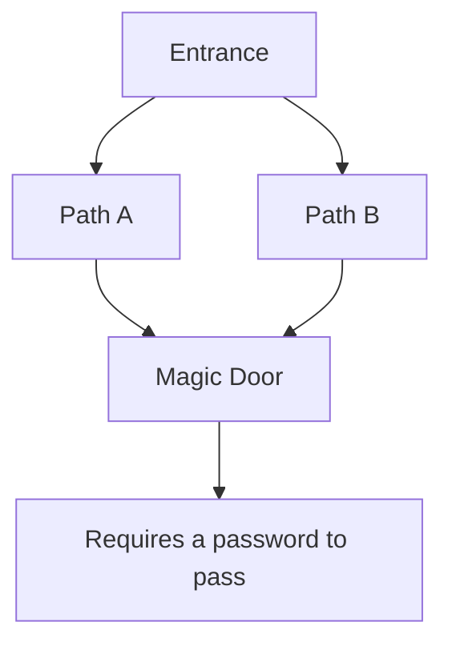
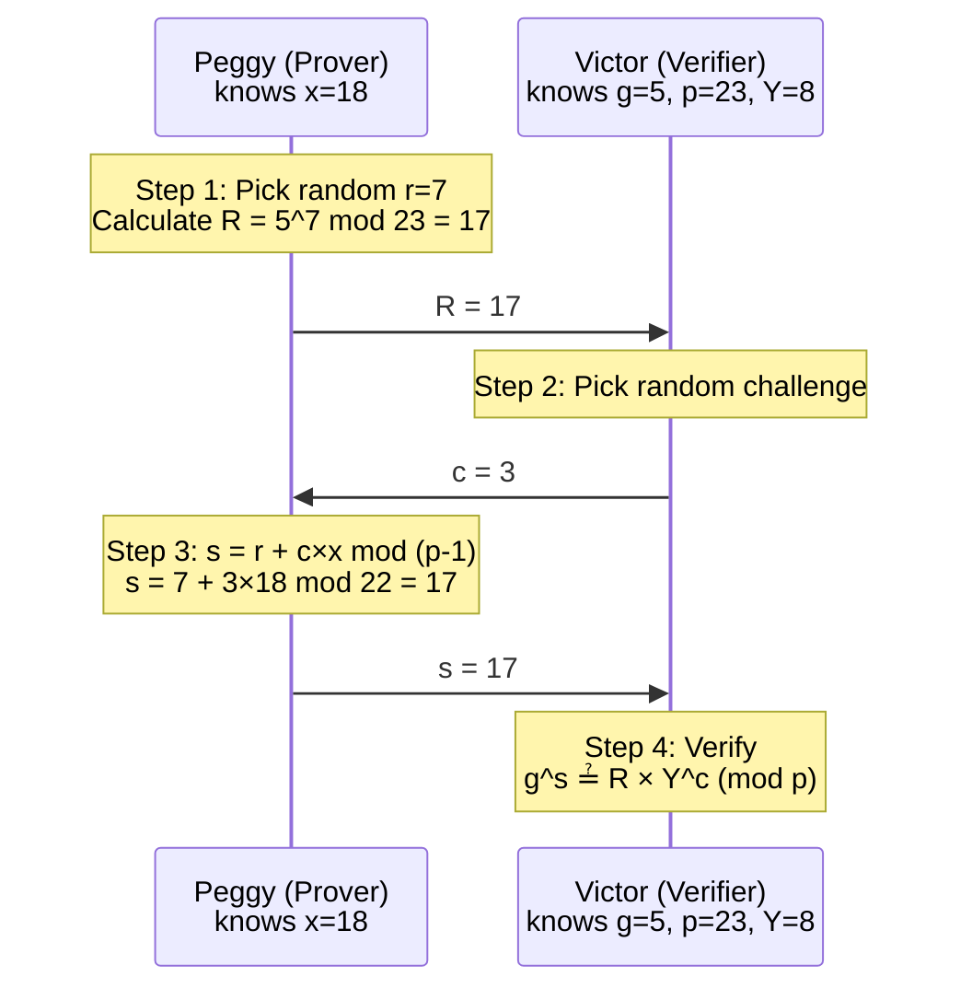
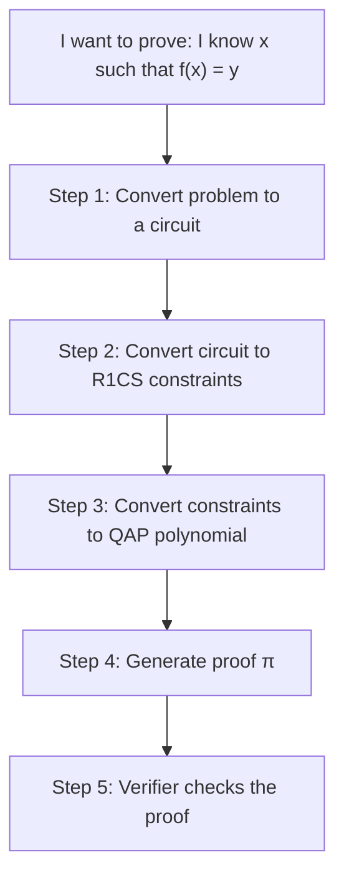
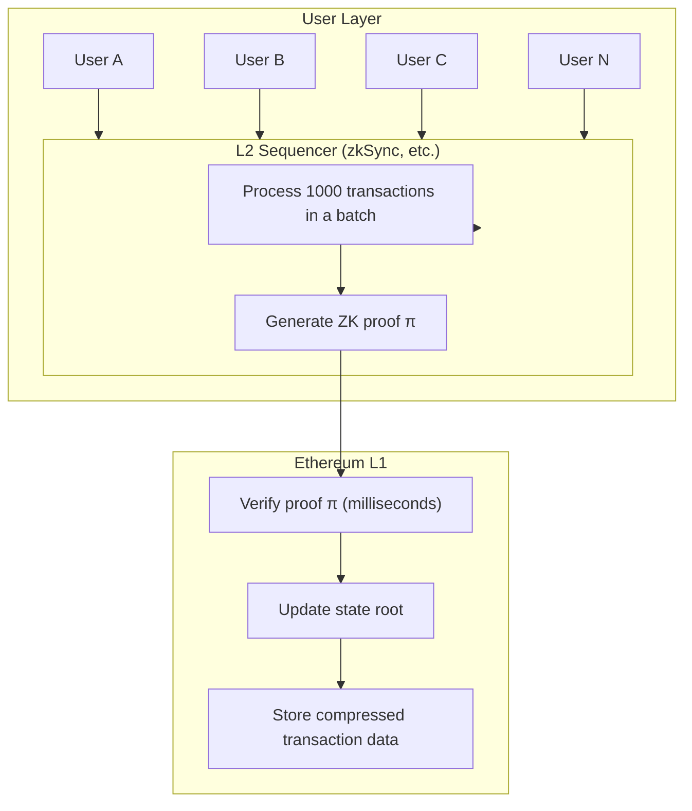

import ZKProofDemo from '@site/src/components/Interactive/ZKProofDemo';

# Chapter 9: Introduction to Zero-Knowledge Proofs

## 🎮 Interactive Demo

Try it out first to experience the magic of zero-knowledge proofs!

<ZKProofDemo client:only="react" />

---

Zero-Knowledge Proof (ZKP) is one of the most fascinating concepts in cryptography: **a prover can convince a verifier that a statement is true without revealing any additional information**. This chapter uses intuitive examples to help you understand this seemingly contradictory concept.

## 9.1 What is a Zero-Knowledge Proof?

### ZKP in Everyday Life

Before the formal definition, let's look at some real-world examples:

**Example 1: Proving You Are Over 18**

```
Traditional way:
You: Show me your ID.
Me: (Hands over ID, exposing birthday, address, ID number...)

Zero-knowledge way:
You: Are you over 18?
Me: Yes. (Proven through a mechanism where you only know "Yes" and not my specific age.)
```

**Example 2: Proving You Know a Password**

```
Traditional way:
The server stores your password; you send it during verification.
→ The password could be leaked during transmission or storage.

Zero-knowledge way:
You prove "I know the correct password," but the password itself is never sent.
→ Even if the server is hacked, the password remains safe.
```

### The Classic Metaphor: Ali Baba's Cave

This is the most famous story used to explain zero-knowledge proofs:



**Scenario Setup:**
- Peggy (Prover) claims to know the password to open the magic door.
- Victor (Verifier) wants to confirm if Peggy really knows it.
- Peggy doesn't want to tell Victor the password.

**Protocol Steps:**

```
Round 1:
1. Victor waits at the entrance, unable to see inside the cave.
2. Peggy enters the cave and randomly chooses Path A or Path B (suppose she picks A).
3. Victor walks to the entrance and randomly shouts "Come out from A" or "Come out from B."

Analysis:
- If Victor shouts "Come out from A":
  → Peggy comes out directly (she happened to choose correctly).

- If Victor shouts "Come out from B":
  → Peggy must pass through the magic door using the password.
  → If she doesn't know the password, she can't come out from B!
```

**Repeating Multiple Times:**

```
Round    Peggy knows password    Peggy doesn't know password
1        100% Success            50% Success (by guessing)
2        100% Success            25% Success
3        100% Success            12.5% Success
...
20       100% Success            0.0001% Success
```

After 20 rounds, if Peggy succeeds every time, Victor is 99.9999% certain she knows the password.

**Key Point: Victor learned that "Peggy knows the password," but he didn't learn the password itself!**

### Three Core Properties

| Property | Description | In the Cave Example |
|------|------|------------|
| **Completeness** | If the statement is true, an honest verifier will be convinced. | If Peggy knows the password, she can eventually prove it. |
| **Soundness** | If the statement is false, a cheater cannot convince the verifier. | Someone who doesn't know the password cannot fool Victor for 20 rounds. |
| **Zero-Knowledge** | The verifier only learns that the statement is "true" and nothing else. | Victor doesn't learn what the password is. |

## 9.2 Zero-Knowledge Proofs in Mathematics

### Problem: Proving You Know a Discrete Logarithm

```
Public Information:
- Prime p = 23
- Generator g = 5
- Public value Y = 8

Problem: Prove you know x such that Y = g^x (mod p)
      i.e., 8 = 5^x (mod 23)

(In reality, x = 18, because 5^18 mod 23 = 8)
```

### Schnorr Identification Protocol

This is a real zero-knowledge proof protocol:



### Full Hand-calculation Example (Using Smaller Numbers)

Let's use simpler numbers:

```
Parameters:
- p = 11 (prime)
- g = 2 (generator)
- x = 3 (private key, known only to Peggy)
- Y = g^x mod p = 2^3 mod 11 = 8 (public)
```

**Step 1: Peggy Generates a Commitment**

```
Peggy chooses a random number r = 5
Calculates R = g^r mod p = 2^5 mod 11 = 32 mod 11 = 10

Sends R = 10 to Victor
```

**Step 2: Victor Sends a Challenge**

```
Victor chooses a random challenge c = 2
Sends c = 2 to Peggy
```

**Step 3: Peggy Calculates a Response**

```
s = r + c×x mod (p-1)
s = 5 + 2×3 mod 10
s = 11 mod 10
s = 1

Sends s = 1 to Victor
```

**Step 4: Victor Verifies**

**Simple Explanation: Why compare these?**

Remember three things:
- Peggy's secret is x; public info is Y = g^x (mod p).
- Peggy's commitment is R = g^r (mod p).
- Peggy's answer is s = r + c×x.

Substitute s:

```
g^s = g^(r + c×x)
    = g^r × g^(c×x)
    = R × (g^x)^c
    = R × Y^c
```

So **if Peggy really knows x**, the equation must hold.  
Conversely, if she doesn't know x, it's very hard to make both sides equal.

```
Verification equation: g^s ≟ R × Y^c (mod p)

Left side: g^s = 2^1 mod 11 = 2
Right side: R × Y^c = 10 × 8^2 mod 11
                    = 10 × 64 mod 11
                    = 10 × 9 mod 11  (since 64 mod 11 = 9)
                    = 90 mod 11
                    = 2

Left = Right = 2  ✓ Verification passed!
```

### Why is this Zero-Knowledge?

```
Victor sees: R = 10, c = 2, s = 1

Key question: Can Victor derive x from these values?

Answer: No! Because:
1. R is random.
2. s = r + c×x, but Victor doesn't know r.
3. One equation with two unknowns (r and x) cannot be solved.

Furthermore, Victor could "forge" a set of (R, c, s) himself:
- Pick s and c first.
- Calculate R = g^s / Y^c.
- The resulting (R, c, s) looks identical to a real one.

This means Victor gained no new information from the interaction!
```

## 9.3 zk-SNARKs: Making Zero-Knowledge Proofs Practical

### Interactive vs Non-interactive

```
Interactive (Schnorr):
Peggy ←→ Victor requires multiple rounds of communication.

Non-interactive (SNARK):
Peggy generates a proof π.
Victor can verify it at any time without Peggy being online.
```

### What is a zk-SNARK?

```
zk-SNARK = Zero-Knowledge Succinct Non-interactive ARgument of Knowledge

Breakdown:
- Zero-Knowledge: No extra information leaked.
- Succinct: Small proof (a few hundred bytes), fast verification (milliseconds).
- Non-interactive: No back-and-forth communication needed.
- ARgument: Computationally secure (not information-theoretically secure).
- of Knowledge: The prover actually "knows" the secret.
```

### Application Scenarios

| Project | Use Case | Benefit |
|------|------|------|
| Zcash | Private Transactions | Hides sender, receiver, and amount. |
| zkSync | L2 Scaling | Off-chain execution, on-chain verification. |
| Tornado Cash | Mixing | Untraceable source of funds. |
| Dark Forest | Gaming | Hides player positions. |

### Workflow Overview



## 9.4 Writing Your First ZKP with Circom

### Simple Example: Proving You Know the Product of Two Numbers

```
Problem: Prove you know a and b such that a × b = c.
(Public c, without exposing a and b.)
```

**Circom Code:**

```javascript
pragma circom 2.0.0;

template Multiplier() {
    // Private inputs (known only to the prover)
    signal input a;
    signal input b;
    
    // Public output (visible to everyone)
    signal output c;
    
    // Constraint: c must equal a × b
    c <== a * b;
}

component main = Multiplier();
```

**Usage Flow:**

```
1. Compile the circuit:
   circom multiplier.circom --r1cs --wasm

2. Trusted setup (generate proof keys):
   snarkjs groth16 setup multiplier.r1cs pot12_final.ptau circuit_final.zkey

3. Generate proof:
   Input: { "a": 3, "b": 7 }
   Output: c = 21, plus proof π

4. Verify:
   Anyone can verify: "There exist some a, b such that a × b = 21."
   But they don't know a=3, b=7.
```

### Slightly More Complex Example: Proving You Know a Hash Preimage

```javascript
pragma circom 2.0.0;

include "circomlib/poseidon.circom";

template HashPreimage() {
    // Private input: secret value
    signal input secret;
    
    // Public input: hash value
    signal input hash;
    
    // Calculate hash
    component hasher = Poseidon(1);
    hasher.inputs[0] <== secret;
    
    // Constraint: calculated hash must equal the public hash
    hash === hasher.out;
}

component main {public [hash]} = HashPreimage();
```

**Use Case:**
- You can prove "I know a secret whose hash is X."
- Without revealing the secret.
- This is the core principle of Tornado Cash!

## 9.5 zk-STARKs: Trustless Zero-Knowledge Proofs

### The Problem with SNARKs

```
zk-SNARKs require a "Trusted Setup."

During the setup phase, "toxic waste" data is generated.
If someone keeps this data, they can forge proofs!

Solution 1: Multi-Party Computation (MPC)
- Many people participate in the setup.
- As long as one person honestly destroys their share, it's safe.
- Zcash's Powers of Tau ceremony had thousands of participants.

Solution 2: Use STARKs.
```

### zk-STARKs

```
zk-STARK = Zero-Knowledge Scalable Transparent ARgument of Knowledge

- Scalable: Proof generation time is quasi-linear.
- Transparent: No trusted setup required! Completely transparent.
```

### STARKs vs SNARKs

| Feature | zk-SNARKs | zk-STARKs |
|------|-----------|-----------|
| Trusted Setup | **Required** | Not Required |
| Proof Size | ~200 B | ~100 KB |
| Verification Time | Fastest | Fast |
| Proof Time | Fast | Slower |
| Quantum Resistant | No | **Yes** |
| Projects | Zcash, zkSync Era | StarkNet, zkSync Lite |

### StarkNet's Cairo Language

```python
# Cairo Example: Proving Fibonacci calculation
func fibonacci(n) -> (result: felt):
    if n == 0:
        return (0)
    end
    if n == 1:
        return (1)
    end
    
    let (a) = fibonacci(n - 1)
    let (b) = fibonacci(n - 2)
    return (a + b)
end

@external
func main():
    let (result) = fibonacci(10)
    assert result = 55  # Verify fib(10) = 55
    return ()
end
```

## 9.6 zkRollup: The Killer App of Zero-Knowledge Proofs

### The Scaling Problem

```
Ethereum Mainnet (L1):
- ~15 transactions per second.
- Gas fees can be several dollars per transaction.
- Too slow and too expensive!

Goal:
- More transactions.
- Lower fees.
- Without sacrificing security.
```

### How zkRollup Works



### Efficiency Comparison

```
Verifying 1000 transactions on L1:
- Verify 1000 signatures.
- Execute 1000 transfer logics.
- Gas cost: 1000 × 21,000 = 21 million Gas.

Verifying 1000 transactions on zkRollup:
- Verify 1 ZK proof.
- Update 1 state root.
- Gas cost: ~500,000 Gas.

Saved 97%+ of the cost!
```

## 9.7 Simple Python Zero-Knowledge Proof

Let's implement a simplified version of the Schnorr ZKP:

```python
import random
import hashlib

def zkp_demo():
    """Simplified Schnorr Zero-Knowledge Proof Demo"""
    
    # ========== Public Parameters ==========
    p = 23      # Prime
    g = 5       # Generator
    
    print("=== ZKP: Proving I Know a Discrete Logarithm ===")
    print(f"Public Parameters: p = {p}, g = {g}")
    
    # ========== Peggy's Secret ==========
    x = 7  # Private key (known only to Peggy)
    Y = pow(g, x, p)  # Public key
    print(f"\nPublic Value Y = g^x mod p = {Y}")
    print(f"Peggy knows x = {x} (kept secret)")
    
    # ========== Protocol Starts ==========
    print("\n--- Protocol Starts ---")
    
    # Step 1: Peggy generates a commitment
    r = random.randint(1, p - 2)  # Random number
    R = pow(g, r, p)
    print(f"\n[Peggy] Chooses random r = {r}")
    print(f"[Peggy] Calculates commitment R = g^r = {g}^{r} mod {p} = {R}")
    print(f"[Peggy] Sends R = {R}")
    
    # Step 2: Victor sends a challenge
    c = random.randint(1, p - 2)
    print(f"\n[Victor] Sends random challenge c = {c}")
    
    # Step 3: Peggy calculates a response
    s = (r + c * x) % (p - 1)
    print(f"\n[Peggy] Calculates response s = r + c×x mod (p-1)")
    print(f"[Peggy] s = {r} + {c}×{x} mod {p - 1} = {s}")
    print(f"[Peggy] Sends s = {s}")
    
    # Step 4: Victor verifies
    left = pow(g, s, p)
    right = (R * pow(Y, c, p)) % p
    
    print(f"\n[Victor] Verifies g^s ≟ R × Y^c (mod p)")
    print(f"[Victor] Left side: g^s = {g}^{s} mod {p} = {left}")
    print(f"[Victor] Right side: R × Y^c = {R} × {Y}^{c} mod {p} = {right}")
    
    if left == right:
        print(f"\n✓ Verification passed! Victor believes Peggy knows x.")
    else:
        print(f"\n✗ Verification failed!")
    
    # ========== Why is it Zero-Knowledge? ==========
    print("\n--- Why is it Zero-Knowledge? ---")
    print("Victor only saw: R, c, s")
    print("Victor cannot derive x from these values because:")
    print("- s = r + c×x, but Victor doesn't know r.")
    print("- One equation with two unknowns cannot be solved.")
    
    return left == right

# Run multiple rounds to increase confidence
def run_multiple_rounds(rounds=5):
    """Run multiple rounds of the proof"""
    print(f"\n{'='*50}")
    print(f"Running {rounds} rounds of proof")
    print(f"{'='*50}")
    
    success = 0
    for i in range(rounds):
        print(f"\nRound {i+1}: ", end="")
        # Simplified multi-round
        p, g, x = 23, 5, 7
        Y = pow(g, x, p)
        r = random.randint(1, p - 2)
        R = pow(g, r, p)
        c = random.randint(1, p - 2)
        s = (r + c * x) % (p - 1)
        
        if pow(g, s, p) == (R * pow(Y, c, p)) % p:
            print("✓ Passed")
            success += 1
        else:
            print("✗ Failed")
    
    print(f"\nResult: {success}/{rounds} rounds passed")
    print(f"Probability of a cheater succeeding: 1/{2**rounds} = {1/2**rounds:.6%}")

if __name__ == "__main__":
    zkp_demo()
    run_multiple_rounds()
```

Example Output:

```
=== ZKP: Proving I Know a Discrete Logarithm ===
Public Parameters: p = 23, g = 5

Public Value Y = g^x mod p = 17
Peggy knows x = 7 (kept secret)

--- Protocol Starts ---

[Peggy] Chooses random r = 15
[Peggy] Calculates commitment R = g^r = 5^15 mod 23 = 19
[Peggy] Sends R = 19

[Victor] Sends random challenge c = 8

[Peggy] Calculates response s = r + c×x mod (p-1)
[Peggy] s = 15 + 8×7 mod 22 = 5
[Peggy] Sends s = 5

[Victor] Verifies g^s ≟ R × Y^c (mod p)
[Victor] Left side: g^s = 5^5 mod 23 = 20
[Victor] Right side: R × Y^c = 19 × 17^8 mod 23 = 20

✓ Verification passed! Victor believes Peggy knows x.
```

## 9.8 Signatures are also Zero-Knowledge Proofs

You might not realize that the digital signatures you use every day (Schnorr, ECDSA) are essentially **zero-knowledge proofs**!

### What Does a Signature Prove?

When you sign a message $m$, you are actually proving:
**"I know the private key $x$ that corresponds to the public key $Y$."**

And it satisfies the properties of a zero-knowledge proof:
1.  **Completeness**: If you have the private key, the signature verification will pass.
2.  **Soundness**: If you don't have the private key, you cannot forge a valid signature.
3.  **Zero-Knowledge**: The signature does not leak any information about the private key $x$.

### From ZKP to Signature (Fiat-Shamir Transform)

Remember the Schnorr interaction protocol above?

1. Peggy sends $R$.
2. Victor sends a random challenge $c$.
3. Peggy sends $s$.

To turn this into a **non-interactive signature**, Peggy doesn't wait for Victor's challenge. Instead, she generates the challenge herself:

$$c = Hash(R, m)$$

Thus, the signature is $(R, s)$. The verifier calculates $c = Hash(R, m)$ themselves and then verifies $g^s = R \cdot Y^c$.

This is the **Schnorr Signature**!

### The ZKP Essence of Various Signatures

| Protocol | Knowledge Proven | Form |
|---|---|---|
| **Schnorr Authentication** | I know the discrete logarithm $x$. | Interactive ZKP |
| **Schnorr Signature** | I know the discrete logarithm $x$ (bound to message $m$). | Non-interactive ZKP |
| **ECDSA Signature** | I know the discrete logarithm $x$. | Non-interactive ZKP (variant) |

:::info Deep Insight
**Digital Signature = Non-Interactive Zero-Knowledge Proof (NIZK)**
By setting the "challenge" $c$ to the hash of the message $H(m)$, the proof is bound to a specific message, turning it into a signature for that message.
:::

## Summary

| Concept | Key Points |
|------|------|
| **Zero-Knowledge Proof** | Prove something is true without leaking extra information. |
| **Three Properties** | Completeness, Soundness, Zero-Knowledge. |
| **Interactive ZKP** | Schnorr protocol, requires multiple rounds of communication. |
| **zk-SNARKs** | Small proofs, fast verification, requires trusted setup. |
| **zk-STARKs** | Large proofs, no trusted setup required, quantum resistant. |
| **zkRollup** | Uses ZKP to achieve L2 scaling. |

## Thinking Questions

1. In the Ali Baba's cave example, why repeat multiple rounds? Can one round prove it?
2. Why can zero-knowledge proofs hide information while remaining verifiable?
3. How does zkRollup achieve both scaling and security?

## Exercises

### Hand-calculation Exercise

Use parameters: p = 11, g = 2, x = 4.

1. Calculate the public value Y = g^x mod p.
2. Suppose Peggy chooses r = 6; calculate the commitment R.
3. Suppose Victor challenges with c = 3; calculate the response s.
4. Verify the equation g^s = R × Y^c (mod p).

---

Next Chapter: [Deep Dive into Zero-Knowledge Proofs — From Circuits to Proofs](/docs/cryptography/zkp-deep-dive/arithmetic-circuits)
