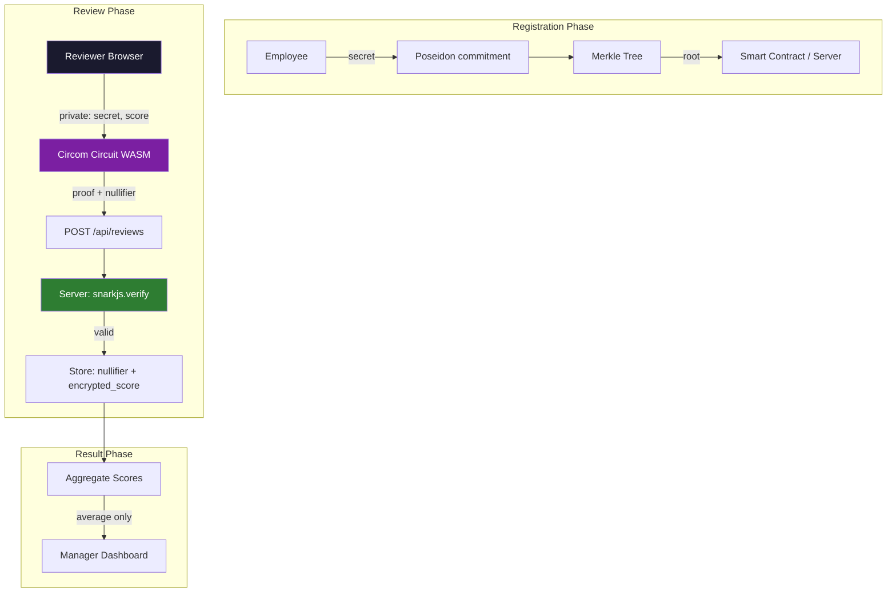
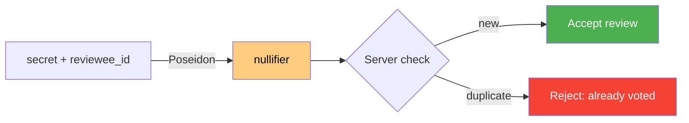
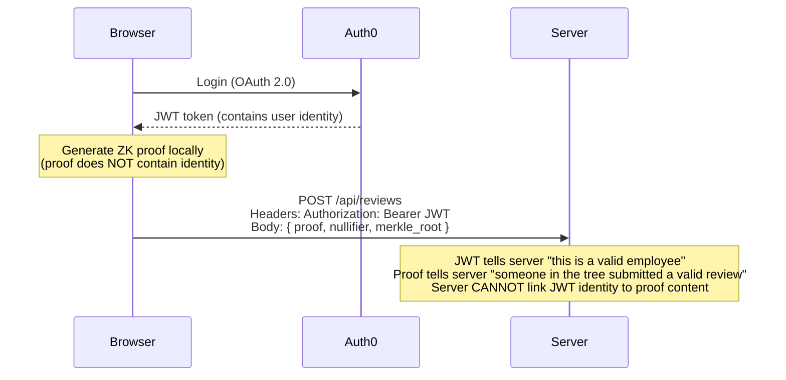
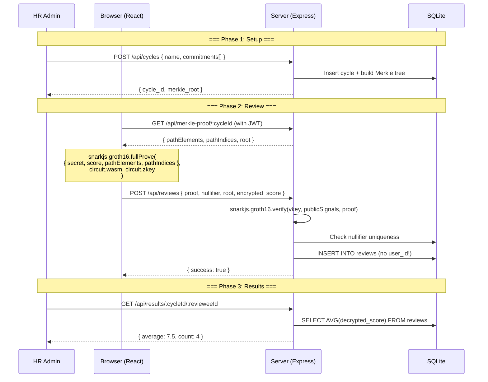
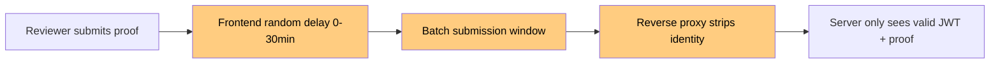
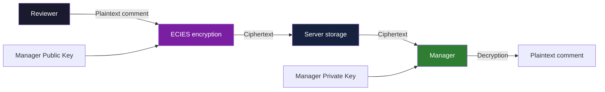
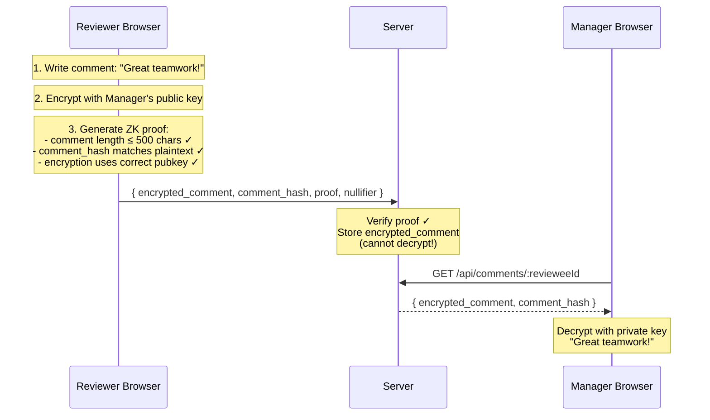
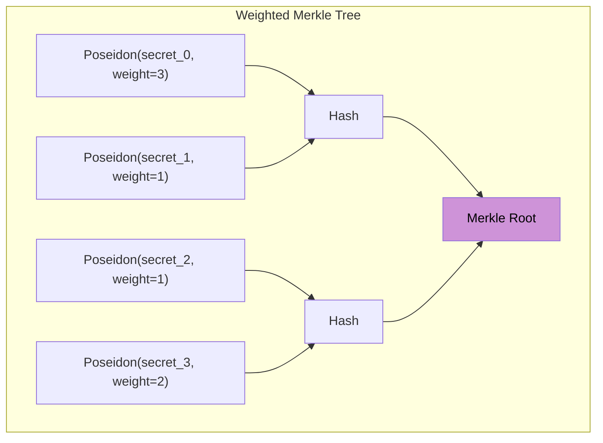
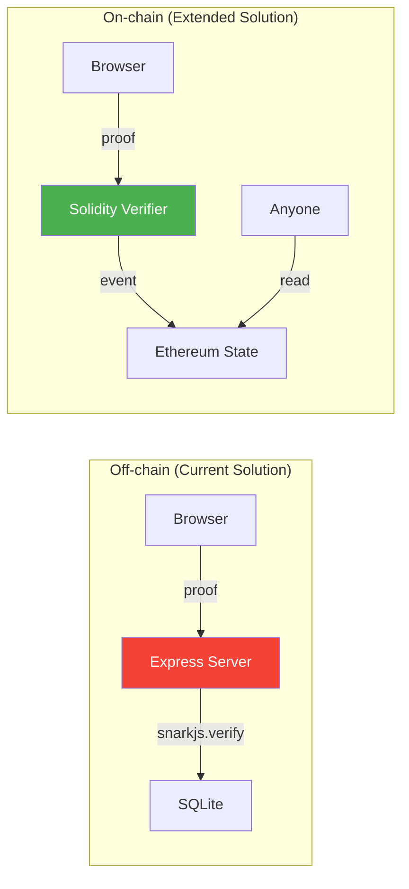

---
sidebar:
  order: 1
title: ZKP Anonymous 360-Degree Review System
---

import { ZKP360ReviewDemo } from '../../../../src/components/Interactive';

# Graduation Project: ZKP Anonymous 360-Degree Review System

## Interactive Demo

Before you start learning, experience how the complete system works through this interactive demo:

<ZKP360ReviewDemo client:only="react" />

---

## 1. Project Background

### 1.1 Trust Issues in 360 Reviews

360-degree review is a common performance evaluation method in corporate management. Superiors, colleagues, and subordinates provide anonymous scores for an individual from different perspectives. However, a core conflict exists in practice:

> **The HR system records "who gave what score to whom." Employees fear HR might leak their scores to superiors, so they hesitate to give honest feedback.**

Dilemmas of traditional solutions:

| Solution | Problem |
|------|------|
| Anonymous Questionnaire | HR can still see individual scores in the backend |
| Third-party Platform | Requires trusting the third party not to leak data |
| Paper Anonymity | Cannot prevent HR from identifying handwriting |
| No Records at All | Cannot verify who voted or prevent double voting |

### 1.2 How ZKP Solves This

Zero-Knowledge Proofs provide an elegant solution by **completely decoupling identity verification from the scoring behavior**.

The reviewer proves:
1. "I am a legitimate reviewer" (present in the Merkle tree)
2. "My score is within the legal range" (1-10 points)
3. "I have not voted twice" (unique nullifier)

But **without revealing**:
- Who I am
- What score I gave
- What my private key is

### 1.3 System Architecture Overview



---

## 2. Core Protocol Design

### 2.1 Poseidon Commitment Scheme

We chose the Poseidon hash function to build the commitment scheme. Poseidon is a hash function specifically designed for ZK circuits. Its constraint count is much lower than SHA256.

**Commitment Generation:**

$$
\text{commitment} = \text{Poseidon}(\text{secret})
$$

Here, $\text{secret}$ is the reviewer's private random number, similar to a private key.

**Properties:**
- **Hiding**: Given the commitment, it is impossible to reverse-engineer the secret.
- **Binding**: Different secrets generate different commitments (collision probability is negligible).

### 2.2 Merkle Membership Proof

> For basic knowledge about Merkle trees, please refer to the [Merkle Trees and SPV Verification](/docs/cryptography/merkle) chapter.

All reviewers' commitments form the leaf nodes of a Merkle tree. Reviewers use a Merkle proof to show their commitment is in the tree without exposing which leaf node it is.

$$
\text{root} = \text{MerkleRoot}([\text{commitment}_0, \text{commitment}_1, ..., \text{commitment}_{n-1}])
$$

Verification path:

$$
\text{Verify}(\text{leaf}, \text{path}, \text{root}) \rightarrow \{0, 1\}
$$

### 2.3 Nullifier for Double Voting Prevention

The nullifier is the core mechanism to prevent duplicate voting:

$$
\text{nullifier} = \text{Poseidon}(\text{secret}, \text{reviewee\_id})
$$

**Key Design:**
- The same secret + same reviewee_id always produces the same nullifier.
- The server stores used nullifiers and rejects duplicate submissions.
- Different reviewee_ids produce different nullifiers, so reviews for different people do not affect each other.
- It is impossible to reverse-engineer the secret from the nullifier (Poseidon's one-way property).



---

## 3. Circom Circuit Details

The project's circuit consists of three parts. The total constraint count is about **2870**. Proof generation takes 5-10 seconds in modern browsers.

### 3.1 range_check.circom: Range Constraints

Ensures the score is within the 1-10 range through binary decomposition:

```circom title="circuits/range_check.circom"
pragma circom 2.1.6;

// Check that `in` is in range [1, max_value]
// Uses binary decomposition to constrain the value
template RangeCheck(n_bits) {
    signal input in;
    signal input max_value;
    signal output out;

    // Binary decomposition
    signal bits[n_bits];
    var sum = 0;
    for (var i = 0; i < n_bits; i++) {
        bits[i] <-- (in >> i) & 1;
        bits[i] * (bits[i] - 1) === 0;  // Each bit is 0 or 1
        sum += bits[i] * (1 << i);
    }
    sum === in;  // Reconstruction matches input

    // Check: in >= 1
    signal in_minus_1;
    in_minus_1 <== in - 1;

    // Binary decomposition of (in - 1) proves in >= 1
    signal lower_bits[n_bits];
    var lower_sum = 0;
    for (var i = 0; i < n_bits; i++) {
        lower_bits[i] <-- (in_minus_1 >> i) & 1;
        lower_bits[i] * (lower_bits[i] - 1) === 0;
        lower_sum += lower_bits[i] * (1 << i);
    }
    lower_sum === in_minus_1;

    // Check: in <= max_value
    signal diff;
    diff <== max_value - in;

    signal upper_bits[n_bits];
    var upper_sum = 0;
    for (var i = 0; i < n_bits; i++) {
        upper_bits[i] <-- (diff >> i) & 1;
        upper_bits[i] * (upper_bits[i] - 1) === 0;
        upper_sum += upper_bits[i] * (1 << i);
    }
    upper_sum === diff;

    out <== 1;
}
```

**Constraint Analysis:**
- Each bit constraint: $b_i \times (b_i - 1) = 0$ (ensures $b_i \in \{0, 1\}$)
- Reconstruction constraint: $\sum b_i \times 2^i = \text{in}$
- 3 sets of 4-bit decomposition = **~30 constraints**

### 3.2 merkle_proof.circom: Merkle Path Verification

Merkle proof verification using Poseidon hash:

```circom title="circuits/merkle_proof.circom"
pragma circom 2.1.6;

include "node_modules/circomlib/circuits/poseidon.circom";

// Verify a Merkle proof using Poseidon hash
// depth: height of the Merkle tree
template MerkleProof(depth) {
    signal input leaf;
    signal input root;
    signal input pathElements[depth];
    signal input pathIndices[depth];  // 0 = left, 1 = right

    signal hashes[depth + 1];
    hashes[0] <== leaf;

    component hashers[depth];
    component muxes_left[depth];
    component muxes_right[depth];

    for (var i = 0; i < depth; i++) {
        // pathIndices[i] must be binary
        pathIndices[i] * (pathIndices[i] - 1) === 0;

        // Select left and right inputs based on path direction
        // If pathIndices[i] == 0: hash(current, sibling)
        // If pathIndices[i] == 1: hash(sibling, current)
        signal left;
        signal right;

        left <== hashes[i] + pathIndices[i] * (pathElements[i] - hashes[i]);
        right <== pathElements[i] + pathIndices[i] * (hashes[i] - pathElements[i]);

        hashers[i] = Poseidon(2);
        hashers[i].inputs[0] <== left;
        hashers[i].inputs[1] <== right;

        hashes[i + 1] <== hashers[i].out;
    }

    // Final hash must equal the root
    root === hashes[depth];
}
```

**Constraint Analysis:**
- Each layer: 1 Poseidon (approx. 240 constraints) + 2 muxes + 1 binary check
- Tree with depth 10 ≈ **~2500 constraints**
- Supports $2^{10} = 1024$ reviewers

### 3.3 review_proof.circom: Main Circuit

Combines all components into a complete review proof circuit:

```circom title="circuits/review_proof.circom"
pragma circom 2.1.6;

include "node_modules/circomlib/circuits/poseidon.circom";
include "./merkle_proof.circom";
include "./range_check.circom";

template ReviewProof(merkle_depth) {
    // === Private inputs (never leave the browser) ===
    signal input secret;          // Reviewer's private secret
    signal input score;           // The review score (1-10)
    signal input pathElements[merkle_depth];  // Merkle proof siblings
    signal input pathIndices[merkle_depth];   // Merkle proof directions

    // === Public inputs (sent to server for verification) ===
    signal input merkle_root;     // Published Merkle root
    signal input nullifier_hash;  // For duplicate detection
    signal input reviewee_id;     // Who is being reviewed
    signal input max_score;       // Maximum allowed score (10)

    // 1. Compute commitment from secret
    component commitment_hasher = Poseidon(1);
    commitment_hasher.inputs[0] <== secret;
    signal commitment;
    commitment <== commitment_hasher.out;

    // 2. Verify Merkle membership
    component merkle_verifier = MerkleProof(merkle_depth);
    merkle_verifier.leaf <== commitment;
    merkle_verifier.root <== merkle_root;
    for (var i = 0; i < merkle_depth; i++) {
        merkle_verifier.pathElements[i] <== pathElements[i];
        merkle_verifier.pathIndices[i] <== pathIndices[i];
    }

    // 3. Compute and verify nullifier
    component nullifier_hasher = Poseidon(2);
    nullifier_hasher.inputs[0] <== secret;
    nullifier_hasher.inputs[1] <== reviewee_id;
    nullifier_hash === nullifier_hasher.out;

    // 4. Range check on score
    component range = RangeCheck(4);  // 4 bits supports up to 15
    range.in <== score;
    range.max_value <== max_score;
}

// Instantiate with Merkle depth = 10 (supports up to 1024 reviewers)
component main { public [merkle_root, nullifier_hash, reviewee_id, max_score] }
    = ReviewProof(10);
```

**Total Constraint Analysis:**

| Component | Constraints | Description |
|------|--------|------|
| Poseidon(1) commitment | ~240 | 1 Poseidon hash |
| MerkleProof(10) | ~2500 | 10 layers of Poseidon + mux |
| Poseidon(2) nullifier | ~240 | 1 Poseidon hash |
| RangeCheck(4) | ~30 | 3 sets of binary decomposition |
| **Total** | **~2870** | 5-10s in browser |

---

## 4. Auth0 Integration Design

### 4.1 Roles and Permissions

Auth0 SSO provides three roles:

| Role | Permissions | Description |
|------|------|------|
| `employee` | Submit reviews, view own review results | All employees |
| `manager` | Employee permissions + view team aggregated results | Team leads |
| `hr_admin` | Manage review cycles, view aggregated statistics | HR administrators |

### 4.2 JWT + RBAC

The JWT token issued by Auth0 contains role information:

```json
{
  "sub": "auth0|user_id_123",
  "email": "alice@company.com",
  "https://review-app/roles": ["employee"],
  "iat": 1700000000,
  "exp": 1700086400
}
```

### 4.3 Key Design Insight

> **Auth0 authenticates HTTP requests. The ZK proof contains no identity.**

This is the most critical design point of the entire system:



**Why can't the server link identity with the score?**

1. JWT only verifies "this HTTP request comes from a legitimate employee."
2. The ZK proof only proves "the submitter is in the Merkle tree and the score is valid."
3. There is no information related to the JWT `sub` in the proof.
4. Even if HR checks server logs, they can only see "a specific employee submitted a valid proof."

### 4.4 Auth0 Configuration Steps

**Step 1: Create Auth0 Application**

Create a Single Page Application in the Auth0 Dashboard:
- Application Type: Single Page Application
- Allowed Callback URLs: `http://localhost:5173/callback`
- Allowed Logout URLs: `http://localhost:5173`
- Allowed Web Origins: `http://localhost:5173`

**Step 2: Configure RBAC**

Create API and roles:

```bash
# Auth0 Management API
# Create API
curl -X POST https://YOUR_DOMAIN.auth0.com/api/v2/resource-servers \
  -H "Authorization: Bearer MGMT_TOKEN" \
  -d '{"name": "Review API", "identifier": "https://review-api"}'

# Create roles
curl -X POST https://YOUR_DOMAIN.auth0.com/api/v2/roles \
  -d '{"name": "employee", "description": "Can submit reviews"}'
```

**Step 3: Frontend Integration**

```javascript
// auth0-config.js
import { Auth0Provider } from '@auth0/auth0-react';

const AUTH0_CONFIG = {
  domain: 'YOUR_DOMAIN.auth0.com',
  clientId: 'YOUR_CLIENT_ID',
  authorizationParams: {
    redirect_uri: window.location.origin + '/callback',
    audience: 'https://review-api',
    scope: 'openid profile email',
  },
};
```

---

## 5. System Architecture and API

### 5.1 Tech Stack

| Layer | Technology | Description |
|----|------|------|
| Frontend | Vite + React | Modern build tool |
| ZK (Browser) | snarkjs WASM | Browser-side proof generation |
| Authentication | Auth0 SPA SDK | SSO + JWT |
| Backend | Express.js | API server |
| Database | better-sqlite3 | Lightweight embedded database |
| ZK (Server) | snarkjs | Proof verification |

### 5.2 API Endpoint Design

| Method | Path | Auth | Description |
|--------|------|------|------|
| `GET` | `/api/review-cycles` | employee | Get current review cycles |
| `GET` | `/api/merkle-root/:cycleId` | employee | Get Merkle root |
| `GET` | `/api/merkle-proof/:cycleId` | employee | Get personal Merkle proof |
| `POST` | `/api/reviews` | employee | Submit anonymous review |
| `GET` | `/api/results/:cycleId/:revieweeId` | manager | Get aggregated results |
| `POST` | `/api/cycles` | hr_admin | Create review cycle |

### 5.3 Database Schema

```sql
-- Review cycles
CREATE TABLE cycles (
  id INTEGER PRIMARY KEY AUTOINCREMENT,
  name TEXT NOT NULL,
  merkle_root TEXT NOT NULL,
  status TEXT DEFAULT 'active',  -- active | closed
  created_at DATETIME DEFAULT CURRENT_TIMESTAMP
);

-- Reviewer registration (only stores commitment, no link to identity)
CREATE TABLE commitments (
  id INTEGER PRIMARY KEY AUTOINCREMENT,
  cycle_id INTEGER REFERENCES cycles(id),
  commitment TEXT NOT NULL,       -- Poseidon(secret)
  leaf_index INTEGER NOT NULL     -- Position in Merkle tree
);

-- Anonymous review records (Note: no user_id column!)
CREATE TABLE reviews (
  id INTEGER PRIMARY KEY AUTOINCREMENT,
  cycle_id INTEGER REFERENCES cycles(id),
  nullifier TEXT NOT NULL UNIQUE,  -- Double voting prevention
  merkle_root TEXT NOT NULL,       -- Merkle root at submission
  reviewee_id INTEGER NOT NULL,
  encrypted_score TEXT NOT NULL,   -- AES encrypted score
  proof TEXT NOT NULL,             -- ZK proof in JSON format
  verified BOOLEAN DEFAULT false,
  created_at DATETIME DEFAULT CURRENT_TIMESTAMP
);

-- Note: the reviews table has no user_id!
-- The server cannot know which nullifier corresponds to which person.
```

### 5.4 Complete Data Flow



---

## 6. Key Code Snippets

### 6.1 Backend: Proof Verification Middleware

```javascript title="server/middleware/verifyProof.js"
import * as snarkjs from 'snarkjs';
import fs from 'fs';

const vkey = JSON.parse(
  fs.readFileSync('./circuits/verification_key.json', 'utf8')
);

export async function verifyProof(req, res, next) {
  const { proof, nullifier, merkle_root, reviewee_id, max_score } = req.body;

  // Public signals must match the circuit's public input order
  const publicSignals = [
    merkle_root,
    nullifier,
    reviewee_id,
    max_score || '10',
  ];

  try {
    const valid = await snarkjs.groth16.verify(vkey, publicSignals, proof);

    if (!valid) {
      return res.status(400).json({ error: 'Invalid proof' });
    }

    // Check nullifier hasn't been used
    const existing = db.prepare(
      'SELECT id FROM reviews WHERE nullifier = ?'
    ).get(nullifier);

    if (existing) {
      return res.status(409).json({ error: 'Duplicate vote detected' });
    }

    next();
  } catch (err) {
    return res.status(500).json({ error: 'Proof verification failed' });
  }
}
```

### 6.2 Frontend: Browser-side Proof Generation

```javascript title="client/src/utils/generateProof.js"
import * as snarkjs from 'snarkjs';

export async function generateReviewProof({
  secret,
  score,
  revieweeId,
  merkleRoot,
  pathElements,
  pathIndices,
}) {
  // All private inputs stay in the browser
  const input = {
    // Private inputs
    secret: secret.toString(),
    score: score.toString(),
    pathElements: pathElements.map(String),
    pathIndices: pathIndices.map(String),
    // Public inputs
    merkle_root: merkleRoot,
    nullifier_hash: '0', // Will be computed by circuit
    reviewee_id: revieweeId.toString(),
    max_score: '10',
  };

  console.time('Proof generation');
  const { proof, publicSignals } = await snarkjs.groth16.fullProve(
    input,
    '/circuits/review_proof.wasm',
    '/circuits/circuit_final.zkey'
  );
  console.timeEnd('Proof generation');

  // publicSignals[1] is the nullifier computed by the circuit
  const nullifier = publicSignals[1];

  return { proof, publicSignals, nullifier };
}
```

### 6.3 Frontend: ReviewForm Component

```jsx title="client/src/components/ReviewForm.jsx"
import { useState } from 'react';
import { useAuth0 } from '@auth0/auth0-react';
import { generateReviewProof } from '../utils/generateProof';

export function ReviewForm({ cycleId, revieweeId, merkleData }) {
  const { getAccessTokenSilently } = useAuth0();
  const [score, setScore] = useState(5);
  const [status, setStatus] = useState('idle');
  const [error, setError] = useState(null);

  // secret is stored locally (e.g., localStorage or derived from password)
  const secret = localStorage.getItem(`review_secret_${cycleId}`);

  const handleSubmit = async (e) => {
    e.preventDefault();
    setStatus('proving');
    setError(null);

    try {
      // Step 1: Generate ZK proof in browser (5-10 seconds)
      const { proof, publicSignals, nullifier } = await generateReviewProof({
        secret,
        score,
        revieweeId,
        merkleRoot: merkleData.root,
        pathElements: merkleData.pathElements,
        pathIndices: merkleData.pathIndices,
      });

      setStatus('submitting');

      // Step 2: Submit proof to server
      // JWT authenticates the HTTP request
      // but proof contains NO identity information
      const token = await getAccessTokenSilently();

      const res = await fetch('/api/reviews', {
        method: 'POST',
        headers: {
          'Content-Type': 'application/json',
          Authorization: `Bearer ${token}`,
        },
        body: JSON.stringify({
          cycle_id: cycleId,
          reviewee_id: revieweeId,
          proof,
          nullifier,
          merkle_root: merkleData.root,
          encrypted_score: encrypt(score, merkleData.sharedKey),
          max_score: '10',
        }),
      });

      if (!res.ok) {
        const data = await res.json();
        throw new Error(data.error || 'Submission failed');
      }

      setStatus('success');
    } catch (err) {
      setError(err.message);
      setStatus('error');
    }
  };

  return (
    <form onSubmit={handleSubmit}>
      <label>
        Score (1-10):
        <input
          type="range"
          min="1"
          max="10"
          value={score}
          onChange={(e) => setScore(Number(e.target.value))}
        />
        <span>{score}</span>
      </label>

      <button type="submit" disabled={status === 'proving' || status === 'submitting'}>
        {status === 'proving' && 'Generating proof...'}
        {status === 'submitting' && 'Submitting...'}
        {status === 'idle' && 'Submit Anonymous Review'}
        {status === 'success' && 'Submitted!'}
        {status === 'error' && 'Retry'}
      </button>

      {error && <p className="error">{error}</p>}
    </form>
  );
}

function encrypt(score, key) {
  // Simplified - use AES-GCM in production
  return btoa(JSON.stringify({ score, nonce: Math.random() }));
}
```

### 6.4 Circuit Compilation and Trusted Setup

```bash title="scripts/setup_circuits.sh"
#!/bin/bash
set -euo pipefail

echo "=== Step 1: Compile Circom circuit ==="
circom circuits/review_proof.circom \
  --r1cs --wasm --sym \
  -o build/

echo "=== Step 2: Powers of Tau ceremony ==="
# Download pre-computed powers of tau (for circuits up to 2^12 constraints)
wget -q https://hermez.s3-eu-west-1.amazonaws.com/powersOfTau28_hez_final_12.ptau \
  -O build/pot12_final.ptau

echo "=== Step 3: Groth16 trusted setup ==="
snarkjs groth16 setup \
  build/review_proof.r1cs \
  build/pot12_final.ptau \
  build/circuit_0000.zkey

echo "=== Step 4: Contribute randomness ==="
snarkjs zkey contribute \
  build/circuit_0000.zkey \
  build/circuit_final.zkey \
  --name="First contribution" \
  -v -e="$(head -c 64 /dev/urandom | xxd -p)"

echo "=== Step 5: Export verification key ==="
snarkjs zkey export verificationkey \
  build/circuit_final.zkey \
  build/verification_key.json

echo "=== Step 6: Copy WASM to public directory ==="
cp build/review_proof_js/review_proof.wasm public/circuits/
cp build/circuit_final.zkey public/circuits/

echo "Done! Circuit artifacts ready."
echo "  - WASM:  public/circuits/review_proof.wasm"
echo "  - Zkey:  public/circuits/circuit_final.zkey"
echo "  - VKey:  build/verification_key.json"
```

---

## 7. Security Analysis

### 7.1 Attack Surface Analysis

| Attack Scenario | Attacker | Feasible? | Defense Mechanism |
|----------|--------|----------|----------|
| HR views individual scores | hr_admin | **No** | reviews table has no user_id, scores are encrypted |
| HR tracks identity via nullifier | hr_admin | **No** | nullifier = Poseidon(secret, reviewee_id), one-way function |
| Employee votes twice | employee | **No** | Same secret+reviewee_id produces same nullifier, deduplicated |
| Forge legitimate review | outsider | **No** | Must be in Merkle tree, and proof must pass verification |
| HR tampers with Merkle tree | hr_admin | **Detectable** | Merkle root can be publicly audited or put on-chain |
| Replay attack | attacker | **No** | Unique nullifier + merkle_root bound to specific cycle |
| Side-channel attack (timing) | hr_admin | **Mitigatable** | Batch submission windows / random delays |

### 7.2 Nullifier Principle for Double Voting Prevention

Why can't the same person vote twice?

$$
\text{nullifier} = \text{Poseidon}(\text{secret}, \text{reviewee\_id})
$$

- **Determinism**: The same input always produces the same output.
- **Server-side Deduplication**: `UNIQUE` constraint on the nullifier column.
- **Unforgeable**: The secret must be known to calculate the correct nullifier. The circuit forces the nullifier and commitment to use the same secret.

If someone tries to use a different secret to generate a new nullifier, the Merkle proof will fail because the corresponding commitment is not in the tree.

### 7.3 Why Poseidon is Better than SHA256

In ZK circuits, **constraint count is the key performance metric**:

| Hash Function | ZK Circuit Constraints | Browser Proof Time | Security |
|----------|--------------|---------------|--------|
| SHA256 | ~25,000 per call | 60-120s | 128-bit |
| Poseidon | ~240 per call | 5-10s | 128-bit |

Poseidon is specifically designed for ZK scenarios:
- **Algebraic Structure**: Operations are defined on prime fields, consistent with the fields used by ZK circuits.
- **Low Multiplicative Depth**: Reduces the number of constraints.
- **Security**: Undergone rigorous cryptographic analysis, 128-bit security.

The circuit in this project uses about 3 Poseidon calls. If SHA256 were used:
- Poseidon: $3 \times 240 = 720$ constraints
- SHA256: $3 \times 25000 = 75000$ constraints

This represents a **100-fold difference**, directly affecting user wait time.

### 7.4 Employee FAQ

:::info Core Question
"After I log in with Auth0 SSO, the server knows who I am. When I submit a review, can't HR record 'Alice submitted a review at 15:07' and thus track my score?"
:::

**This concern is completely reasonable.** Here is why SSO login does not break anonymity from three levels:

#### Level 1: Proof and JWT are Mathematically Unrelated

```
JWT payload:   { sub: "auth0|alice_123", role: "employee" }  ← Identity
ZK proof:      { pi_a, pi_b, pi_c }                         ← Generated from secret
nullifier:     Poseidon(secret, reviewee_id)                 ← Unrelated to identity
```

These two things are generated from **completely different key materials**:
- JWT is signed by Auth0 using RS256, bound to `auth0|alice_123`.
- The ZK proof is generated locally in the browser by the reviewer's `secret`. The `secret` is never sent to Auth0 or the backend.

There is **no cryptographic path** to reverse-engineer the `sub` in the JWT from the proof or nullifier.

#### Level 2: Even if HR has Complete Server Logs

Suppose HR obtains the Nginx access log:

```
15:07:01 POST /api/reviews IP=10.0.1.42 User=alice nullifier=0x3a8f...
15:07:03 POST /api/reviews IP=10.0.1.58 User=bob   nullifier=0x9c2d...
15:08:22 POST /api/reviews IP=10.0.1.71 User=charlie nullifier=0x7e1a...
15:09:45 POST /api/reviews IP=10.0.1.33 User=diana  nullifier=0xb4c0...
```

HR knows Alice submitted `0x3a8f...`. What then?

1. **The nullifier cannot be decrypted to reveal the score.** It is the output of the Poseidon one-way function.
2. **The encrypted_score is encrypted with a shared key.** HR does not have the decryption key (only the aggregation service does).
3. **The proof itself does not contain the score.** It only proves "the score is within the 1-10 range" without leaking the specific value.

> HR knows Alice voted, but **they don't know what score she gave**. This is the same logic as a polling station: staff know you came to vote, but they don't know who you voted for.

#### Level 3: Mitigation of Timing and Side-channel Attacks

What really needs to be guarded against are **side-channel attacks**, such as:

| Attack Method | Example | Mitigation Solution |
|----------|------|----------|
| Timing Analysis | "Only Alice hasn't voted. The last nullifier must be hers." | Batch submission windows |
| IP Association | "Only Alice uses this IP." | VPN / Unified company exit IP |
| Method of Elimination | "3 out of 4 in the group are confirmed. The 4th must be Bob." | Minimum anonymity set threshold |

**Recommended production-grade mitigation solutions:**



1. **Batch Submission Window**: All reviews are submitted at once at the deadline. The server only processes them after the window closes.
2. **Frontend Random Delay**: After receiving the proof, wait randomly for 0-30 minutes before sending the HTTP request.
3. **Reverse Proxy Strips Identity**: After Nginx or the API Gateway verifies the JWT's validity, it only forwards `{ role: "employee" }` to the backend, without forwarding the `sub`.
4. **Minimum Anonymity Set**: Results are only open for viewing after at least K people have submitted (K=3 provides 1/3 uncertainty).

```javascript title="server/middleware/stripIdentity.js"
// Reverse proxy middleware: strips identity information after verifying JWT
export function stripIdentity(req, res, next) {
  // JWT validity has been verified upstream
  // Keep only role information, discard user identity
  req.auth = {
    role: req.auth.roles[0],  // "employee" | "manager" | "hr_admin"
    // Note: sub, email, and name are not passed
  };
  next();
}
```

#### Summary: Three-layer Defense Model

$$
\underbrace{\text{ZK proof unrelated to identity}}_{\text{Cryptographic guarantee}} + \underbrace{\text{Score encryption}}_{\text{Unreadable even if linked}} + \underbrace{\text{Timing mitigation}}_{\text{Side-channel defense}}
$$

Even if an attacker simultaneously has Auth0 admin rights, server root rights, and a complete database backup, they can only get:
- Alice submitted a valid review (from access log).
- The nullifier for that review is `0x3a8f...` (from database).
- The review score is `AES(???)` (from database, cannot be decrypted).

**They cannot know what score Alice gave.**

---

## 8. Extended Challenges

After completing the basic version, try these advanced challenges. Each challenge comes with a complete reference implementation.

### 8.1 Encrypted Comments

**Goal**: Add a text comment feature in addition to numerical scoring. Reviewers encrypt comments with the Manager's public key. HR cannot view them. Only the Manager can decrypt them.

#### 8.1.1 Design Idea



Core question: **HR can see the ciphertext, but how does ZKP ensure the comment content is compliant?**

We need to use a ZK circuit to prove the following without exposing the plaintext comment:
1. The comment length is within limits (e.g., ≤ 500 characters).
2. The ciphertext is encrypted with the correct public key (preventing the use of a wrong public key that would make it undecryptable for the Manager).
3. The plaintext corresponding to the ciphertext matches the one declared in the proof.

#### 8.1.2 ECIES Encryption Flow

> For basic knowledge about ECIES, please refer to the [Elliptic Curves](/docs/cryptography/elliptic-curves) chapter.

```javascript title="client/src/utils/encryptComment.js"
import { randomBytes } from 'crypto';
import { buildPoseidon } from 'circomlibjs';

/**
 * ECIES-like encryption for review comments
 * Uses Baby Jubjub curve (ZK-friendly) instead of secp256k1
 *
 * @param {string} comment - plaintext comment (UTF-8)
 * @param {BigInt} managerPubKey - Manager's public key on Baby Jubjub
 * @returns {{ ciphertext, ephemeralPub, nonce, commentHash }}
 */
export async function encryptComment(comment, managerPubKey) {
  const poseidon = await buildPoseidon();

  // 1. Encode comment as field elements (chunk into 31-byte pieces)
  const encoder = new TextEncoder();
  const bytes = encoder.encode(comment);
  const chunks = [];
  for (let i = 0; i < bytes.length; i += 31) {
    const chunk = bytes.slice(i, i + 31);
    let value = 0n;
    for (let j = 0; j < chunk.length; j++) {
      value += BigInt(chunk[j]) << BigInt(j * 8);
    }
    chunks.push(value);
  }

  // 2. Generate ephemeral key pair on Baby Jubjub
  const ephemeralPriv = BigInt('0x' + randomBytes(32).toString('hex')) % BigInt('0x30644e72e131a029b85045b68181585d2833e84879b9709143e1f593f0000001');

  // 3. Derive shared secret via ECDH
  //    sharedSecret = Poseidon(ephemeralPriv * managerPubKey)
  //    (simplified - real implementation uses Baby Jubjub scalar multiplication)
  const sharedSecret = poseidon.F.toObject(
    poseidon([ephemeralPriv, managerPubKey])
  );

  // 4. Encrypt each chunk: ciphertext[i] = chunk[i] XOR Poseidon(sharedSecret, i)
  const ciphertext = chunks.map((chunk, i) => {
    const mask = poseidon.F.toObject(poseidon([sharedSecret, BigInt(i)]));
    return chunk ^ mask;
  });

  // 5. Compute Poseidon hash of plaintext (for ZK proof)
  const commentHash = poseidon.F.toObject(
    poseidon(chunks.length <= 16 ? chunks : [poseidon(chunks.slice(0, 16)), poseidon(chunks.slice(16))])
  );

  return {
    ciphertext,
    ephemeralPub: ephemeralPriv, // In real impl: ephemeralPriv * G
    nonce: chunks.length,
    commentHash,
  };
}
```

#### 8.1.3 Comment Length Constraint Circuit

```circom title="circuits/comment_proof.circom"
pragma circom 2.1.6;

include "node_modules/circomlib/circuits/poseidon.circom";
include "node_modules/circomlib/circuits/comparators.circom";

// Prove comment length is within limits without revealing content
template CommentLengthProof(max_chunks) {
    // === Private inputs ===
    signal input comment_chunks[max_chunks];  // Plaintext chunks (field elements)
    signal input actual_length;               // Number of non-zero chunks

    // === Public inputs ===
    signal input comment_hash;                // Poseidon hash of plaintext
    signal input max_length;                  // Maximum allowed chunks

    // 1. Verify actual_length <= max_length
    component le = LessEqThan(8);
    le.in[0] <== actual_length;
    le.in[1] <== max_length;
    le.out === 1;

    // 2. Verify actual_length >= 1 (non-empty comment)
    component ge = GreaterEqThan(8);
    ge.in[0] <== actual_length;
    ge.in[1] <== 1;
    ge.out === 1;

    // 3. Verify that chunks beyond actual_length are zero (padding)
    signal is_active[max_chunks];
    for (var i = 0; i < max_chunks; i++) {
        component lt = LessThan(8);
        lt.in[0] <== i;
        lt.in[1] <== actual_length;
        is_active[i] <== lt.out;

        // If not active, chunk must be zero
        (1 - is_active[i]) * comment_chunks[i] === 0;
    }

    // 4. Verify comment_hash matches the plaintext chunks
    component hasher = Poseidon(max_chunks);
    for (var i = 0; i < max_chunks; i++) {
        hasher.inputs[i] <== comment_chunks[i];
    }
    comment_hash === hasher.out;
}

component main { public [comment_hash, max_length] } = CommentLengthProof(16);
```

#### 8.1.4 Manager Decryption

```javascript title="client/src/utils/decryptComment.js"
import { buildPoseidon } from 'circomlibjs';

/**
 * Manager decrypts a review comment using their private key
 */
export async function decryptComment(ciphertext, ephemeralPub, managerPrivKey) {
  const poseidon = await buildPoseidon();

  // 1. Derive shared secret (same as encryption)
  const sharedSecret = poseidon.F.toObject(
    poseidon([ephemeralPub, managerPrivKey])
    // Real impl: managerPrivKey * ephemeralPub (ECDH)
  );

  // 2. Decrypt each chunk
  const chunks = ciphertext.map((ct, i) => {
    const mask = poseidon.F.toObject(poseidon([sharedSecret, BigInt(i)]));
    return ct ^ mask;
  });

  // 3. Decode field elements back to UTF-8
  const decoder = new TextEncoder();
  const bytes = [];
  for (const chunk of chunks) {
    let value = chunk;
    for (let j = 0; j < 31; j++) {
      const byte = Number(value & 0xFFn);
      if (byte === 0 && value === 0n) break;
      bytes.push(byte);
      value >>= 8n;
    }
  }

  return decoder.decode(new Uint8Array(bytes));
}
```

#### 8.1.5 Complete Data Flow



#### 8.1.6 Database Extension

```sql
ALTER TABLE reviews ADD COLUMN encrypted_comment TEXT;
ALTER TABLE reviews ADD COLUMN comment_hash TEXT;
ALTER TABLE reviews ADD COLUMN ephemeral_pub TEXT;
-- HR can see the ciphertext, but only the Manager can decrypt it.
-- comment_hash is used for ZK proof verification and does not leak content.
```

---

## 8.2 Weighted Scoring

**Goal**: Different reviewers have different scoring weights (e.g., direct superior weight 3x, peer weight 1x), but without exposing who has what weight (as weights might leak identity).

#### 8.2.1 Design Idea

Core challenge: If weights are public, HR might infer identity by knowing "only the superior has a weight of 3."

**Solution**: Encode weights into the Merkle tree. Verify weights and calculate weighted scores within the ZK circuit. The server only sees the weighted ciphertext.

$$
\text{leaf}_i = \text{Poseidon}(\text{secret}_i, \text{weight}_i)
$$



#### 8.2.2 Weighted Review Circuit

```circom title="circuits/weighted_review.circom"
pragma circom 2.1.6;

include "node_modules/circomlib/circuits/poseidon.circom";
include "./merkle_proof.circom";
include "./range_check.circom";

template WeightedReview(merkle_depth) {
    // === Private inputs ===
    signal input secret;
    signal input score;           // Raw score (1-10)
    signal input weight;          // Reviewer's weight (1-5)
    signal input pathElements[merkle_depth];
    signal input pathIndices[merkle_depth];

    // === Public inputs ===
    signal input merkle_root;
    signal input nullifier_hash;
    signal input reviewee_id;
    signal input max_score;
    signal input max_weight;
    signal input weighted_score_commitment;  // Poseidon(score * weight, blinding)

    // === Private inputs for commitment ===
    signal input blinding;        // Random blinding factor

    // 1. Commitment includes weight: leaf = Poseidon(secret, weight)
    component leaf_hasher = Poseidon(2);
    leaf_hasher.inputs[0] <== secret;
    leaf_hasher.inputs[1] <== weight;

    // 2. Verify Merkle membership (leaf includes weight)
    component merkle = MerkleProof(merkle_depth);
    merkle.leaf <== leaf_hasher.out;
    merkle.root <== merkle_root;
    for (var i = 0; i < merkle_depth; i++) {
        merkle.pathElements[i] <== pathElements[i];
        merkle.pathIndices[i] <== pathIndices[i];
    }

    // 3. Range check on score
    component score_range = RangeCheck(4);
    score_range.in <== score;
    score_range.max_value <== max_score;

    // 4. Range check on weight
    component weight_range = RangeCheck(4);
    weight_range.in <== weight;
    weight_range.max_value <== max_weight;

    // 5. Compute weighted score
    signal weighted_score;
    weighted_score <== score * weight;

    // 6. Commit to weighted score with blinding
    //    (server can aggregate commitments without seeing individual values)
    component ws_commit = Poseidon(2);
    ws_commit.inputs[0] <== weighted_score;
    ws_commit.inputs[1] <== blinding;
    weighted_score_commitment === ws_commit.out;

    // 7. Nullifier (same as before)
    component nullifier = Poseidon(2);
    nullifier.inputs[0] <== secret;
    nullifier.inputs[1] <== reviewee_id;
    nullifier_hash === nullifier.out;
}

component main { public [
    merkle_root, nullifier_hash, reviewee_id,
    max_score, max_weight, weighted_score_commitment
] } = WeightedReview(10);
```

#### 8.2.3 Privacy-Preserving Weighted Aggregation

The server does not know each person's `score * weight`, only the Pedersen/Poseidon commitment. How to aggregate?

**Option A: Homomorphic Encryption Aggregation (Recommended for Production)**

Using Paillier homomorphic encryption, the server can sum ciphertexts:

$$
\text{Enc}(s_1 \cdot w_1) \times \text{Enc}(s_2 \cdot w_2) = \text{Enc}(s_1 \cdot w_1 + s_2 \cdot w_2)
$$

```javascript title="server/utils/homomorphicAggregation.js"
import { Paillier } from 'paillier-bigint';

/**
 * Aggregate encrypted weighted scores using Paillier homomorphic addition
 *
 * Each reviewer encrypts: score * weight
 * Server can add ciphertexts without decrypting
 * Only the designated aggregator (Manager) can decrypt the sum
 */
export async function aggregateWeightedScores(encryptedScores, publicKey) {
  let aggregated = publicKey.encrypt(0n);

  for (const encScore of encryptedScores) {
    // Homomorphic addition: Enc(a) * Enc(b) = Enc(a + b)
    aggregated = publicKey.addition(aggregated, encScore);
  }

  return aggregated;
  // Manager decrypts to get: sum(score_i * weight_i)
  // Divide by sum(weight_i) to get weighted average
}
```

**Option B: Plaintext Weighted Score + ZK Range Proof (Simplified Version)**

If hiding the exact value of the weighted score is not required, the circuit can output a weighted score range proof:

```javascript title="server/routes/weightedResults.js"
// Simplified version: ZK proof ensures weighted_score is within the legal range
// Server can see weighted_score but doesn't know the decomposition of score and weight
router.get('/api/weighted-results/:cycleId/:revieweeId', async (req, res) => {
  const reviews = db.prepare(`
    SELECT weighted_score, weight_commitment
    FROM weighted_reviews
    WHERE cycle_id = ? AND reviewee_id = ? AND verified = true
  `).all(req.params.cycleId, req.params.revieweeId);

  // weighted_score could be 3 (score=3,weight=1) or (score=1,weight=3)
  // Server cannot distinguish, privacy preserved
  const totalWeightedScore = reviews.reduce(
    (sum, r) => sum + r.weighted_score, 0
  );

  // Total weight is known from Merkle tree setup
  const totalWeight = await getTotalWeight(req.params.cycleId, req.params.revieweeId);

  res.json({
    weighted_average: (totalWeightedScore / totalWeight).toFixed(2),
    review_count: reviews.length,
  });
});
```

#### 8.2.4 Why can't the server decompose the weighted score?

| Server sees | Possible decompositions | Can the server distinguish? |
|-------------|-----------|-------------------|
| weighted_score = 6 | 6\*1, 3\*2, 2\*3, 1\*6 | **No** |
| weighted_score = 8 | 8\*1, 4\*2, 2\*4, 1\*8 | **No** |
| weighted_score = 15 | 5\*3, 3\*5, 15\*1 | **No** |

The ZK proof only proves $1 \leq \text{score} \leq 10$ and $1 \leq \text{weight} \leq 5$, without leaking the specific decomposition.

$$
\text{weighted\_avg} = \frac{\sum_{i=1}^{n} w_i \cdot s_i}{\sum_{i=1}^{n} w_i}
$$

#### 8.2.5 Database Extension

```sql
-- Modify commitments table: leaf now includes weight
CREATE TABLE weighted_commitments (
  id INTEGER PRIMARY KEY AUTOINCREMENT,
  cycle_id INTEGER REFERENCES cycles(id),
  commitment TEXT NOT NULL,        -- Poseidon(secret, weight)
  leaf_index INTEGER NOT NULL,
  -- Note: plaintext weight is not stored!
  -- weight only exists locally for the reviewer and within the ZK circuit.
);

-- Modify reviews table: add fields related to weighted scores
CREATE TABLE weighted_reviews (
  id INTEGER PRIMARY KEY AUTOINCREMENT,
  cycle_id INTEGER REFERENCES cycles(id),
  nullifier TEXT NOT NULL UNIQUE,
  merkle_root TEXT NOT NULL,
  reviewee_id INTEGER NOT NULL,
  weighted_score INTEGER NOT NULL,            -- score * weight (plaintext, but cannot be decomposed)
  weighted_score_commitment TEXT NOT NULL,     -- Poseidon(score*weight, blinding)
  proof TEXT NOT NULL,
  verified BOOLEAN DEFAULT false,
  created_at DATETIME DEFAULT CURRENT_TIMESTAMP
);
```

---

## 8.3 On-chain Verification

**Goal**: Deploy the ZK proof verifier to Ethereum to achieve an immutable Merkle root and transparent, auditable verification logic.

#### 8.3.1 Architecture Comparison



| Dimension | Off-chain | On-chain |
|------|-----------|----------|
| Merkle root tamperability | HR can swap it | Immutable (stored on blockchain) |
| Verification logic | Closed-source Express code | Open-source Solidity contract |
| Nullifier deduplication | Database UNIQUE constraint | mapping(uint256 => bool) |
| Cost | Free | Gas fees (~300K gas/proof) |
| Latency | &lt;100ms | ~15s (block time) |

#### 8.3.2 Exporting Solidity Verifier

snarkjs can directly export a Solidity verification contract from the zkey file:

```bash title="scripts/export_verifier.sh"
#!/bin/bash
set -euo pipefail

# 1. Export Solidity verifier from zkey
snarkjs zkey export solidityverifier \
  build/circuit_final.zkey \
  contracts/Groth16Verifier.sol

# 2. Fix Solidity version pragma (snarkjs exports ^0.6.11, we need >=0.8.0)
sed -i 's/pragma solidity >=0.6.11/pragma solidity ^0.8.20/' \
  contracts/Groth16Verifier.sol

echo "Verifier exported to contracts/Groth16Verifier.sol"

# 3. Export calldata helper (for testing)
snarkjs zkey export soliditycalldata \
  build/public.json build/proof.json > build/calldata.txt

echo "Sample calldata exported to build/calldata.txt"
```

#### 8.3.3 On-chain Review Contract

```solidity title="contracts/AnonymousReview.sol"
// SPDX-License-Identifier: MIT
pragma solidity ^0.8.20;

import "./Groth16Verifier.sol";

/**
 * @title AnonymousReview
 * @notice On-chain anonymous 360 review system using ZK proofs
 * @dev Uses Groth16 verifier exported from snarkjs
 */
contract AnonymousReview is Groth16Verifier {
    // ============ State ============

    struct ReviewCycle {
        bytes32 merkleRoot;
        uint256 maxScore;
        bool active;
        uint256 reviewCount;
        uint256 totalScore;  // For computing average
    }

    // cycleId => ReviewCycle
    mapping(uint256 => ReviewCycle) public cycles;
    uint256 public nextCycleId;

    // nullifier => bool (used)
    mapping(uint256 => bool) public nullifierUsed;

    // cycleId => revieweeId => aggregated data
    mapping(uint256 => mapping(uint256 => uint256)) public reviewCounts;
    mapping(uint256 => mapping(uint256 => uint256)) public scoreSums;

    // ============ Events ============

    event CycleCreated(uint256 indexed cycleId, bytes32 merkleRoot);
    event ReviewSubmitted(
        uint256 indexed cycleId,
        uint256 indexed revieweeId,
        uint256 nullifier
        // Note: NO reviewer address, NO score!
    );

    // ============ Admin Functions ============

    /**
     * @notice Create a new review cycle with the given Merkle root
     * @param _merkleRoot The Merkle root of all reviewer commitments
     * @param _maxScore Maximum score allowed (e.g., 10)
     */
    function createCycle(bytes32 _merkleRoot, uint256 _maxScore) external returns (uint256) {
        uint256 cycleId = nextCycleId++;
        cycles[cycleId] = ReviewCycle({
            merkleRoot: _merkleRoot,
            maxScore: _maxScore,
            active: true,
            reviewCount: 0,
            totalScore: 0
        });

        emit CycleCreated(cycleId, _merkleRoot);
        return cycleId;
    }

    /**
     * @notice Close a review cycle
     */
    function closeCycle(uint256 _cycleId) external {
        require(cycles[_cycleId].active, "Cycle not active");
        cycles[_cycleId].active = false;
    }

    // ============ Review Submission ============

    /**
     * @notice Submit an anonymous review with ZK proof
     * @dev The proof verifies:
     *   1. Reviewer's commitment is in the Merkle tree
     *   2. Score is in range [1, maxScore]
     *   3. Nullifier is correctly derived from secret + revieweeId
     *
     * @param _cycleId Review cycle ID
     * @param _revieweeId Who is being reviewed
     * @param _nullifier Unique nullifier for duplicate detection
     * @param _encryptedScore AES-encrypted score (only aggregator can decrypt)
     * @param _proof Groth16 proof components [pA, pB, pC]
     * @param _pubSignals Public signals [merkle_root, nullifier, reviewee_id, max_score]
     */
    function submitReview(
        uint256 _cycleId,
        uint256 _revieweeId,
        uint256 _nullifier,
        bytes calldata _encryptedScore,
        uint256[2] calldata _pA,
        uint256[2][2] calldata _pB,
        uint256[2] calldata _pC,
        uint256[4] calldata _pubSignals
    ) external {
        ReviewCycle storage cycle = cycles[_cycleId];
        require(cycle.active, "Cycle not active");

        // Verify public signals match
        require(
            _pubSignals[0] == uint256(cycle.merkleRoot),
            "Merkle root mismatch"
        );
        require(_pubSignals[1] == _nullifier, "Nullifier mismatch");
        require(_pubSignals[2] == _revieweeId, "Reviewee ID mismatch");
        require(_pubSignals[3] == cycle.maxScore, "Max score mismatch");

        // Check nullifier hasn't been used
        require(!nullifierUsed[_nullifier], "Duplicate vote");
        nullifierUsed[_nullifier] = true;

        // Verify ZK proof
        require(
            this.verifyProof(_pA, _pB, _pC, _pubSignals),
            "Invalid proof"
        );

        // Update aggregated data
        reviewCounts[_cycleId][_revieweeId]++;

        emit ReviewSubmitted(_cycleId, _revieweeId, _nullifier);
    }

    // ============ View Functions ============

    /**
     * @notice Get the number of reviews for a reviewee in a cycle
     */
    function getReviewCount(uint256 _cycleId, uint256 _revieweeId)
        external view returns (uint256)
    {
        return reviewCounts[_cycleId][_revieweeId];
    }
}
```

#### 8.3.4 Frontend Integration

```javascript title="client/src/utils/submitOnChain.js"
import { ethers } from 'ethers';
import * as snarkjs from 'snarkjs';

const CONTRACT_ABI = [/* ... ABI from compilation ... */];
const CONTRACT_ADDRESS = '0x...'; // Deployed contract address

/**
 * Submit a review on-chain with ZK proof
 */
export async function submitReviewOnChain({
  cycleId,
  revieweeId,
  secret,
  score,
  merkleProof,
  encryptedScore,
}) {
  // 1. Generate ZK proof in browser
  const { proof, publicSignals } = await snarkjs.groth16.fullProve(
    {
      secret: secret.toString(),
      score: score.toString(),
      pathElements: merkleProof.pathElements.map(String),
      pathIndices: merkleProof.pathIndices.map(String),
      merkle_root: merkleProof.root,
      nullifier_hash: '0',
      reviewee_id: revieweeId.toString(),
      max_score: '10',
    },
    '/circuits/review_proof.wasm',
    '/circuits/circuit_final.zkey'
  );

  // 2. Format proof for Solidity verifier
  const calldata = await snarkjs.groth16.exportSolidityCallData(
    proof,
    publicSignals
  );
  const [pA, pB, pC, pubSignals] = JSON.parse(`[${calldata}]`);

  // 3. Submit to smart contract
  const provider = new ethers.BrowserProvider(window.ethereum);
  const signer = await provider.getSigner();
  const contract = new ethers.Contract(CONTRACT_ADDRESS, CONTRACT_ABI, signer);

  const tx = await contract.submitReview(
    cycleId,
    revieweeId,
    publicSignals[1],  // nullifier
    ethers.toUtf8Bytes(encryptedScore),
    pA, pB, pC,
    pubSignals
  );

  const receipt = await tx.wait();
  console.log('Review submitted on-chain:', receipt.hash);

  return receipt;
}
```

#### 8.3.5 Hardhat Deployment Configuration

```javascript title="hardhat.config.js"
require('@nomicfoundation/hardhat-toolbox');

module.exports = {
  solidity: {
    version: '0.8.20',
    settings: {
      optimizer: { enabled: true, runs: 200 },
    },
  },
  networks: {
    sepolia: {
      url: process.env.SEPOLIA_RPC_URL,
      accounts: [process.env.DEPLOYER_PRIVATE_KEY],
    },
    localhost: {
      url: 'http://127.0.0.1:8545',
    },
  },
};
```

```javascript title="scripts/deploy.js"
const { ethers } = require('hardhat');

async function main() {
  console.log('Deploying AnonymousReview...');

  const AnonymousReview = await ethers.getContractFactory('AnonymousReview');
  const contract = await AnonymousReview.deploy();
  await contract.waitForDeployment();

  console.log('AnonymousReview deployed to:', await contract.getAddress());
}

main().catch((error) => {
  console.error(error);
  process.exitCode = 1;
});
```

---

## 9. Summary

This project demonstrates how Zero-Knowledge Proofs can solve real-world trust issues in corporate management. By decoupling identity from behavior, we can create a truly anonymous and secure review system.
