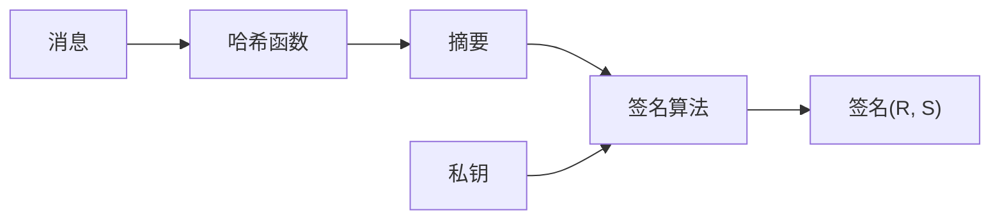

import { SHA256Demo, ModularArithmeticDemo } from '../../../../../src/components/Interactive';

# 第一章：密码学基础

在深入 ECDSA 之前，我们需要先理解一些基础概念。本章将介绍对称加密、非对称加密和哈希函数。

## 1.1 对称加密 vs 非对称加密

### 对称加密

**一把钥匙开一把锁** —— 加密和解密使用同一个密钥。

```
明文 --[密钥]--> 密文 --[同一密钥]--> 明文
```

**常见算法**：AES、DES、ChaCha20

**问题**：如何安全地把密钥传给对方？这就是著名的"密钥分发问题"。

### 非对称加密

**一对钥匙，公开一把，保密一把**：

- **公钥**：可以公开给任何人
- **私钥**：必须严格保密

```
明文 --[公钥加密]--> 密文 --[私钥解密]--> 明文
```

**关键特性**：
- 公钥加密的数据，只有私钥能解密
- 私钥签名的数据，公钥可以验证

**常见算法**：RSA、ECDSA、EdDSA

:::tip 类比理解
想象一个特殊的邮箱：
- **公钥** = 邮箱投递口（任何人都能往里投信）
- **私钥** = 邮箱钥匙（只有你能打开取信）
:::

## 1.2 数字签名

ECDSA 的核心功能是**数字签名**，而不是加密。

### 签名 ≠ 加密

| 特性 | 加密 | 签名 |
|------|------|------|
| 目的 | 保密性 | 真实性 + 完整性 |
| 谁用私钥 | 解密方 | 签名方 |
| 谁用公钥 | 加密方 | 验证方 |

### 数字签名的作用

1. **身份认证**：证明消息确实来自私钥持有者
2. **不可否认**：签名者无法否认自己签过名
3. **完整性**：消息被篡改后签名失效

### 签名流程



## 1.3 哈希函数

哈希函数是密码学的基石之一。

### 什么是哈希？

哈希函数将**任意长度**的输入转换为**固定长度**的输出。

```javascript
// 伪代码示例
hash("Hello") = "2cf24dba5fb0a30e26e83b2ac5b9e29e1b161e5c"
hash("Hello!") = "7f83b1657ff1fc53b92dc18148a1d65dfc2d4b1f"  // 完全不同！
hash("Hello" * 1000000) = "..." // 仍然是固定长度
```

### 哈希函数的特性

| 特性 | 说明 | 重要性 |
|------|------|--------|
| **确定性** | 相同输入永远得到相同输出 | 基础要求 |
| **单向性** | 无法从输出反推输入 | 安全性核心 |
| **雪崩效应** | 输入微小变化，输出剧烈变化 | 防篡改 |
| **抗碰撞** | 极难找到两个不同输入产生相同输出 | 防伪造 |

### 常见哈希算法

| 算法 | 输出长度 | 用途 |
|------|----------|------|
| SHA-1 | 160 bit | 已不安全，仅用于兼容 |
| SHA-256 | 256 bit | 比特币、以太坊 |
| Keccak-256 | 256 bit | 以太坊地址生成 |
| RIPEMD-160 | 160 bit | 比特币地址 |

### 动手试试

<SHA256Demo client:only="react" />

## 1.4 模运算基础

ECDSA 大量使用模运算（取余运算）。

<ModularArithmeticDemo client:only="react" />

### 拓展欧几里得与贝祖等式（必懂）

普通 gcd 算法只回答一句话：
**“最大公约数是多少？”**

拓展欧几里得要回答的是：
**“这个最大公约数，是怎么用 a 和 b 拼出来的？”**

这就是 **贝祖等式**：

```
gcd(a, b) = x·a + y·b
```

也就是说，拓展欧几里得不仅算出 gcd，还会同时给出 **一组 x、y**，让你看到 “gcd 是怎么拼出来的”。

**例子：30 和 18**

```
gcd(30, 18) = 6
6 = 30 × (-1) + 18 × 2
```

拓展欧几里得 = gcd + “拼法”。  
在密码学里，这个“拼法”的系数就是 **模逆元** 的关键。

### 从模方程到贝祖等式（推导）

```
a × x ≡ 1 (mod m)
⇔ a × x - 1 能被 m 整除
⇔ a × x - 1 = m × y
⇔ a × x + m × y = 1
```

由定义可知：
```
m × y ≡ 0 (mod m)
```

这就是为什么“求模逆元”最终会变成一条贝祖等式。

### 为什么 gcd ≠ 1 就没有逆元？

如果 gcd(a, m) = d > 1，那么
```
a × x + m × y
```
无论怎么取 x、y，结果都只能是 **d 的倍数**。

但 1 不是 d 的倍数，所以
```
a × x + m × y = 1
```
不可能成立，也就不可能有
```
a × x ≡ 1 (mod m)
```
这样的逆元。

## 1.5 比特与数字表示

### 比特数决定安全性

| 比特数 | 可表示的数字范围 | 安全性 |
|--------|-----------------|--------|
| 8 bit | 0 ~ 255 | 极不安全 |
| 32 bit | 0 ~ 4,294,967,295 | 不安全 |
| 128 bit | 0 ~ 3.4×10³⁸ | AES 密钥 |
| 160 bit | 0 ~ 1.46×10⁴⁸ | SHA-1、早期 ECDSA |
| 256 bit | 0 ~ 1.16×10⁷⁷ | 比特币/以太坊私钥 |

:::tip 直观理解
256 位的安全性意味着：即使全世界的计算机联合起来暴力破解，需要的时间也远超过宇宙的年龄。
:::

### 十六进制表示

密码学中常用十六进制（hex）表示大数：

```
二进制: 1010 1011 1100 1101
十六进制: A B C D
十进制: 43981

私钥示例 (256 bit = 64 hex 字符):
e8f32e723decf4051aefac8e2c93c9c5b214313817cdb01a1494b917c8436b35
```

## 本章小结

| 概念 | 关键点 |
|------|--------|
| 非对称加密 | 公钥公开，私钥保密 |
| 数字签名 | 私钥签名，公钥验证 |
| 哈希函数 | 单向、固定长度、雪崩效应 |
| 模运算 | ECDSA 的数学基础 |

## 思考题

1. 为什么不能直接对原始消息签名，而要先哈希？
2. 如果哈希函数存在碰撞，对签名安全性有什么影响？
3. 256 位私钥有多少种可能？这个数字和什么相当？

---

下一章：[RSA 加密算法](/docs/cryptography/rsa) - 非对称加密入门
