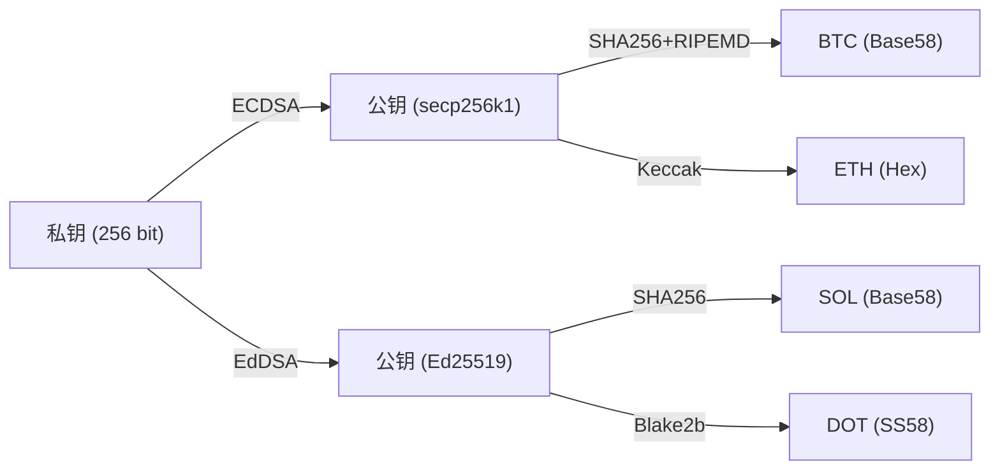
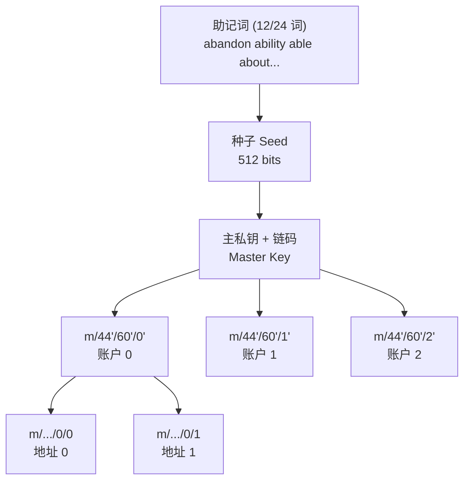
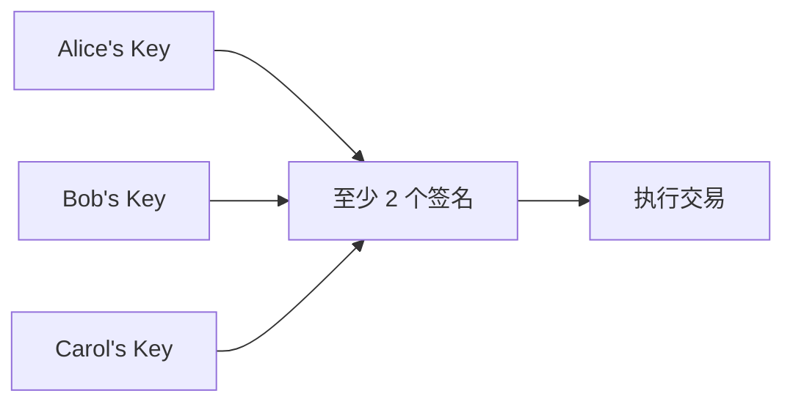

import { CryptoAppsDemo } from '../../../../../src/components/Interactive';

# 第五章：加密货币应用

## 🎮 交互式演示

本章将 ECDSA 知识应用到实际的加密货币场景中。请使用下方的交互式工具体验核心流程：

<CryptoAppsDemo client:only="react" />

---

## 4.1 多链地址生成

### 为什么同一个私钥对应不同地址？

不同的区块链使用不同的：
1.  **签名算法**：如 Bitcoin/Ethereum 使用 ECDSA (secp256k1)，而 Solana/Polkadot 使用 EdDSA (Ed25519)。
2.  **哈希算法**：如 SHA256, Keccak-256, Blake2b 等。
3.  **地址格式**：如 Base58Check, Bech32, Hex, SS58。

请在上方演示的 **"🔑 多链地址生成"** 标签页中体验：**同一个 256 位私钥**如何在不同链上生成完全不同的地址。这说明了私钥是资产的根本控制权，而地址只是公钥的不同表现形式。

**主流链地址特征：**
- **Bitcoin**: `1...` (Legacy), `bc1...` (Segwit)
- **Ethereum**: `0x...` (40 字符 Hex)
- **Solana**: 44 字符 Base58
- **Polkadot**: `1...` (SS58)
- **Tron**: `T...`

## 4.2 交易签名

在区块链中，每一笔转账都需要发送者的数字签名。请在演示的 **"📝 交易签名"** 标签页中体验。

### 签名流程

1.  **构造交易**：包含 nonce、gas、接收方、金额等字段。
2.  **序列化**：使用 RLP (Recursive Length Prefix) 编码将字段打包。
3.  **哈希**：对 RLP 编码后的数据进行 Keccak-256 哈希。
4.  **签名**：使用私钥对哈希值进行 ECDSA 签名，得到 `(r, s, v)`。

### v 值的含义

签名结果除了 `r` 和 `s`，还有一个 `v` 值（Recovery ID）。
`v` 的作用是告诉验证者，在恢复公钥时应该使用椭圆曲线上的哪一个点（y 是正数还是负数）。这使得以太坊可以在不发送发送者公钥的情况下，直接从签名恢复出发起人地址，节省了链上空间。

## 4.3 签名验证与公钥恢复

ECDSA 有一个特殊特性：可以从签名恢复签名者的公钥！这就是智能合约中 `ecrecover` 函数的原理。

从签名 (r, s) 和消息哈希 z：
1. 计算 R 点：r 是 R 的 x 坐标。
2. 利用 v 值确定 R 的 y 坐标。
3. 计算：$Q = r^{-1}(sR - zG)$。
4. 恢复出的 Q 就是公钥，进而可以算出地址。

## 4.4 HD 钱包（分层确定性钱包）

### 问题与解决方案

如果每次收款都创建一个新地址（为了隐私），你需要备份成百上千个私钥，这非常容易丢失。
HD 钱包允许你通过**一组助记词**（12 或 24 个单词）生成无限个密钥对。请在演示的 **"🌳 HD 钱包"** 标签页中尝试。

## 4.5 多重签名

普通账户由一个私钥控制（单点故障）。多重签名（MultiSig）要求 $m$ 个密钥中的 $n$ 个签名才能执行交易（$m$-of-$n$）。

**2-of-3 多签示例:**

在演示的 **"🤝 多重签名"** 标签页中，你可以模拟 Alice、Bob 和 Carol 共同管理资金的流程。

## 本章小结

| 应用 | 关键技术 |
|------|----------|
| **地址生成** | 公钥哈希 + 编码 (Base58/Hex) |
| **交易签名** | RLP 编码 + ECDSA + 链 ID 防重放 |
| **HD 钱包** | 助记词 (BIP-39) + 路径派生 (BIP-32/44) |
| **多重签名** | 智能合约逻辑控制 |

## 练习题

1.  手动计算一个比特币地址的 Base58Check 编码
2.  解释为什么以太坊交易需要 chainId
3.  设计一个 3-of-5 多签的资金管理方案

## 进阶阅读

- [BIP-32: Hierarchical Deterministic Wallets](https://github.com/bitcoin/bips/blob/master/bip-0032.mediawiki)
- [EIP-155: Replay Attack Protection](https://eips.ethereum.org/EIPS/eip-155)
- [EIP-712: Typed Structured Data Hashing](https://eips.ethereum.org/EIPS/eip-712)

---

恭喜完成课程！现在你已经掌握了：
- 密码学基础概念
- RSA 非对称加密
- 椭圆曲线数学原理
- ECDSA 签名算法
- 加密货币实际应用

---

下一章：[Schnorr 签名算法](/docs/cryptography/schnorr) - 更简洁高效的签名方案
