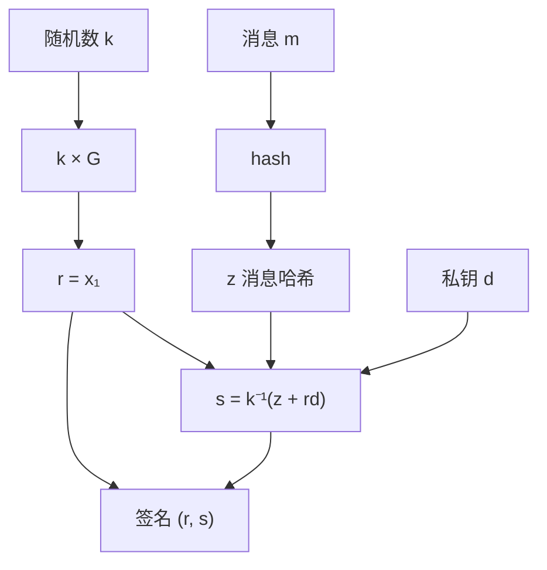
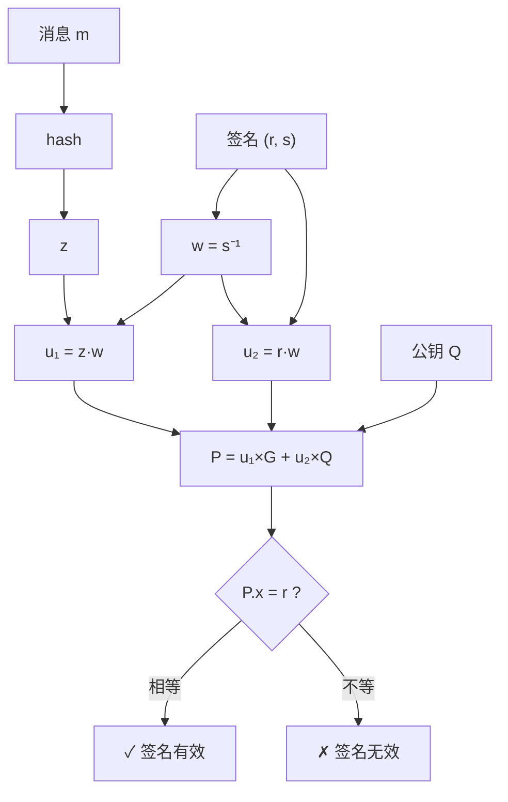

import { ECDSADemo } from '../../../../../src/components/Interactive';

# 第四章：ECDSA 签名算法

本章是课程的核心，我们将完整走过 ECDSA 的签名和验证流程。

## 3.1 ECDSA 概述

**ECDSA** = **E**lliptic **C**urve **D**igital **S**ignature **A**lgorithm

### 签名的目的

| 功能 | 说明 |
|------|------|
| **身份认证** | 证明签名者持有私钥 |
| **不可否认** | 签名者无法抵赖 |
| **完整性** | 消息被篡改后签名失效 |

### 核心组件

| 类别 | 参数 | 说明 |
|------|------|------|
| **系统参数** | 曲线 | y² = x³ + ax + b (mod p) |
| | 基点 G | 生成元 |
| | 阶 n | G 的阶，nG = O |
| **密钥对** | 私钥 d | d ∈ [1, n-1]，随机整数 |
| | 公钥 Q | Q = d × G，曲线上的点 |
| **签名** | (r, s) | 两个整数 |

## 3.2 密钥生成

### 步骤

1. 选择随机数 d ∈ [1, n-1] 作为**私钥**
2. 计算 Q = d × G 作为**公钥**

### 交互式演示：ECDSA 完整流程

使用以下交互式组件来体验密钥生成、签名和验证的完整流程。
我们使用简化的小数值参数（与上一章有限域示例类似），以便于可视化。

<ECDSADemo client:only="react" />

### secp256k1 真实示例

```python
import secrets

# 生成 256 位随机私钥
private_key = secrets.randbits(256)
# 确保在有效范围内
n = 0xFFFFFFFFFFFFFFFFFFFFFFFFFFFFFFFEBAAEDCE6AF48A03BBFD25E8CD0364141
private_key = private_key % n
if private_key == 0:
    private_key = 1

print(f"私钥: {hex(private_key)}")
# 输出类似: 0xe8f32e723decf4051aefac8e2c93c9c5b214313817cdb01a1494b917c8436b35
```

## 3.3 签名生成

### 签名算法步骤

给定消息 m 和私钥 d：

```
1. 计算消息哈希：z = hash(m)
2. 选择随机数：k ∈ [1, n-1]  (关键！必须真随机)
3. 计算点：(x₁, y₁) = k × G
4. 计算 r：r = x₁ mod n  (如果 r = 0，重新选 k)
5. 计算 s：s = k⁻¹(z + r·d) mod n  (如果 s = 0，重新选 k)
6. 输出签名：(r, s)
```

### 图解签名过程



### 小数值完整示例

（请参考上文的交互式演示进行操作，观察 r 和 s 的计算过程）

**手算过程示例：**

1. z = hash("Hello") = (72+101+108+108+111) % 100 = 500 % 100 = 0 → 用 z = 5
2. k = 10
3. k × G = 10 × (5, 1) → 需要计算...
4. 假设 10G = (7, 11)，则 r = 7
5. k⁻¹ mod 19：10 × 2 = 20 ≡ 1 (mod 19)，所以 k⁻¹ = 2
6. s = 2 × (5 + 7 × 7) mod 19 = 2 × 54 mod 19 = 108 mod 19 = 13

**签名：(r=7, s=13)**

## 3.4 签名验证

### 验证算法步骤

给定消息 m、签名 (r, s) 和公钥 Q：

```
1. 检查 r, s ∈ [1, n-1]
2. 计算消息哈希：z = hash(m)
3. 计算：w = s⁻¹ mod n
4. 计算：u₁ = z·w mod n
5. 计算：u₂ = r·w mod n
6. 计算点：P = u₁×G + u₂×Q
7. 验证：r ≡ P.x (mod n)
```

### 图解验证过程



### 验证演示

（请参考上文的交互式演示进行验证操作）

## 3.5 数学证明：为什么验证能工作？

### 推导过程

已知签名公式：
$$
s = k^{-1}(z + rd) \mod n
$$

验证时计算：
$$
P = u_1G + u_2Q = (zw)G + (rw)Q
$$

其中 $w = s^{-1}$，$Q = dG$

代入：
$$
P = zwG + rwdG = w(z + rd)G
$$

由于 $w = s^{-1}$：
$$
P = s^{-1}(z + rd)G
$$

又因为 $s = k^{-1}(z + rd)$，所以 $s^{-1} = k(z + rd)^{-1}$：
$$
P = k(z + rd)^{-1}(z + rd)G = kG
$$

**结论**：验证点 P 就是签名时的点 kG，所以 P.x = r ✓

## 3.6 安全性分析

### 为什么安全？

要伪造签名，攻击者需要：
- 知道私钥 d → **ECDLP 难题**
- 或者知道随机数 k → **等价于知道私钥**

### 随机数 k 的重要性

:::danger 严重警告
**k 必须是真随机的，且每次签名必须不同！**

如果两次签名使用相同的 k：
- 两个签名有相同的 r 值
- 攻击者可以计算出私钥！
:::

### PS3 私钥泄露事件

2010年，索尼 PS3 的 ECDSA 实现被破解。

**原因**：索尼对所有签名使用了**相同的 k 值**！

**攻击方法**：

给定两个签名 $(r, s_1)$ 和 $(r, s_2)$（注意 r 相同！）：

$$
s_1 = k^{-1}(z_1 + rd) \mod n
$$
$$
s_2 = k^{-1}(z_2 + rd) \mod n
$$

相减：
$$
s_1 - s_2 = k^{-1}(z_1 - z_2) \mod n
$$

解出 k：
$$
k = \frac{z_1 - z_2}{s_1 - s_2} \mod n
$$

知道 k 后，从任一签名公式解出 d：
$$
d = \frac{sk - z}{r} \mod n
$$

**后果**：任何人都可以签署"官方"PS3 固件！

```python
def recover_private_key(z1, s1, z2, s2, r, n):
    """从两个使用相同 k 的签名恢复私钥"""
    # 计算 k
    k = ((z1 - z2) * pow(s1 - s2, -1, n)) % n
    
    # 计算私钥 d
    d = ((s1 * k - z1) * pow(r, -1, n)) % n
    
    return d, k

# 示例
z1, z2 = 12, 34  # 两条消息的哈希
s1, s2 = 8, 15   # 两个签名的 s 值
r = 7            # 相同的 r 值！
n = 19

d, k = recover_private_key(z1, s1, z2, s2, r, n)
print(f"恢复的私钥: d = {d}")
print(f"恢复的随机数: k = {k}")
```

### 其他安全注意事项

| 风险 | 后果 | 防护 |
|------|------|------|
| k 重复使用 | 私钥泄露 | 使用 RFC 6979 确定性 k |
| k 可预测 | 私钥泄露 | 使用 CSPRNG |
| 侧信道攻击 | 私钥泄露 | 恒定时间实现 |
| 哈希碰撞 | 签名伪造 | 使用安全哈希（SHA-256+）|

## 3.7 完整实现

### Python 完整代码

```python
import hashlib
import secrets

class ECDSA:
    """简化的 ECDSA 实现（教学用途）"""
    
    def __init__(self, a, b, p, G, n):
        self.a = a
        self.b = b
        self.p = p
        self.G = G
        self.n = n
    
    def point_add(self, P, Q):
        """椭圆曲线点加法"""
        if P is None:
            return Q
        if Q is None:
            return P
        
        x1, y1 = P
        x2, y2 = Q
        
        if x1 == x2 and (y1 + y2) % self.p == 0:
            return None
        
        if P == Q:
            lam = (3 * x1 * x1 + self.a) * pow(2 * y1, -1, self.p) % self.p
        else:
            lam = (y2 - y1) * pow(x2 - x1, -1, self.p) % self.p
        
        x3 = (lam * lam - x1 - x2) % self.p
        y3 = (lam * (x1 - x3) - y1) % self.p
        
        return (x3, y3)
    
    def scalar_mult(self, k, P):
        """标量乘法"""
        result = None
        addend = P
        
        while k:
            if k & 1:
                result = self.point_add(result, addend)
            addend = self.point_add(addend, addend)
            k >>= 1
        
        return result
    
    def generate_keypair(self):
        """生成密钥对"""
        d = secrets.randbelow(self.n - 1) + 1
        Q = self.scalar_mult(d, self.G)
        return d, Q
    
    def sign(self, message, d):
        """签名"""
        z = int(hashlib.sha256(message.encode()).hexdigest(), 16) % self.n
        
        while True:
            k = secrets.randbelow(self.n - 1) + 1
            R = self.scalar_mult(k, self.G)
            r = R[0] % self.n
            
            if r == 0:
                continue
            
            k_inv = pow(k, -1, self.n)
            s = (k_inv * (z + r * d)) % self.n
            
            if s == 0:
                continue
            
            return (r, s)
    
    def verify(self, message, signature, Q):
        """验证"""
        r, s = signature
        
        if not (1 <= r < self.n and 1 <= s < self.n):
            return False
        
        z = int(hashlib.sha256(message.encode()).hexdigest(), 16) % self.n
        w = pow(s, -1, self.n)
        
        u1 = (z * w) % self.n
        u2 = (r * w) % self.n
        
        P1 = self.scalar_mult(u1, self.G)
        P2 = self.scalar_mult(u2, Q)
        P = self.point_add(P1, P2)
        
        if P is None:
            return False
        
        return r == P[0] % self.n


# 使用示例
if __name__ == "__main__":
    # 使用小参数进行测试
    ecdsa = ECDSA(
        a=2, b=2, p=17,
        G=(5, 1), n=19
    )
    
    # 生成密钥对
    private_key, public_key = ecdsa.generate_keypair()
    print(f"私钥: {private_key}")
    print(f"公钥: {public_key}")
    
    # 签名
    message = "Hello, ECDSA!"
    signature = ecdsa.sign(message, private_key)
    print(f"签名: {signature}")
    
    # 验证
    is_valid = ecdsa.verify(message, signature, public_key)
    print(f"验证结果: {is_valid}")
    
    # 篡改消息后验证
    is_valid_tampered = ecdsa.verify("Hello, ECDSA?", signature, public_key)
    print(f"篡改消息验证结果: {is_valid_tampered}")
```

## 本章小结

| 步骤 | 关键操作 |
|------|----------|
| **密钥生成** | Q = d × G |
| **签名** | r = (kG).x, s = k⁻¹(z + rd) |
| **验证** | P = s⁻¹zG + s⁻¹rQ, 检查 P.x = r |
| **安全核心** | ECDLP 难题 + 随机数 k |

## 思考题

1. 为什么 r = 0 或 s = 0 时需要重新选择 k？
2. 如果签名者否认自己签过某条消息，验证者能否证明？
3. RFC 6979 如何生成确定性的 k？这样安全吗？

---

下一章：[加密货币应用](/docs/cryptography/crypto-applications)
