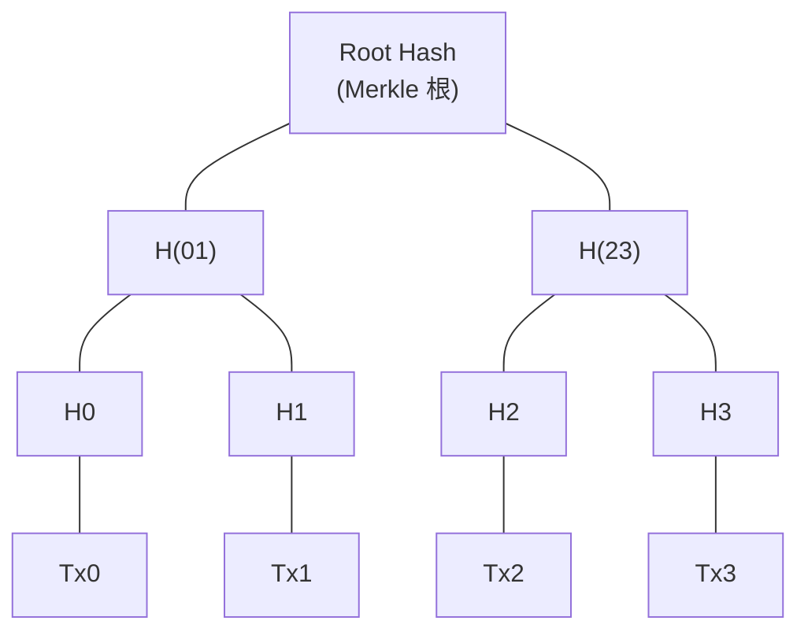
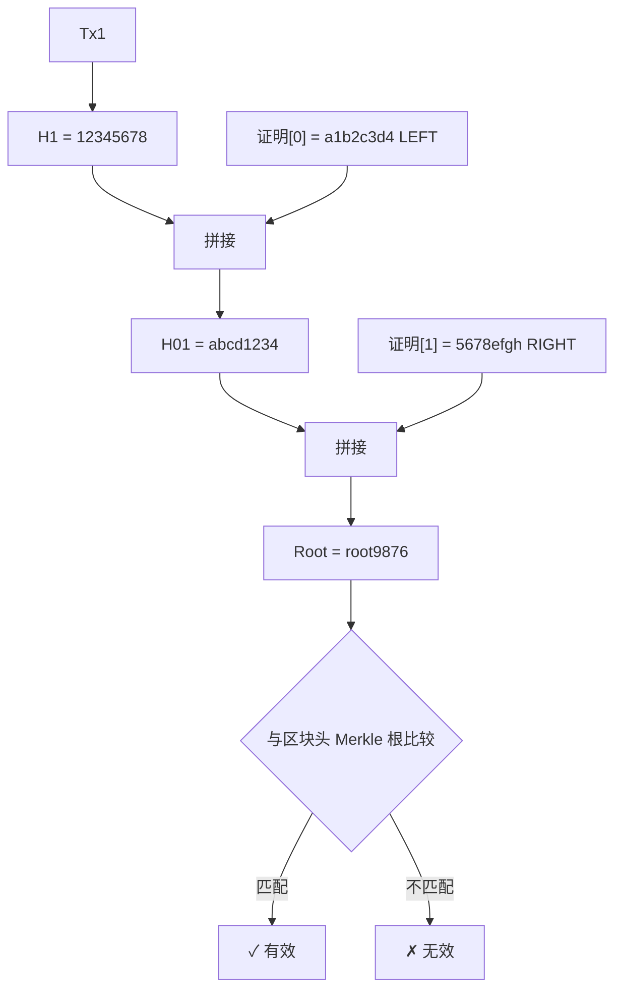
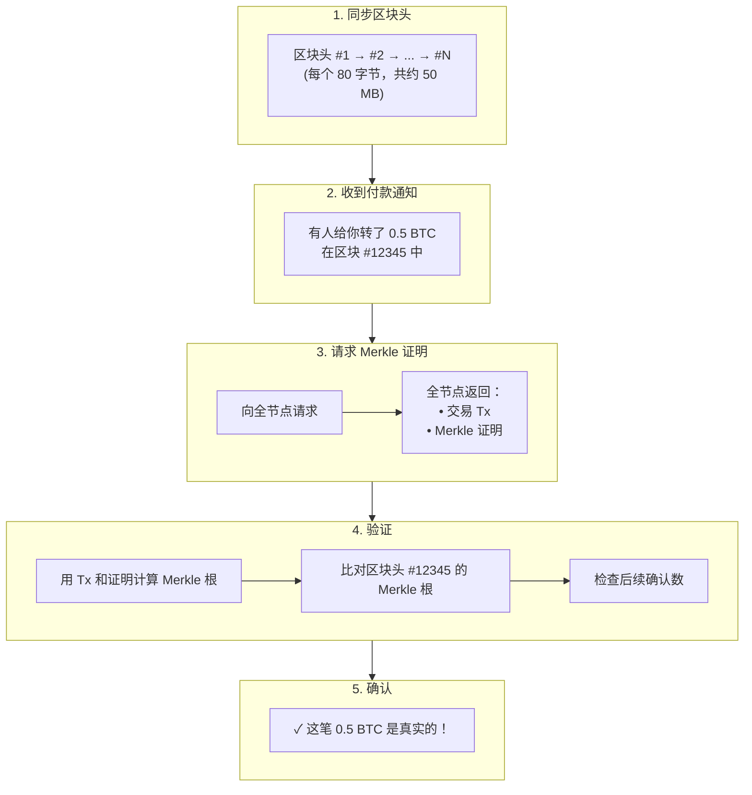

import MerkleTreeBuilder from '@site/src/components/Interactive/MerkleTreeBuilder';

# 第十章：Merkle 树与 SPV 验证

## 🎮 交互式演示

先动手构建一棵 Merkle 树，体验它的工作原理！

<MerkleTreeBuilder client:only="react" />

---

Merkle 树是区块链最重要的数据结构之一。它让你的手机钱包无需下载几百 GB 的区块链数据，也能安全地验证交易。本章将通过完整的手算示例，带你理解这个神奇的数据结构。

## 9.1 从一个问题开始

### 你的手机钱包如何工作？

```
比特币全节点：
- 下载所有区块数据：~500 GB
- 验证每一笔交易
- 存储完整区块链

但是你的手机钱包：
- 存储只有几十 MB
- 却能安全验证"你收到了 0.5 BTC"
- 怎么做到的？
```

答案就是：**Merkle 树 + SPV（简化支付验证）**

### 核心思想

```
不下载所有交易，只验证"某笔交易确实在区块里"

类比：
不需要读完整本书，只需要查目录就能确认某章节存在
```

## 9.2 什么是 Merkle 树？

### 基本结构

Merkle 树是一种特殊的二叉树，每个节点都是哈希值：



```
H0 = Hash(Tx0)
H1 = Hash(Tx1)
H01 = Hash(H0 + H1)  // 连接后再哈希
...
Root = Hash(H01 + H23)
```

### 核心特性

| 特性 | 说明 | 好处 |
|------|------|------|
| **唯一根** | 任何交易改变，根哈希必变 | 快速检测篡改 |
| **O(log n) 验证** | 4 笔交易只需 2 个哈希验证 | 轻量级验证 |
| **增量更新** | 只更新变化的路径 | 高效更新 |

## 9.3 手算构建 Merkle 树

### 示例：4 笔交易

让我们一步步构建一个完整的 Merkle 树。

**交易数据：**

```
Tx0 = "Alice -> Bob: 10 BTC"
Tx1 = "Bob -> Carol: 5 BTC"
Tx2 = "Carol -> Dave: 3 BTC"
Tx3 = "Dave -> Eve: 1 BTC"
```

### Step 1：计算叶子节点哈希

```python
import hashlib

def sha256(data):
    """简化的哈希函数"""
    return hashlib.sha256(data.encode()).hexdigest()[:16]  # 取前 16 字符便于展示

# 计算每笔交易的哈希
H0 = sha256("Alice -> Bob: 10 BTC")   # 假设 = "a1b2c3d4e5f6g7h8"
H1 = sha256("Bob -> Carol: 5 BTC")    # 假设 = "1234567890abcdef"
H2 = sha256("Carol -> Dave: 3 BTC")   # 假设 = "fedcba0987654321"
H3 = sha256("Dave -> Eve: 1 BTC")     # 假设 = "0123456789abcdef"

print(f"H0 = {H0}")
print(f"H1 = {H1}")
print(f"H2 = {H2}")
print(f"H3 = {H3}")
```

**结果（简化展示）：**

```
H0 = a1b2c3d4
H1 = 12345678
H2 = fedcba09
H3 = 01234567
```

### Step 2：计算第二层

```
H01 = Hash(H0 + H1) = Hash("a1b2c3d4" + "12345678") = "abcd1234"
H23 = Hash(H2 + H3) = Hash("fedcba09" + "01234567") = "5678efgh"
```

### Step 3：计算根哈希

```
Root = Hash(H01 + H23) = Hash("abcd1234" + "5678efgh") = "root9876"
```

### 完整树结构

```
                    root9876
                   /        \
            abcd1234        5678efgh
            /     \         /      \
      a1b2c3d4  12345678  fedcba09  01234567
          │         │         │         │
         Tx0       Tx1       Tx2       Tx3
      Alice→Bob  Bob→Carol Carol→Dave Dave→Eve
```

:::tip 关键点
**Merkle 根**是一个 32 字节的哈希值（这里简化了），它唯一地代表了所有 4 笔交易。
任何一笔交易哪怕改动一个字符，根哈希都会完全不同！
:::

## 9.4 奇数交易的处理

如果交易数量是奇数怎么办？

```
交易：Tx0, Tx1, Tx2（只有 3 笔）

处理方法：复制最后一个

           Root
          /    \
       H01      H22
      /   \      │
    H0    H1    H2
     │     │     │
   Tx0   Tx1   Tx2

H22 = Hash(H2 + H2)  // H2 和自己拼接
```

## 9.5 Merkle 证明

### 什么是 Merkle 证明？

**问题**：如何证明 Tx1 在区块中，只给验证者提供最少的数据？

**答案**：只需要提供从 Tx1 到根的"路径"上的兄弟节点。

```
                    root9876  ← 验证终点
                   /        \
            abcd1234        [5678efgh] ← 需要这个
            /     \
      [a1b2c3d4]  12345678  ← Tx1 的哈希
            ↑         │
        需要这个     Tx1 ← 待证明
```

**Merkle 证明 = [a1b2c3d4, 5678efgh]**

只需要 2 个哈希！（而不是所有 4 笔交易）

### 验证过程（手算）

验证者收到：
- 交易 Tx1 = "Bob -> Carol: 5 BTC"
- Merkle 证明 = [(a1b2c3d4, LEFT), (5678efgh, RIGHT)]
- 期望的根 = root9876

**Step 1：计算 Tx1 的哈希**

```
H1 = Hash("Bob -> Carol: 5 BTC") = 12345678
```

**Step 2：与第一个证明节点组合**

```
证明[0] = (a1b2c3d4, LEFT)
意思：兄弟节点在左边

H01 = Hash(a1b2c3d4 + 12345678) = abcd1234
```

**Step 3：与第二个证明节点组合**

```
证明[1] = (5678efgh, RIGHT)
意思：兄弟节点在右边

Root = Hash(abcd1234 + 5678efgh) = root9876
```

**Step 4：比较根哈希**

```
计算得到的根 root9876 == 期望的根 root9876 ✓

验证通过！Tx1 确实在区块中！
```

### 图解验证过程



## 9.6 证明大小分析

### 为什么是 O(log n)？

```
交易数量    树高度    证明大小（哈希数）
4           2         2
8           3         3
16          4         4
1,000       10        10
1,000,000   20        20
```

| 区块交易数 | 证明大小 | 对比下载全部 |
|------------|----------|--------------|
| 1,000 | 10 × 32 B = 320 B | 500 KB |
| 10,000 | 14 × 32 B = 448 B | 5 MB |
| 1,000,000 | 20 × 32 B = 640 B | 500 MB |

**百万笔交易只需 20 个哈希（640 字节）就能验证！**

## 9.7 SPV（简化支付验证）

### 什么是 SPV？

**SPV = Simplified Payment Verification**

中本聪在比特币白皮书中描述的轻客户端验证方式。

```
全节点                          SPV 节点（轻钱包）
─────────                       ──────────────────
下载所有区块（~500 GB）          只下载区块头（~50 MB）
验证所有交易                     用 Merkle 证明验证自己的交易
存储完整 UTXO 集                存储自己的交易和密钥
```

### 比特币区块头结构

| 字段 | 大小 | 说明 |
|------|------|------|
| 版本 | 4 字节 | 区块版本号 |
| 前区块哈希 | 32 字节 | 指向前一个区块 |
| **Merkle 根** | 32 字节 | **关键！** 代表所有交易 |
| 时间戳 | 4 字节 | 区块创建时间 |
| 难度目标 | 4 字节 | 挖矿难度 |
| Nonce | 4 字节 | 工作量证明随机数 |
| **总计** | **80 字节** | 区块头很小！ |

Merkle 根是区块头的一部分，这就是 SPV 能工作的关键！

### SPV 验证流程



### SPV 安全性分析

| 攻击类型 | 难度 | 防护措施 |
|----------|------|----------|
| 伪造交易 | 需要破解 SHA256 | 不可能 |
| 伪造区块头 | 需要大量算力 | 工作量证明保护 |
| 隐藏交易 | 矿工可以做到 | 连接多个节点 |
| 双花攻击 | 需要 51% 算力 | 等待足够确认（6块） |

:::danger SPV 的局限
SPV 依赖"最长链是诚实的"假设。如果攻击者有 51% 算力，可以欺骗 SPV 节点。
全节点可以独立验证每一笔交易，不受此限制。
:::

## 9.8 以太坊的 Merkle Patricia Trie

### 为什么以太坊不用普通 Merkle 树？

```
比特币：每个区块包含一批交易，用 Merkle 树组织

以太坊：需要存储"状态"（所有账户余额、合约存储）
- 需要快速查找某个账户
- 需要高效更新单个账户
- 需要证明某个账户"不存在"

普通 Merkle 树做不到这些！
```

### Merkle Patricia Trie

以太坊使用 MPT = Merkle 树 + Patricia Trie

```
Patricia Trie（前缀树）：
- 高效查找键
- 共享前缀节省空间

Merkle：
- 密码学验证
- 防篡改
```

### 以太坊区块头中的三棵树

| 字段 | 说明 |
|------|------|
| stateRoot | 状态树根 - 所有账户状态 |
| transactionsRoot | 交易树根 - 区块内交易 |
| receiptsRoot | 收据树根 - 交易执行结果 |

### 状态证明示例

```python
# 使用 eth_getProof RPC 获取账户证明
proof = eth.get_proof(
    address="0x1234...",
    storage_keys=[],
    block="latest"
)

# 返回包含：
# - 账户数据（余额、nonce、代码哈希、存储根）
# - Merkle 证明路径
# - 可以用来向他人证明"这个账户在某个区块有 X ETH"
```

## 9.9 实际应用：Merkle 空投

### 传统空投 vs Merkle 空投

```
传统方式：
- 合约存储所有符合条件的地址
- 10,000 个地址 → 大量存储费用
- 每增加一个地址都要付 Gas

Merkle 方式：
- 合约只存储一个 32 字节的 Merkle 根
- 用户领取时提供证明
- 无论多少地址，链上成本相同！
```

### Solidity 实现

```solidity
// SPDX-License-Identifier: MIT
pragma solidity ^0.8.0;

contract MerkleAirdrop {
    bytes32 public merkleRoot;
    mapping(address => bool) public claimed;
    
    constructor(bytes32 _merkleRoot) {
        merkleRoot = _merkleRoot;
    }
    
    function claim(
        uint256 amount,
        bytes32[] calldata proof
    ) external {
        require(!claimed[msg.sender], "Already claimed");
        
        // 构造叶子节点
        bytes32 leaf = keccak256(abi.encodePacked(msg.sender, amount));
        
        // 验证 Merkle 证明
        require(verify(proof, merkleRoot, leaf), "Invalid proof");
        
        // 标记已领取
        claimed[msg.sender] = true;
        
        // 发送代币
        // token.transfer(msg.sender, amount);
    }
    
    function verify(
        bytes32[] memory proof,
        bytes32 root,
        bytes32 leaf
    ) internal pure returns (bool) {
        bytes32 hash = leaf;
        
        for (uint256 i = 0; i < proof.length; i++) {
            bytes32 proofElement = proof[i];
            
            if (hash < proofElement) {
                hash = keccak256(abi.encodePacked(hash, proofElement));
            } else {
                hash = keccak256(abi.encodePacked(proofElement, hash));
            }
        }
        
        return hash == root;
    }
}
```

### 生成证明（链下）

```python
from merkle_tree import MerkleTree

# 白名单
whitelist = [
    ("0x1111...", 100),  # 地址, 空投数量
    ("0x2222...", 200),
    ("0x3333...", 150),
    # ... 可以有成千上万个
]

# 构建 Merkle 树
leaves = [keccak256(addr + amount) for addr, amount in whitelist]
tree = MerkleTree(leaves)

# 部署时只需要根
merkle_root = tree.get_root()  # 32 字节

# 用户领取时生成证明
user_address = "0x2222..."
proof = tree.get_proof(user_index=1)
```

## 9.10 完整 Python 实现

```python
import hashlib
from typing import List, Tuple, Optional

def sha256(data: str) -> str:
    """SHA256 哈希"""
    if isinstance(data, str):
        data = data.encode()
    return hashlib.sha256(data).hexdigest()

class MerkleTree:
    """Merkle 树完整实现"""
    
    def __init__(self, transactions: List[str]):
        self.transactions = transactions
        self.tree: List[List[str]] = []
        self.root = self._build_tree()
    
    def _build_tree(self) -> str:
        """构建 Merkle 树"""
        if not self.transactions:
            return sha256("")
        
        # Level 0: 叶子节点
        level = [sha256(tx) for tx in self.transactions]
        self.tree.append(level)
        
        print("=== 构建 Merkle 树 ===")
        print(f"叶子节点（Level 0）：")
        for i, h in enumerate(level):
            print(f"  H{i} = {h[:16]}...")
        
        # 逐层向上
        level_num = 1
        while len(level) > 1:
            # 奇数个节点，复制最后一个
            if len(level) % 2 == 1:
                level.append(level[-1])
            
            # 计算父节点
            next_level = []
            for i in range(0, len(level), 2):
                parent = sha256(level[i] + level[i + 1])
                next_level.append(parent)
            
            level = next_level
            self.tree.append(level)
            
            print(f"\nLevel {level_num}：")
            for i, h in enumerate(level):
                print(f"  H = {h[:16]}...")
            level_num += 1
        
        print(f"\n根哈希：{level[0][:16]}...")
        return level[0]
    
    def get_proof(self, index: int) -> List[Tuple[str, str]]:
        """获取指定交易的 Merkle 证明"""
        proof = []
        
        for level in self.tree[:-1]:  # 不包括根
            # 找兄弟节点
            if index % 2 == 0:
                sibling_index = index + 1
                position = 'RIGHT'
            else:
                sibling_index = index - 1
                position = 'LEFT'
            
            if sibling_index < len(level):
                proof.append((level[sibling_index], position))
            else:
                # 奇数情况，和自己配对
                proof.append((level[index], 'RIGHT'))
            
            # 移到父节点
            index = index // 2
        
        return proof
    
    def verify(self, tx: str, proof: List[Tuple[str, str]], root: str) -> bool:
        """验证 Merkle 证明"""
        current = sha256(tx)
        print(f"\n=== 验证 Merkle 证明 ===")
        print(f"交易哈希：{current[:16]}...")
        
        for i, (sibling, position) in enumerate(proof):
            if position == 'LEFT':
                current = sha256(sibling + current)
                print(f"Step {i+1}: Hash(LEFT + current) = {current[:16]}...")
            else:
                current = sha256(current + sibling)
                print(f"Step {i+1}: Hash(current + RIGHT) = {current[:16]}...")
        
        print(f"\n计算得到的根：{current[:16]}...")
        print(f"期望的根：    {root[:16]}...")
        print(f"验证结果：{'✓ 通过' if current == root else '✗ 失败'}")
        
        return current == root


def main():
    # 创建交易
    transactions = [
        "Alice -> Bob: 10 BTC",
        "Bob -> Carol: 5 BTC",
        "Carol -> Dave: 3 BTC",
        "Dave -> Eve: 1 BTC"
    ]
    
    print("交易列表：")
    for i, tx in enumerate(transactions):
        print(f"  Tx{i}: {tx}")
    print()
    
    # 构建 Merkle 树
    tree = MerkleTree(transactions)
    
    # 生成并验证证明
    print("\n" + "=" * 50)
    print("验证 Tx1 (Bob -> Carol: 5 BTC)")
    
    proof = tree.get_proof(1)
    print(f"\nMerkle 证明：")
    for i, (h, pos) in enumerate(proof):
        print(f"  [{i}] {pos}: {h[:16]}...")
    
    is_valid = tree.verify(transactions[1], proof, tree.root)
    
    # 尝试篡改
    print("\n" + "=" * 50)
    print("尝试验证篡改的交易")
    fake_tx = "Bob -> Carol: 500 BTC"  # 金额被篡改
    tree.verify(fake_tx, proof, tree.root)


if __name__ == "__main__":
    main()
```

**输出示例：**

```
交易列表：
  Tx0: Alice -> Bob: 10 BTC
  Tx1: Bob -> Carol: 5 BTC
  Tx2: Carol -> Dave: 3 BTC
  Tx3: Dave -> Eve: 1 BTC

=== 构建 Merkle 树 ===
叶子节点（Level 0）：
  H0 = 7a8b3c4d5e6f7890...
  H1 = 1234567890abcdef...
  H2 = fedcba0987654321...
  H3 = 0123456789abcdef...

Level 1：
  H = abcd1234efgh5678...
  H = 5678efgh1234abcd...

Level 2：
  H = root987654321abc...

根哈希：root987654321abc...

==================================================
验证 Tx1 (Bob -> Carol: 5 BTC)

Merkle 证明：
  [0] LEFT: 7a8b3c4d5e6f7890...
  [1] RIGHT: 5678efgh1234abcd...

=== 验证 Merkle 证明 ===
交易哈希：1234567890abcdef...
Step 1: Hash(LEFT + current) = abcd1234efgh5678...
Step 2: Hash(current + RIGHT) = root987654321abc...

计算得到的根：root987654321abc...
期望的根：    root987654321abc...
验证结果：✓ 通过

==================================================
尝试验证篡改的交易

=== 验证 Merkle 证明 ===
交易哈希：9999999999999999...
Step 1: Hash(LEFT + current) = xxxxxxxxxxxx...
Step 2: Hash(current + RIGHT) = yyyyyyyyyyyy...

计算得到的根：yyyyyyyyyyyy...
期望的根：    root987654321abc...
验证结果：✗ 失败
```

## 本章小结

| 概念 | 要点 |
|------|------|
| **Merkle 树** | 二叉哈希树，根唯一代表所有数据 |
| **Merkle 证明** | O(log n) 大小，验证数据存在性 |
| **SPV** | 轻钱包使用 Merkle 证明验证交易 |
| **区块头** | 包含 Merkle 根，只有 80 字节 |
| **MPT** | 以太坊状态树，支持查找和证明 |

| 应用场景 | 用途 |
|----------|------|
| 比特币 | 区块交易验证 |
| 以太坊 | 状态、交易、收据证明 |
| 空投 | 低成本链上验证 |
| NFT 白名单 | 高效铸造权限控制 |

## 思考题

1. 如果一个区块有 1024 笔交易，Merkle 证明需要多少个哈希？
2. SPV 钱包为什么要等待 6 个确认才认为交易安全？
3. 为什么以太坊使用 MPT 而不是普通 Merkle 树？

## 练习

### 手算练习

给定 4 笔交易的哈希（简化为 4 位）：

```
H0 = 1234
H1 = 5678
H2 = abcd
H3 = efgh
```

假设 Hash(A + B) = 取 A 和 B 的第 1、3 字符组成新哈希。

1. 计算 H01 = Hash(H0 + H1)
2. 计算 H23 = Hash(H2 + H3)
3. 计算根哈希
4. 写出验证 H1 存在的 Merkle 证明
5. 手动验证证明是否正确

---

恭喜！你已经完成了加密货币密码学入门课程的所有章节！🎉

返回：[课程首页](/docs/)
