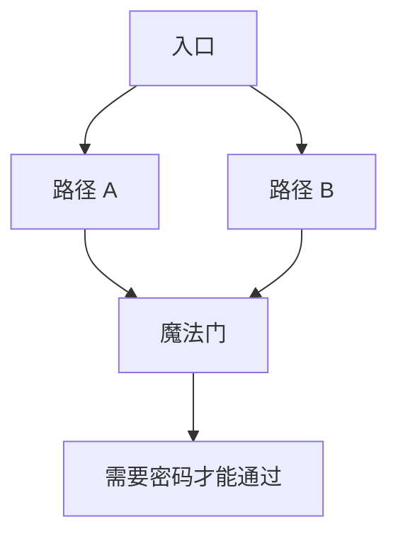
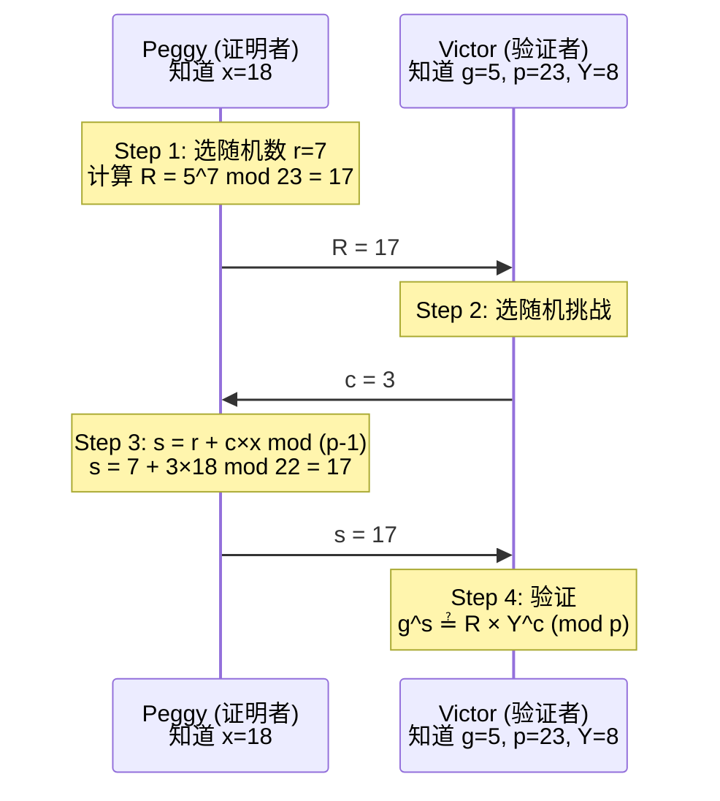
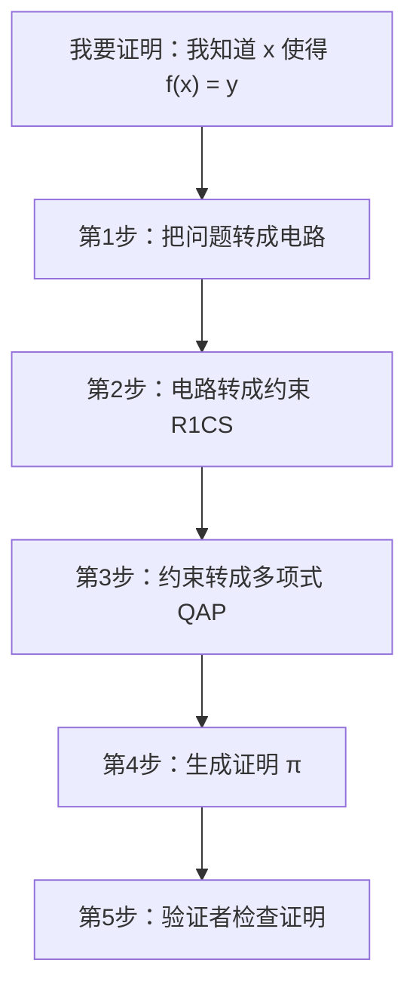
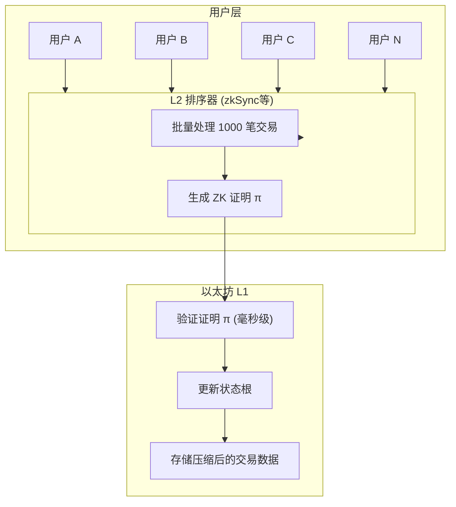

import ZKProofDemo from '../../../../../src/components/Interactive/ZKProofDemo';

# 第九章：零知识证明入门

## 🎮 交互式演示

先玩一玩，体验零知识证明的神奇！

<ZKProofDemo client:only="react" />

---

零知识证明（Zero-Knowledge Proof, ZKP）是密码学中最神奇的概念之一：**证明者可以让验证者相信某个陈述为真，但不泄露任何额外信息**。本章将用直观的例子带你理解这个看似矛盾的概念。

## 8.1 什么是零知识证明？

### 生活中的零知识证明

在正式定义之前，先看几个生活中的例子：

**例子 1：证明你超过 18 岁**

```
传统方式：
你：给我看身份证
我：（递出身份证，暴露了生日、地址、身份证号...）

零知识方式：
你：你超过 18 岁吗？
我：是的（通过某种机制证明，但你只知道"是"，不知道具体年龄）
```

**例子 2：证明你知道密码**

```
传统方式：
服务器存储你的密码，验证时你发送密码
→ 密码在传输和存储中都可能泄露

零知识方式：
你证明"我知道正确的密码"，但密码本身永远不发送
→ 即使服务器被黑，也拿不到密码
```

### 经典比喻：阿里巴巴的洞穴

这是解释零知识证明最著名的故事：



**场景设置：**
- Peggy（证明者）声称知道打开魔法门的密码
- Victor（验证者）想确认 Peggy 是否真的知道
- Peggy 不想告诉 Victor 密码是什么

**协议步骤：**

```
第 1 轮：
1. Victor 在入口等待，不能看到洞穴内部
2. Peggy 进入洞穴，随机选择 A 或 B 路径（假设选了 A）
3. Victor 走到入口，随机喊 "从 A 出来" 或 "从 B 出来"

情况分析：
- 如果 Victor 喊 "从 A 出来"
  → Peggy 直接出来（碰巧选对了）

- 如果 Victor 喊 "从 B 出来"
  → Peggy 必须穿过魔法门，用密码打开
  → 如果她不知道密码，就出不来！
```

**重复多次：**

```
轮次    Peggy知道密码    Peggy不知道密码
1       100% 成功        50% 成功（靠猜）
2       100% 成功        25% 成功
3       100% 成功        12.5% 成功
...
20      100% 成功        0.0001% 成功
```

20 轮后，如果 Peggy 每次都成功，Victor 99.9999% 确信她知道密码。

**关键点：Victor 学到了"Peggy 知道密码"，但没学到密码本身！**

### 三个核心性质

| 性质 | 描述 | 洞穴例子中 |
|------|------|------------|
| **完备性** (Completeness) | 如果陈述为真，诚实的验证者会被说服 | Peggy 知道密码，最终能证明 |
| **可靠性** (Soundness) | 如果陈述为假，欺骗者不能说服验证者 | 不知道密码的人骗不过 20 轮 |
| **零知识性** (Zero-Knowledge) | 验证者只学到"真"，没有其他信息 | Victor 不知道密码是什么 |

## 8.2 数学中的零知识证明

### 问题：证明你知道离散对数

```
公开信息：
- 素数 p = 23
- 生成元 g = 5
- 公开值 Y = 8

问题：证明你知道 x，使得 Y = g^x (mod p)
     即：8 = 5^x (mod 23)

（实际上 x = 18，因为 5^18 mod 23 = 8）
```

### Schnorr 识别协议

这是一个真实的零知识证明协议：



### 完整手算示例（使用更小的数）

让我们用更简单的数字：

```
参数：
- p = 11（素数）
- g = 2（生成元）
- x = 3（私钥，只有 Peggy 知道）
- Y = g^x mod p = 2^3 mod 11 = 8（公开）
```

**Step 1：Peggy 生成承诺**

```
Peggy 选择随机数 r = 5
计算 R = g^r mod p = 2^5 mod 11 = 32 mod 11 = 10

发送 R = 10 给 Victor
```

**Step 2：Victor 发送挑战**

```
Victor 选择随机挑战 c = 2
发送 c = 2 给 Peggy
```

**Step 3：Peggy 计算响应**

```
s = r + c×x mod (p-1)
s = 5 + 2×3 mod 10
s = 11 mod 10
s = 1

发送 s = 1 给 Victor
```

**Step 4：Victor 验证**

**文科生/小学生版解释：为什么要比这个？**

先记住三件事：
- Peggy 的秘密是 x，公开信息是 Y = g^x (mod p)
- Peggy 给的承诺是 R = g^r (mod p)
- Peggy 回答的是 s = r + c×x

把 s 代进去：

```
g^s = g^(r + c×x)
    = g^r × g^(c×x)
    = R × (g^x)^c
    = R × Y^c
```

所以 **如果 Peggy 真的知道 x**，等式一定成立。  
反过来，如果她不知道 x，就很难同时让左右相等。

```
验证等式：g^s ≟ R × Y^c (mod p)

左边：g^s = 2^1 mod 11 = 2
右边：R × Y^c = 10 × 8^2 mod 11
              = 10 × 64 mod 11
              = 10 × 9 mod 11  （因为 64 mod 11 = 9）
              = 90 mod 11
              = 2

左边 = 右边 = 2  ✓ 验证通过！
```

### 为什么这是零知识的？

```
Victor 看到的：R = 10, c = 2, s = 1

关键问题：Victor 能从这些值推出 x 吗？

答案：不能！因为：
1. R 是随机的
2. s = r + c×x，但 Victor 不知道 r
3. 知道一个方程，两个未知数（r 和 x），无法求解

而且，Victor 可以自己"伪造"一组 (R, c, s)：
- 先选 s 和 c
- 计算 R = g^s / Y^c
- 得到的 (R, c, s) 和真实的"看起来一样"

这意味着 Victor 没有从交互中获得任何新信息！
```

## 8.3 zk-SNARKs：让零知识证明实用化

### 交互式 vs 非交互式

```
交互式（Schnorr）：
Peggy ←→ Victor 需要多轮通信

非交互式（SNARK）：
Peggy 生成证明 π
Victor 任何时候都可以验证，不需要 Peggy 在线
```

### zk-SNARK 是什么？

```
zk-SNARK = Zero-Knowledge Succinct Non-interactive ARgument of Knowledge

拆解：
- Zero-Knowledge：不泄露额外信息
- Succinct：证明很小（几百字节），验证很快（毫秒级）
- Non-interactive：不需要来回通信
- ARgument：计算安全（非信息论安全）
- of Knowledge：证明者确实"知道"秘密
```

### 应用场景

| 项目 | 用途 | 好处 |
|------|------|------|
| Zcash | 隐私交易 | 隐藏发送者、接收者、金额 |
| zkSync | L2 扩容 | 链下执行，链上验证 |
| Tornado Cash | 混币 | 无法追踪资金来源 |
| Dark Forest | 游戏 | 隐藏玩家位置 |

### 工作流程概览



## 8.4 用 Circom 写你的第一个 ZKP

### 简单示例：证明你知道两数之积

```
问题：证明你知道 a 和 b，使得 a × b = c
（公开 c，不暴露 a 和 b）
```

**Circom 代码：**

```javascript
pragma circom 2.0.0;

template Multiplier() {
    // 私有输入（只有证明者知道）
    signal input a;
    signal input b;
    
    // 公开输出（所有人都能看到）
    signal output c;
    
    // 约束：c 必须等于 a × b
    c <== a * b;
}

component main = Multiplier();
```

**使用流程：**

```
1. 编译电路
   circom multiplier.circom --r1cs --wasm

2. 可信设置（生成证明密钥）
   snarkjs groth16 setup multiplier.r1cs pot12_final.ptau circuit_final.zkey

3. 生成证明
   输入：{ "a": 3, "b": 7 }
   输出：c = 21，加上证明 π

4. 验证
   任何人可以验证："存在某些 a, b 使得 a×b = 21"
   但不知道 a=3, b=7
```

### 稍复杂示例：证明你知道哈希原像

```javascript
pragma circom 2.0.0;

include "circomlib/poseidon.circom";

template HashPreimage() {
    // 私有输入：秘密值
    signal input secret;
    
    // 公开输入：哈希值
    signal input hash;
    
    // 计算哈希
    component hasher = Poseidon(1);
    hasher.inputs[0] <== secret;
    
    // 约束：计算的哈希必须等于公开的哈希
    hash === hasher.out;
}

component main {public [hash]} = HashPreimage();
```

**用途：**
- 你可以证明"我知道某个秘密，它的哈希是 X"
- 但不暴露秘密是什么
- 这是 Tornado Cash 的核心原理！

## 8.5 zk-STARKs：无需信任的零知识证明

### SNARKs 的问题

```
zk-SNARKs 需要"可信设置"（Trusted Setup）

设置阶段生成参数时，会产生"有毒废料"（toxic waste）
如果有人保留了这些数据，可以伪造证明！

解决方案 1：多方计算
- 多人参与设置
- 只要有一人诚实销毁份额，就安全
- Zcash 的 Powers of Tau 仪式有上千人参与

解决方案 2：使用 STARKs
```

### zk-STARKs

```
zk-STARK = Zero-Knowledge Scalable Transparent ARgument of Knowledge

- Scalable：证明生成时间准线性
- Transparent：不需要可信设置！完全透明
```

### STARKs vs SNARKs

| 特性 | zk-SNARKs | zk-STARKs |
|------|-----------|-----------|
| 可信设置 | **需要** | 不需要 |
| 证明大小 | ~200 B | ~100 KB |
| 验证时间 | 最快 | 快 |
| 证明时间 | 快 | 较慢 |
| 抗量子 | 否 | **是** |
| 使用项目 | Zcash, zkSync Era | StarkNet, zkSync Lite |

### StarkNet 的 Cairo 语言

```python
# Cairo 示例：证明斐波那契计算
func fibonacci(n) -> (result: felt):
    if n == 0:
        return (0)
    end
    if n == 1:
        return (1)
    end
    
    let (a) = fibonacci(n - 1)
    let (b) = fibonacci(n - 2)
    return (a + b)
end

@external
func main():
    let (result) = fibonacci(10)
    assert result = 55  # 验证 fib(10) = 55
    return ()
end
```

## 8.6 zkRollup：零知识证明的杀手应用

### 扩容问题

```
以太坊主网（L1）：
- 每秒 ~15 笔交易
- 每笔交易 Gas 费可能几美元
- 太慢太贵！

目标：
- 更多交易
- 更低费用
- 不牺牲安全性
```

### zkRollup 工作原理



### 效率对比

```
在 L1 验证 1000 笔交易：
- 验证 1000 个签名
- 执行 1000 笔转账逻辑
- Gas 费：1000 × 21000 = 2100 万 Gas

在 zkRollup 验证 1000 笔交易：
- 验证 1 个 ZK 证明
- 更新 1 个状态根
- Gas 费：~50 万 Gas

节省 97%+ 的成本！
```

## 8.7 简单的 Python 零知识证明

让我们实现一个简化版的 Schnorr ZKP：

```python
import random
import hashlib

def zkp_demo():
    """简化版 Schnorr 零知识证明演示"""
    
    # ========== 公共参数 ==========
    p = 23      # 素数
    g = 5       # 生成元
    
    print("=== 零知识证明：证明我知道离散对数 ===")
    print(f"公共参数：p = {p}, g = {g}")
    
    # ========== Peggy 的秘密 ==========
    x = 7  # 私钥（只有 Peggy 知道）
    Y = pow(g, x, p)  # 公钥
    print(f"\n公开值 Y = g^x mod p = {Y}")
    print(f"Peggy 知道 x = {x}（保密）")
    
    # ========== 协议开始 ==========
    print("\n--- 协议开始 ---")
    
    # Step 1: Peggy 生成承诺
    r = random.randint(1, p - 2)  # 随机数
    R = pow(g, r, p)
    print(f"\n[Peggy] 选择随机数 r = {r}")
    print(f"[Peggy] 计算承诺 R = g^r = {g}^{r} mod {p} = {R}")
    print(f"[Peggy] 发送 R = {R}")
    
    # Step 2: Victor 发送挑战
    c = random.randint(1, p - 2)
    print(f"\n[Victor] 发送随机挑战 c = {c}")
    
    # Step 3: Peggy 计算响应
    s = (r + c * x) % (p - 1)
    print(f"\n[Peggy] 计算响应 s = r + c×x mod (p-1)")
    print(f"[Peggy] s = {r} + {c}×{x} mod {p - 1} = {s}")
    print(f"[Peggy] 发送 s = {s}")
    
    # Step 4: Victor 验证
    left = pow(g, s, p)
    right = (R * pow(Y, c, p)) % p
    
    print(f"\n[Victor] 验证 g^s ≟ R × Y^c (mod p)")
    print(f"[Victor] 左边: g^s = {g}^{s} mod {p} = {left}")
    print(f"[Victor] 右边: R × Y^c = {R} × {Y}^{c} mod {p} = {right}")
    
    if left == right:
        print(f"\n✓ 验证通过！Victor 相信 Peggy 知道 x")
    else:
        print(f"\n✗ 验证失败！")
    
    # ========== 为什么是零知识？ ==========
    print("\n--- 为什么是零知识？ ---")
    print("Victor 只看到了：R, c, s")
    print("Victor 无法从这些值推出 x，因为：")
    print("- s = r + c×x，但 Victor 不知道 r")
    print("- 一个方程，两个未知数，无法求解")
    
    return left == right

# 运行多轮以增加可信度
def run_multiple_rounds(rounds=5):
    """运行多轮证明"""
    print(f"\n{'='*50}")
    print(f"运行 {rounds} 轮证明")
    print(f"{'='*50}")
    
    success = 0
    for i in range(rounds):
        print(f"\n第 {i+1} 轮：", end="")
        # 简化版多轮
        p, g, x = 23, 5, 7
        Y = pow(g, x, p)
        r = random.randint(1, p - 2)
        R = pow(g, r, p)
        c = random.randint(1, p - 2)
        s = (r + c * x) % (p - 1)
        
        if pow(g, s, p) == (R * pow(Y, c, p)) % p:
            print("✓ 通过")
            success += 1
        else:
            print("✗ 失败")
    
    print(f"\n结果：{success}/{rounds} 轮通过")
    print(f"欺骗者成功概率：1/{2**rounds} = {1/2**rounds:.6%}")

if __name__ == "__main__":
    zkp_demo()
    run_multiple_rounds()
```

输出示例：

```
=== 零知识证明：证明我知道离散对数 ===
公共参数：p = 23, g = 5

公开值 Y = g^x mod p = 17
Peggy 知道 x = 7（保密）

--- 协议开始 ---

[Peggy] 选择随机数 r = 15
[Peggy] 计算承诺 R = g^r = 5^15 mod 23 = 19
[Peggy] 发送 R = 19

[Victor] 发送随机挑战 c = 8

[Peggy] 计算响应 s = r + c×x mod (p-1)
[Peggy] s = 15 + 8×7 mod 22 = 5
[Peggy] 发送 s = 5

[Victor] 验证 g^s ≟ R × Y^c (mod p)
[Victor] 左边: g^s = 5^5 mod 23 = 20
[Victor] 右边: R × Y^c = 19 × 17^8 mod 23 = 20

✓ 验证通过！Victor 相信 Peggy 知道 x
```

## 8.8 签名也是零知识证明

你可能没意识到，你每天用的数字签名（Schnorr, ECDSA）本质上就是**零知识证明**！

### 签名证明了什么？

当你对消息 $m$ 签名时，你实际上是在证明：
**"我知道私钥 $x$，它对应公钥 $Y$"**

并且满足零知识证明的特性：
1.  **完备性**：如果你有私钥，签名验证一定通过。
2.  **可靠性**：如果你没有私钥，你无法伪造有效签名。
3.  **零知识性**：签名不会泄露私钥 $x$ 的任何信息。

### 从 ZKP 到 签名 (Fiat-Shamir 变换)

还记得上面的 Schnorr 交互协议吗？

1. Peggy 发送 $R$
2. Victor 发送随机挑战 $c$
3. Peggy 发送 $s$

要把这个变成**非交互式签名**，Peggy 不需要等待 Victor 的挑战，而是自己生成挑战：

$$c = Hash(R, m)$$

这样，签名为 $(R, s)$。验证者自己计算 $c = Hash(R, m)$，然后验证 $g^s = R \cdot Y^c$。

这就是 **Schnorr 签名**！

### 各种签名的 ZKP 本质

| 协议 | 证明的知识 | 形式 |
|---|---|---|
| **Schnorr 身份认证** | 我知道离散对数 $x$ | 交互式 ZKP |
| **Schnorr 签名** | 我知道离散对数 $x$ (绑定消息 $m$) | 非交互式 ZKP |
| **ECDSA 签名** | 我知道离散对数 $x$ | 非交互式 ZKP (变体) |

:::info 深刻理解
**数字签名 = 非交互式零知识证明 (NIZK)**
在此基础上，通过把"挑战" $c$ 设为消息的哈希 $H(m)$，将证明与特定消息绑定，就变成了对消息的签名。
:::

## 本章小结

| 概念 | 要点 |
|------|------|
| **零知识证明** | 证明某事为真，不泄露额外信息 |
| **三个性质** | 完备性、可靠性、零知识性 |
| **交互式 ZKP** | Schnorr 协议，需要多轮通信 |
| **zk-SNARKs** | 小证明、快验证、需要可信设置 |
| **zk-STARKs** | 大证明、无需可信设置、抗量子 |
| **zkRollup** | 用 ZKP 实现 L2 扩容 |

## 思考题

1. 阿里巴巴洞穴的例子中，为什么要重复多轮？一轮能证明吗？
2. 为什么零知识证明可以隐藏信息但仍然可验证？
3. zkRollup 如何同时实现扩容和安全性？

## 练习

### 手算练习

使用参数：p = 11, g = 2, x = 4

1. 计算公开值 Y = g^x mod p
2. 假设 Peggy 选择 r = 6，计算承诺 R
3. 假设 Victor 挑战 c = 3，计算响应 s
4. 验证等式 g^s = R × Y^c (mod p)

---

下一章：[零知识证明深入 — 从电路到证明](/docs/cryptography/zkp-deep-dive/arithmetic-circuits)
