---
sidebar:
  order: 1
title: ZKP 匿名 360 度评审系统
---

import { ZKP360ReviewDemo } from '@site/src/components/Interactive';

# 毕业项目：基于零知识证明的匿名 360 度评审系统

## 交互式演示

在开始学习之前，先通过交互式演示体验完整系统的运作方式：

<ZKP360ReviewDemo client:only="react" />

---

## 1. 项目背景

### 1.1 360 评审的信任问题

360 度评审是企业管理中常用的绩效评估方法：上级、同事、下属从不同角度对一个人进行匿名打分。但实际操作中存在一个核心矛盾：

> **HR 系统记录了"谁给谁打了几分"，员工担心 HR 泄露打分给上级，因此不敢给真实评价。**

传统方案的困境：

| 方案 | 问题 |
|------|------|
| 匿名问卷 | HR 后台仍能看到个人打分 |
| 第三方平台 | 需要信任第三方不泄露 |
| 纸质匿名 | 无法防止 HR 通过笔迹辨认 |
| 完全不记录 | 无法验证谁投了票、是否重复投票 |

### 1.2 ZKP 如何解决

零知识证明提供了一个优雅的解决方案：**将身份验证与打分行为完全解耦**。

评审者证明：
1. "我是合法评审者"（在 Merkle 树中）
2. "我的打分在合法范围内"（1-10 分）
3. "我没有重复投票"（nullifier 唯一）

但**不泄露**：
- 我是谁
- 我打了几分
- 我的私钥是什么

### 1.3 系统架构总览

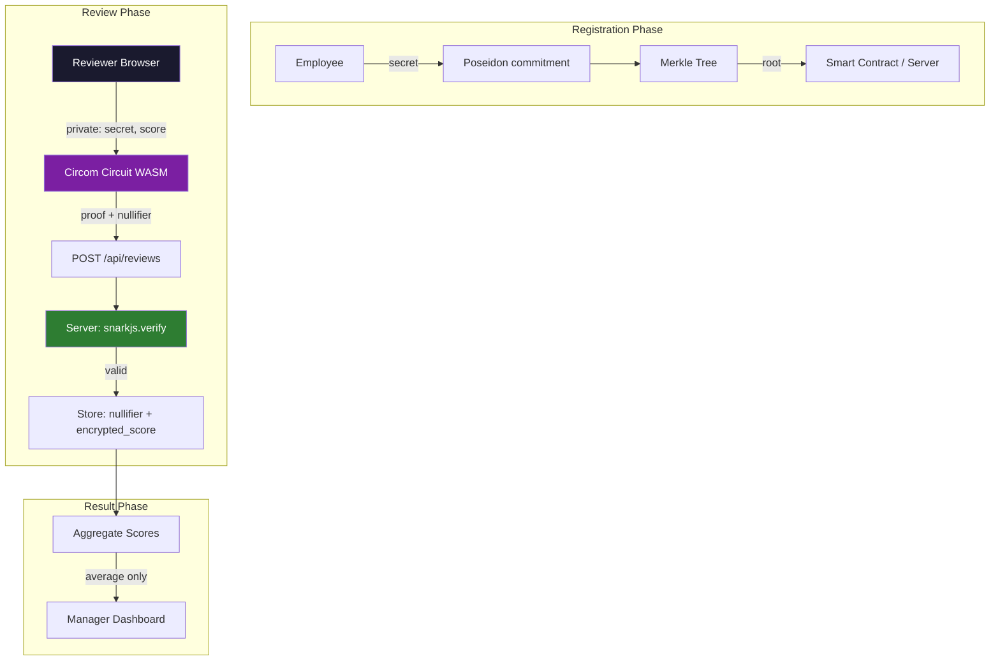

---

## 2. 核心协议设计

### 2.1 Poseidon Commitment 方案

我们选择 Poseidon 哈希函数来构建 commitment 方案。Poseidon 是专为 ZK 电路设计的哈希函数，其约束数远低于 SHA256。

**Commitment 生成：**

$$
\text{commitment} = \text{Poseidon}(\text{secret})
$$

其中 $\text{secret}$ 是评审者的私有随机数，类似于私钥。

**性质：**
- **隐藏性 (Hiding)**：给定 commitment，无法反推 secret
- **绑定性 (Binding)**：不同 secret 生成不同 commitment（碰撞概率可忽略）

### 2.2 Merkle 成员证明

> 关于 Merkle 树的基础知识，请参考 [Merkle 树与 SPV 验证](/docs/cryptography/merkle) 章节。

所有评审者的 commitment 构成 Merkle 树的叶节点。评审者通过 Merkle proof 证明自己的 commitment 在树中，而不暴露是哪个叶节点。

$$
\text{root} = \text{MerkleRoot}([\text{commitment}_0, \text{commitment}_1, ..., \text{commitment}_{n-1}])
$$

验证路径：

$$
\text{Verify}(\text{leaf}, \text{path}, \text{root}) \rightarrow \{0, 1\}
$$

### 2.3 Nullifier 防重复投票

Nullifier 是防止重复投票的核心机制：

$$
\text{nullifier} = \text{Poseidon}(\text{secret}, \text{reviewee\_id})
$$

**关键设计：**
- 同一 secret + 同一 reviewee_id 总是产生相同 nullifier
- 服务端存储已使用的 nullifier，拒绝重复提交
- 不同 reviewee_id 产生不同 nullifier，所以对不同人的评审互不影响
- 无法从 nullifier 反推 secret（Poseidon 单向性）

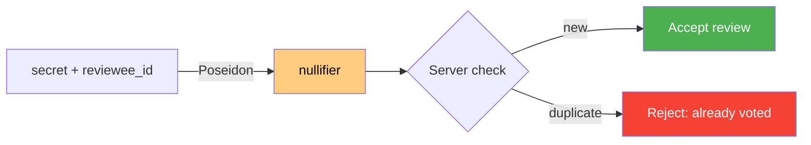

---

## 3. Circom 电路详解

本项目的电路由三部分组成，总约束数约 **2870 个**，在现代浏览器中 5-10 秒即可完成证明生成。

### 3.1 range_check.circom — 范围约束

通过二进制分解确保分数在 1-10 范围内：

```circom title="circuits/range_check.circom"
pragma circom 2.1.6;

// Check that `in` is in range [1, max_value]
// Uses binary decomposition to constrain the value
template RangeCheck(n_bits) {
    signal input in;
    signal input max_value;
    signal output out;

    // Binary decomposition
    signal bits[n_bits];
    var sum = 0;
    for (var i = 0; i < n_bits; i++) {
        bits[i] <-- (in >> i) & 1;
        bits[i] * (bits[i] - 1) === 0;  // Each bit is 0 or 1
        sum += bits[i] * (1 << i);
    }
    sum === in;  // Reconstruction matches input

    // Check: in >= 1
    signal in_minus_1;
    in_minus_1 <== in - 1;

    // Binary decomposition of (in - 1) proves in >= 1
    signal lower_bits[n_bits];
    var lower_sum = 0;
    for (var i = 0; i < n_bits; i++) {
        lower_bits[i] <-- (in_minus_1 >> i) & 1;
        lower_bits[i] * (lower_bits[i] - 1) === 0;
        lower_sum += lower_bits[i] * (1 << i);
    }
    lower_sum === in_minus_1;

    // Check: in <= max_value
    signal diff;
    diff <== max_value - in;

    signal upper_bits[n_bits];
    var upper_sum = 0;
    for (var i = 0; i < n_bits; i++) {
        upper_bits[i] <-- (diff >> i) & 1;
        upper_bits[i] * (upper_bits[i] - 1) === 0;
        upper_sum += upper_bits[i] * (1 << i);
    }
    upper_sum === diff;

    out <== 1;
}
```

**约束分析：**
- 每个 bit 约束：$b_i \times (b_i - 1) = 0$（确保 $b_i \in \{0, 1\}$）
- 重建约束：$\sum b_i \times 2^i = \text{in}$
- 3 组 4-bit 分解 = **~30 约束**

### 3.2 merkle_proof.circom — Merkle 路径验证

使用 Poseidon 哈希的 Merkle proof 验证：

```circom title="circuits/merkle_proof.circom"
pragma circom 2.1.6;

include "node_modules/circomlib/circuits/poseidon.circom";

// Verify a Merkle proof using Poseidon hash
// depth: height of the Merkle tree
template MerkleProof(depth) {
    signal input leaf;
    signal input root;
    signal input pathElements[depth];
    signal input pathIndices[depth];  // 0 = left, 1 = right

    signal hashes[depth + 1];
    hashes[0] <== leaf;

    component hashers[depth];
    component muxes_left[depth];
    component muxes_right[depth];

    for (var i = 0; i < depth; i++) {
        // pathIndices[i] must be binary
        pathIndices[i] * (pathIndices[i] - 1) === 0;

        // Select left and right inputs based on path direction
        // If pathIndices[i] == 0: hash(current, sibling)
        // If pathIndices[i] == 1: hash(sibling, current)
        signal left;
        signal right;

        left <== hashes[i] + pathIndices[i] * (pathElements[i] - hashes[i]);
        right <== pathElements[i] + pathIndices[i] * (hashes[i] - pathElements[i]);

        hashers[i] = Poseidon(2);
        hashers[i].inputs[0] <== left;
        hashers[i].inputs[1] <== right;

        hashes[i + 1] <== hashers[i].out;
    }

    // Final hash must equal the root
    root === hashes[depth];
}
```

**约束分析：**
- 每层：1 个 Poseidon (约 240 约束) + 2 个 mux + 1 个 binary check
- 深度 10 的树 ≈ **~2500 约束**
- 支持 $2^{10} = 1024$ 个评审者

### 3.3 review_proof.circom — 主电路

将所有组件组合成完整的评审证明电路：

```circom title="circuits/review_proof.circom"
pragma circom 2.1.6;

include "node_modules/circomlib/circuits/poseidon.circom";
include "./merkle_proof.circom";
include "./range_check.circom";

template ReviewProof(merkle_depth) {
    // === Private inputs (never leave the browser) ===
    signal input secret;          // Reviewer's private secret
    signal input score;           // The review score (1-10)
    signal input pathElements[merkle_depth];  // Merkle proof siblings
    signal input pathIndices[merkle_depth];   // Merkle proof directions

    // === Public inputs (sent to server for verification) ===
    signal input merkle_root;     // Published Merkle root
    signal input nullifier_hash;  // For duplicate detection
    signal input reviewee_id;     // Who is being reviewed
    signal input max_score;       // Maximum allowed score (10)

    // 1. Compute commitment from secret
    component commitment_hasher = Poseidon(1);
    commitment_hasher.inputs[0] <== secret;
    signal commitment;
    commitment <== commitment_hasher.out;

    // 2. Verify Merkle membership
    component merkle_verifier = MerkleProof(merkle_depth);
    merkle_verifier.leaf <== commitment;
    merkle_verifier.root <== merkle_root;
    for (var i = 0; i < merkle_depth; i++) {
        merkle_verifier.pathElements[i] <== pathElements[i];
        merkle_verifier.pathIndices[i] <== pathIndices[i];
    }

    // 3. Compute and verify nullifier
    component nullifier_hasher = Poseidon(2);
    nullifier_hasher.inputs[0] <== secret;
    nullifier_hasher.inputs[1] <== reviewee_id;
    nullifier_hash === nullifier_hasher.out;

    // 4. Range check on score
    component range = RangeCheck(4);  // 4 bits supports up to 15
    range.in <== score;
    range.max_value <== max_score;
}

// Instantiate with Merkle depth = 10 (supports up to 1024 reviewers)
component main { public [merkle_root, nullifier_hash, reviewee_id, max_score] }
    = ReviewProof(10);
```

**总约束数分析：**

| 组件 | 约束数 | 说明 |
|------|--------|------|
| Poseidon(1) commitment | ~240 | 1 次 Poseidon 哈希 |
| MerkleProof(10) | ~2500 | 10 层 Poseidon + mux |
| Poseidon(2) nullifier | ~240 | 1 次 Poseidon 哈希 |
| RangeCheck(4) | ~30 | 3 组 binary decomposition |
| **总计** | **~2870** | 浏览器 5-10s |

---

## 4. Auth0 集成设计

### 4.1 角色与权限

Auth0 SSO 提供三种角色：

| 角色 | 权限 | 说明 |
|------|------|------|
| `employee` | 提交评审、查看自己被评审结果 | 所有员工 |
| `manager` | employee 权限 + 查看团队聚合结果 | 团队主管 |
| `hr_admin` | 管理评审周期、查看聚合统计 | HR 管理员 |

### 4.2 JWT + RBAC

Auth0 签发的 JWT token 包含角色信息：

```json
{
  "sub": "auth0|user_id_123",
  "email": "alice@company.com",
  "https://review-app/roles": ["employee"],
  "iat": 1700000000,
  "exp": 1700086400
}
```

### 4.3 关键设计洞察

> **Auth0 认证 HTTP 请求，ZK proof 不含身份。**

这是整个系统最关键的设计点：

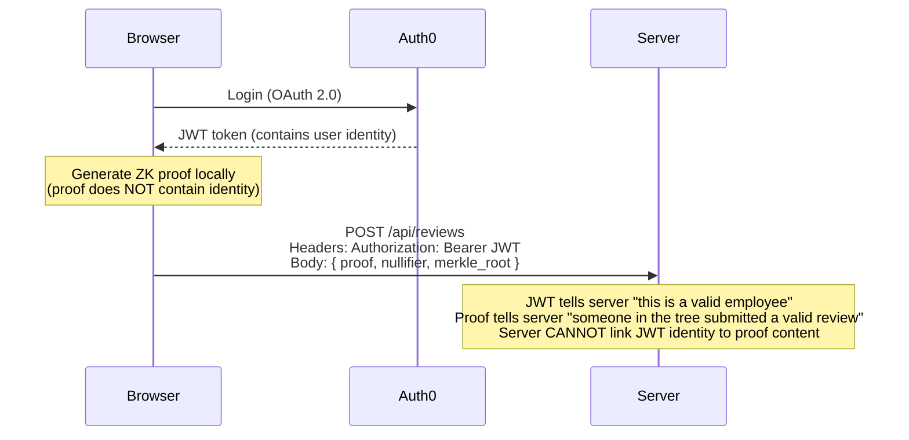

**为什么 Server 无法关联身份与打分？**

1. JWT 只验证"这个 HTTP 请求来自合法员工"
2. ZK proof 只证明"提交者在 Merkle 树中且分数合法"
3. proof 中没有任何与 JWT `sub` 相关的信息
4. 即使 HR 查看服务器日志，也只能看到"某个员工提交了一个合法 proof"

### 4.4 Auth0 配置步骤

**Step 1: 创建 Auth0 Application**

在 Auth0 Dashboard 创建 Single Page Application：
- Application Type: Single Page Application
- Allowed Callback URLs: `http://localhost:5173/callback`
- Allowed Logout URLs: `http://localhost:5173`
- Allowed Web Origins: `http://localhost:5173`

**Step 2: 配置 RBAC**

创建 API 和角色：

```bash
# Auth0 Management API
# 创建 API
curl -X POST https://YOUR_DOMAIN.auth0.com/api/v2/resource-servers \
  -H "Authorization: Bearer MGMT_TOKEN" \
  -d '{"name": "Review API", "identifier": "https://review-api"}'

# 创建角色
curl -X POST https://YOUR_DOMAIN.auth0.com/api/v2/roles \
  -d '{"name": "employee", "description": "Can submit reviews"}'
```

**Step 3: 前端集成**

```javascript
// auth0-config.js
import { Auth0Provider } from '@auth0/auth0-react';

const AUTH0_CONFIG = {
  domain: 'YOUR_DOMAIN.auth0.com',
  clientId: 'YOUR_CLIENT_ID',
  authorizationParams: {
    redirect_uri: window.location.origin + '/callback',
    audience: 'https://review-api',
    scope: 'openid profile email',
  },
};
```

---

## 5. 系统架构与 API

### 5.1 技术栈

| 层 | 技术 | 说明 |
|----|------|------|
| 前端 | Vite + React | 现代构建工具 |
| ZK (浏览器) | snarkjs WASM | 浏览器端证明生成 |
| 认证 | Auth0 SPA SDK | SSO + JWT |
| 后端 | Express.js | API 服务器 |
| 数据库 | better-sqlite3 | 轻量级嵌入式数据库 |
| ZK (服务端) | snarkjs | Proof 验证 |

### 5.2 API 端点设计

| Method | Path | Auth | 说明 |
|--------|------|------|------|
| `GET` | `/api/review-cycles` | employee | 获取当前评审周期 |
| `GET` | `/api/merkle-root/:cycleId` | employee | 获取 Merkle 根 |
| `GET` | `/api/merkle-proof/:cycleId` | employee | 获取个人 Merkle proof |
| `POST` | `/api/reviews` | employee | 提交匿名评审 |
| `GET` | `/api/results/:cycleId/:revieweeId` | manager | 获取聚合结果 |
| `POST` | `/api/cycles` | hr_admin | 创建评审周期 |

### 5.3 数据库 Schema

```sql
-- 评审周期
CREATE TABLE cycles (
  id INTEGER PRIMARY KEY AUTOINCREMENT,
  name TEXT NOT NULL,
  merkle_root TEXT NOT NULL,
  status TEXT DEFAULT 'active',  -- active | closed
  created_at DATETIME DEFAULT CURRENT_TIMESTAMP
);

-- 评审者注册 (仅存 commitment，不关联具体身份)
CREATE TABLE commitments (
  id INTEGER PRIMARY KEY AUTOINCREMENT,
  cycle_id INTEGER REFERENCES cycles(id),
  commitment TEXT NOT NULL,       -- Poseidon(secret)
  leaf_index INTEGER NOT NULL     -- Position in Merkle tree
);

-- 匿名评审记录 (注意: 没有 user_id 列!)
CREATE TABLE reviews (
  id INTEGER PRIMARY KEY AUTOINCREMENT,
  cycle_id INTEGER REFERENCES cycles(id),
  nullifier TEXT NOT NULL UNIQUE,  -- 防重复投票
  merkle_root TEXT NOT NULL,       -- 提交时的 Merkle root
  reviewee_id INTEGER NOT NULL,
  encrypted_score TEXT NOT NULL,   -- AES 加密的分数
  proof TEXT NOT NULL,             -- JSON 格式的 ZK proof
  verified BOOLEAN DEFAULT false,
  created_at DATETIME DEFAULT CURRENT_TIMESTAMP
);

-- 注意: reviews 表没有 user_id!
-- 服务端无法知道哪个 nullifier 对应哪个人
```

### 5.4 完整数据流

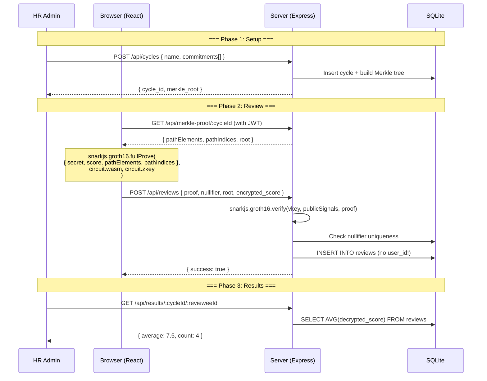

---

## 6. 关键代码片段

### 6.1 后端：Proof 验证中间件

```javascript title="server/middleware/verifyProof.js"
import * as snarkjs from 'snarkjs';
import fs from 'fs';

const vkey = JSON.parse(
  fs.readFileSync('./circuits/verification_key.json', 'utf8')
);

export async function verifyProof(req, res, next) {
  const { proof, nullifier, merkle_root, reviewee_id, max_score } = req.body;

  // Public signals must match the circuit's public input order
  const publicSignals = [
    merkle_root,
    nullifier,
    reviewee_id,
    max_score || '10',
  ];

  try {
    const valid = await snarkjs.groth16.verify(vkey, publicSignals, proof);

    if (!valid) {
      return res.status(400).json({ error: 'Invalid proof' });
    }

    // Check nullifier hasn't been used
    const existing = db.prepare(
      'SELECT id FROM reviews WHERE nullifier = ?'
    ).get(nullifier);

    if (existing) {
      return res.status(409).json({ error: 'Duplicate vote detected' });
    }

    next();
  } catch (err) {
    return res.status(500).json({ error: 'Proof verification failed' });
  }
}
```

### 6.2 前端：浏览器端证明生成

```javascript title="client/src/utils/generateProof.js"
import * as snarkjs from 'snarkjs';

export async function generateReviewProof({
  secret,
  score,
  revieweeId,
  merkleRoot,
  pathElements,
  pathIndices,
}) {
  // All private inputs stay in the browser
  const input = {
    // Private inputs
    secret: secret.toString(),
    score: score.toString(),
    pathElements: pathElements.map(String),
    pathIndices: pathIndices.map(String),
    // Public inputs
    merkle_root: merkleRoot,
    nullifier_hash: '0', // Will be computed by circuit
    reviewee_id: revieweeId.toString(),
    max_score: '10',
  };

  console.time('Proof generation');
  const { proof, publicSignals } = await snarkjs.groth16.fullProve(
    input,
    '/circuits/review_proof.wasm',
    '/circuits/circuit_final.zkey'
  );
  console.timeEnd('Proof generation');

  // publicSignals[1] is the nullifier computed by the circuit
  const nullifier = publicSignals[1];

  return { proof, publicSignals, nullifier };
}
```

### 6.3 前端：ReviewForm 组件

```jsx title="client/src/components/ReviewForm.jsx"
import { useState } from 'react';
import { useAuth0 } from '@auth0/auth0-react';
import { generateReviewProof } from '../utils/generateProof';

export function ReviewForm({ cycleId, revieweeId, merkleData }) {
  const { getAccessTokenSilently } = useAuth0();
  const [score, setScore] = useState(5);
  const [status, setStatus] = useState('idle');
  const [error, setError] = useState(null);

  // secret is stored locally (e.g., localStorage or derived from password)
  const secret = localStorage.getItem(`review_secret_${cycleId}`);

  const handleSubmit = async (e) => {
    e.preventDefault();
    setStatus('proving');
    setError(null);

    try {
      // Step 1: Generate ZK proof in browser (5-10 seconds)
      const { proof, publicSignals, nullifier } = await generateReviewProof({
        secret,
        score,
        revieweeId,
        merkleRoot: merkleData.root,
        pathElements: merkleData.pathElements,
        pathIndices: merkleData.pathIndices,
      });

      setStatus('submitting');

      // Step 2: Submit proof to server
      // JWT authenticates the HTTP request
      // but proof contains NO identity information
      const token = await getAccessTokenSilently();

      const res = await fetch('/api/reviews', {
        method: 'POST',
        headers: {
          'Content-Type': 'application/json',
          Authorization: `Bearer ${token}`,
        },
        body: JSON.stringify({
          cycle_id: cycleId,
          reviewee_id: revieweeId,
          proof,
          nullifier,
          merkle_root: merkleData.root,
          encrypted_score: encrypt(score, merkleData.sharedKey),
          max_score: '10',
        }),
      });

      if (!res.ok) {
        const data = await res.json();
        throw new Error(data.error || 'Submission failed');
      }

      setStatus('success');
    } catch (err) {
      setError(err.message);
      setStatus('error');
    }
  };

  return (
    <form onSubmit={handleSubmit}>
      <label>
        Score (1-10):
        <input
          type="range"
          min="1"
          max="10"
          value={score}
          onChange={(e) => setScore(Number(e.target.value))}
        />
        <span>{score}</span>
      </label>

      <button type="submit" disabled={status === 'proving' || status === 'submitting'}>
        {status === 'proving' && 'Generating proof...'}
        {status === 'submitting' && 'Submitting...'}
        {status === 'idle' && 'Submit Anonymous Review'}
        {status === 'success' && 'Submitted!'}
        {status === 'error' && 'Retry'}
      </button>

      {error && <p className="error">{error}</p>}
    </form>
  );
}

function encrypt(score, key) {
  // Simplified - use AES-GCM in production
  return btoa(JSON.stringify({ score, nonce: Math.random() }));
}
```

### 6.4 电路编译与 Trusted Setup

```bash title="scripts/setup_circuits.sh"
#!/bin/bash
set -euo pipefail

echo "=== Step 1: Compile Circom circuit ==="
circom circuits/review_proof.circom \
  --r1cs --wasm --sym \
  -o build/

echo "=== Step 2: Powers of Tau ceremony ==="
# Download pre-computed powers of tau (for circuits up to 2^12 constraints)
wget -q https://hermez.s3-eu-west-1.amazonaws.com/powersOfTau28_hez_final_12.ptau \
  -O build/pot12_final.ptau

echo "=== Step 3: Groth16 trusted setup ==="
snarkjs groth16 setup \
  build/review_proof.r1cs \
  build/pot12_final.ptau \
  build/circuit_0000.zkey

echo "=== Step 4: Contribute randomness ==="
snarkjs zkey contribute \
  build/circuit_0000.zkey \
  build/circuit_final.zkey \
  --name="First contribution" \
  -v -e="$(head -c 64 /dev/urandom | xxd -p)"

echo "=== Step 5: Export verification key ==="
snarkjs zkey export verificationkey \
  build/circuit_final.zkey \
  build/verification_key.json

echo "=== Step 6: Copy WASM to public directory ==="
cp build/review_proof_js/review_proof.wasm public/circuits/
cp build/circuit_final.zkey public/circuits/

echo "Done! Circuit artifacts ready."
echo "  - WASM:  public/circuits/review_proof.wasm"
echo "  - Zkey:  public/circuits/circuit_final.zkey"
echo "  - VKey:  build/verification_key.json"
```

---

## 7. 安全分析

### 7.1 攻击面分析

| 攻击场景 | 攻击者 | 是否可行 | 防御机制 |
|----------|--------|----------|----------|
| HR 查看个人打分 | hr_admin | **不可行** | reviews 表无 user_id，分数加密 |
| HR 通过 nullifier 追踪身份 | hr_admin | **不可行** | nullifier = Poseidon(secret, reviewee_id)，单向函数 |
| 员工重复投票 | employee | **不可行** | 相同 secret+reviewee_id 产生相同 nullifier，被去重 |
| 伪造合法评审 | outsider | **不可行** | 必须在 Merkle 树中，且 proof 通过验证 |
| HR 篡改 Merkle 树 | hr_admin | **可检测** | Merkle root 可公开审计 / 上链 |
| 重放攻击 | attacker | **不可行** | nullifier 唯一 + merkle_root 绑定特定周期 |
| 旁路攻击（时序分析） | hr_admin | **可缓解** | 批量提交窗口 / 随机延迟 |

### 7.2 Nullifier 防双投原理

为什么同一个人不能投两次？

$$
\text{nullifier} = \text{Poseidon}(\text{secret}, \text{reviewee\_id})
$$

- **确定性**：相同输入总是产生相同输出
- **服务端去重**：`UNIQUE` 约束在 nullifier 列
- **不可伪造**：必须知道 secret 才能计算正确的 nullifier，电路强制 nullifier 与 commitment 使用同一个 secret

如果尝试使用不同的 secret 来生成新 nullifier，Merkle proof 将失败（因为对应的 commitment 不在树中）。

### 7.3 为什么 Poseidon 优于 SHA256

在 ZK 电路中，**约束数是性能的关键指标**：

| 哈希函数 | ZK 电路约束数 | 浏览器证明时间 | 安全性 |
|----------|--------------|---------------|--------|
| SHA256 | ~25,000 per call | 60-120s | 128-bit |
| Poseidon | ~240 per call | 5-10s | 128-bit |

Poseidon 专为 ZK 场景设计：
- **代数结构**：操作定义在素数域上，与 ZK 电路使用的域一致
- **低乘法深度**：减少约束数量
- **安全性**：经过严格的密码学分析，128-bit 安全性

本项目电路使用 ~3 次 Poseidon 调用。如果用 SHA256：
- Poseidon：$3 \times 240 = 720$ 约束
- SHA256：$3 \times 25000 = 75000$ 约束

这意味着 **100 倍的差异**，直接影响用户等待时间。

### 7.4 员工常见质疑 FAQ

:::info 核心问题
"我用 Auth0 SSO 登录后，服务器知道我是谁。那我提交评审时，HR 不就能记录'Alice 在 15:07 提交了评审'，从而追踪我的打分吗？"
:::

**这个担忧完全合理。** 下面从三个层次解释为什么 SSO 登录不会破坏匿名性：

#### 第一层：Proof 与 JWT 在数学上无关联

```
JWT payload:   { sub: "auth0|alice_123", role: "employee" }  ← 身份
ZK proof:      { pi_a, pi_b, pi_c }                         ← 由 secret 生成
nullifier:     Poseidon(secret, reviewee_id)                 ← 与身份无关
```

这两样东西由**完全不同的密钥材料**生成：
- JWT 由 Auth0 用 RS256 签名，绑定的是 `auth0|alice_123`
- ZK proof 由评审者的 `secret` 在浏览器本地生成，`secret` 从未发送给 Auth0 或后端

**没有任何密码学路径**能从 proof/nullifier 反推出 JWT 中的 `sub`。

#### 第二层：即使 HR 有完整服务器日志

假设 HR 获取了 Nginx access log：

```
15:07:01 POST /api/reviews IP=10.0.1.42 User=alice nullifier=0x3a8f...
15:07:03 POST /api/reviews IP=10.0.1.58 User=bob   nullifier=0x9c2d...
15:08:22 POST /api/reviews IP=10.0.1.71 User=charlie nullifier=0x7e1a...
15:09:45 POST /api/reviews IP=10.0.1.33 User=diana  nullifier=0xb4c0...
```

HR 知道了 Alice 提交的是 `0x3a8f...`。然后呢？

1. **nullifier 无法解密出分数** — nullifier 是 Poseidon 单向函数的输出
2. **encrypted_score 用共享密钥加密** — HR 没有解密密钥（只有聚合服务有）
3. **proof 本身不含分数** — proof 只证明"分数在 1-10 范围内"，不泄露具体值

> HR 知道 Alice 投了票，但**不知道她打了几分**。这和选举投票站的逻辑一样：工作人员知道你来投票了，但不知道你投给了谁。

#### 第三层：时序与旁路攻击的缓解

真正需要防范的是**旁路攻击**，例如：

| 攻击方式 | 示例 | 缓解方案 |
|----------|------|----------|
| 时序分析 | "只剩 Alice 没投，最后一个 nullifier 就是她的" | 批量提交窗口 |
| IP 关联 | "这个 IP 只有 Alice 用" | VPN / 公司统一出口 IP |
| 排除法 | "4 人组 3 人已确认，第4个必然是 Bob" | 最小匿名集阈值 |

**推荐的生产级缓解方案：**

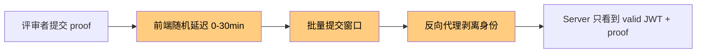

1. **批量提交窗口**：所有评审在截止时间一次性提交，服务端在窗口关闭后才处理
2. **前端随机延迟**：收到 proof 后随机等待 0-30 分钟再发送 HTTP 请求
3. **反向代理剥离身份**：Nginx/API Gateway 验证 JWT 有效性后，只转发 `{ role: "employee" }` 给后端，不转发 `sub`
4. **最小匿名集**：至少 K 人提交后才开放结果查看（K=3 即可提供 $\frac{1}{3}$ 的不确定性）

```javascript title="server/middleware/stripIdentity.js"
// 反向代理中间件：验证 JWT 后剥离身份信息
export function stripIdentity(req, res, next) {
  // JWT 已在上游验证有效性
  // 只保留角色信息，丢弃用户身份
  req.auth = {
    role: req.auth.roles[0],  // "employee" | "manager" | "hr_admin"
    // 注意：不传递 sub、email、name
  };
  next();
}
```

#### 总结：三层防御模型

$$
\underbrace{\text{ZK proof 与身份无关}}_{\text{密码学保证}} + \underbrace{\text{分数加密}}_{\text{即使关联也无法读取}} + \underbrace{\text{时序缓解}}_{\text{防旁路攻击}}
$$

即使攻击者同时拥有 Auth0 管理员权限 + 服务器 root 权限 + 数据库完整备份，他也只能得到：
- Alice 提交了一个有效评审 (来自 access log)
- 该评审的 nullifier 是 `0x3a8f...` (来自数据库)
- 评审分数是 `AES(???)` (来自数据库，无法解密)

**他无法知道 Alice 打了几分。**

---

## 8. 扩展挑战

完成基础版本后，可以尝试以下进阶挑战。每个挑战都附有完整的参考实现。

### 8.1 加密评语

**目标**：除了数字打分，增加文字评语功能。评审者用 Manager 的公钥加密评语，HR 无法查看，只有 Manager 能解密。

#### 8.1.1 设计思路

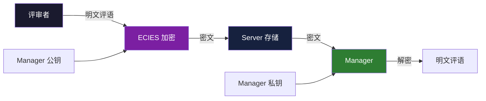

核心问题：**HR 可以看到密文，但 ZKP 如何保证评语内容合规？**

我们需要在**不暴露评语明文**的情况下，用 ZK 电路证明：
1. 评语长度在限制范围内（如 ≤ 500 字符）
2. 密文是用正确的公钥加密的（防止使用错误公钥导致 Manager 无法解密）
3. 密文对应的明文与证明中声明的一致

#### 8.1.2 ECIES 加密流程

> 关于 ECIES 的基础知识，请参考 [椭圆曲线](/docs/cryptography/elliptic-curves) 章节。

```javascript title="client/src/utils/encryptComment.js"
import { randomBytes } from 'crypto';
import { buildPoseidon } from 'circomlibjs';

/**
 * ECIES-like encryption for review comments
 * Uses Baby Jubjub curve (ZK-friendly) instead of secp256k1
 *
 * @param {string} comment - plaintext comment (UTF-8)
 * @param {BigInt} managerPubKey - Manager's public key on Baby Jubjub
 * @returns {{ ciphertext, ephemeralPub, nonce, commentHash }}
 */
export async function encryptComment(comment, managerPubKey) {
  const poseidon = await buildPoseidon();

  // 1. Encode comment as field elements (chunk into 31-byte pieces)
  const encoder = new TextEncoder();
  const bytes = encoder.encode(comment);
  const chunks = [];
  for (let i = 0; i < bytes.length; i += 31) {
    const chunk = bytes.slice(i, i + 31);
    let value = 0n;
    for (let j = 0; j < chunk.length; j++) {
      value += BigInt(chunk[j]) << BigInt(j * 8);
    }
    chunks.push(value);
  }

  // 2. Generate ephemeral key pair on Baby Jubjub
  const ephemeralPriv = BigInt('0x' + randomBytes(32).toString('hex')) % BigInt('0x30644e72e131a029b85045b68181585d2833e84879b9709143e1f593f0000001');

  // 3. Derive shared secret via ECDH
  //    sharedSecret = Poseidon(ephemeralPriv * managerPubKey)
  //    (simplified - real implementation uses Baby Jubjub scalar multiplication)
  const sharedSecret = poseidon.F.toObject(
    poseidon([ephemeralPriv, managerPubKey])
  );

  // 4. Encrypt each chunk: ciphertext[i] = chunk[i] XOR Poseidon(sharedSecret, i)
  const ciphertext = chunks.map((chunk, i) => {
    const mask = poseidon.F.toObject(poseidon([sharedSecret, BigInt(i)]));
    return chunk ^ mask;
  });

  // 5. Compute Poseidon hash of plaintext (for ZK proof)
  const commentHash = poseidon.F.toObject(
    poseidon(chunks.length <= 16 ? chunks : [poseidon(chunks.slice(0, 16)), poseidon(chunks.slice(16))])
  );

  return {
    ciphertext,
    ephemeralPub: ephemeralPriv, // In real impl: ephemeralPriv * G
    nonce: chunks.length,
    commentHash,
  };
}
```

#### 8.1.3 评语长度约束电路

```circom title="circuits/comment_proof.circom"
pragma circom 2.1.6;

include "node_modules/circomlib/circuits/poseidon.circom";
include "node_modules/circomlib/circuits/comparators.circom";

// Prove comment length is within limits without revealing content
template CommentLengthProof(max_chunks) {
    // === Private inputs ===
    signal input comment_chunks[max_chunks];  // Plaintext chunks (field elements)
    signal input actual_length;               // Number of non-zero chunks

    // === Public inputs ===
    signal input comment_hash;                // Poseidon hash of plaintext
    signal input max_length;                  // Maximum allowed chunks

    // 1. Verify actual_length <= max_length
    component le = LessEqThan(8);
    le.in[0] <== actual_length;
    le.in[1] <== max_length;
    le.out === 1;

    // 2. Verify actual_length >= 1 (non-empty comment)
    component ge = GreaterEqThan(8);
    ge.in[0] <== actual_length;
    ge.in[1] <== 1;
    ge.out === 1;

    // 3. Verify that chunks beyond actual_length are zero (padding)
    signal is_active[max_chunks];
    for (var i = 0; i < max_chunks; i++) {
        component lt = LessThan(8);
        lt.in[0] <== i;
        lt.in[1] <== actual_length;
        is_active[i] <== lt.out;

        // If not active, chunk must be zero
        (1 - is_active[i]) * comment_chunks[i] === 0;
    }

    // 4. Verify comment_hash matches the plaintext chunks
    component hasher = Poseidon(max_chunks);
    for (var i = 0; i < max_chunks; i++) {
        hasher.inputs[i] <== comment_chunks[i];
    }
    comment_hash === hasher.out;
}

component main { public [comment_hash, max_length] } = CommentLengthProof(16);
```

#### 8.1.4 Manager 解密

```javascript title="client/src/utils/decryptComment.js"
import { buildPoseidon } from 'circomlibjs';

/**
 * Manager decrypts a review comment using their private key
 */
export async function decryptComment(ciphertext, ephemeralPub, managerPrivKey) {
  const poseidon = await buildPoseidon();

  // 1. Derive shared secret (same as encryption)
  const sharedSecret = poseidon.F.toObject(
    poseidon([ephemeralPub, managerPrivKey])
    // Real impl: managerPrivKey * ephemeralPub (ECDH)
  );

  // 2. Decrypt each chunk
  const chunks = ciphertext.map((ct, i) => {
    const mask = poseidon.F.toObject(poseidon([sharedSecret, BigInt(i)]));
    return ct ^ mask;
  });

  // 3. Decode field elements back to UTF-8
  const decoder = new TextDecoder();
  const bytes = [];
  for (const chunk of chunks) {
    let value = chunk;
    for (let j = 0; j < 31; j++) {
      const byte = Number(value & 0xFFn);
      if (byte === 0 && value === 0n) break;
      bytes.push(byte);
      value >>= 8n;
    }
  }

  return decoder.decode(new Uint8Array(bytes));
}
```

#### 8.1.5 完整数据流

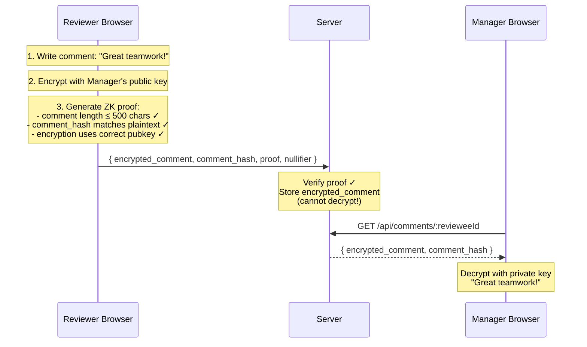

#### 8.1.6 数据库扩展

```sql
ALTER TABLE reviews ADD COLUMN encrypted_comment TEXT;
ALTER TABLE reviews ADD COLUMN comment_hash TEXT;
ALTER TABLE reviews ADD COLUMN ephemeral_pub TEXT;
-- HR 可以看到密文，但只有 Manager 能解密
-- comment_hash 用于 ZK proof 验证，不泄露内容
```

---

### 8.2 加权评分

**目标**：不同评审者的打分权重不同（如直属上级权重 3x，同级权重 1x），但不暴露谁有什么权重（因为权重可能泄露身份）。

#### 8.2.1 设计思路

核心挑战：权重如果公开，HR 可能通过"只有上级权重是 3"来推断身份。

**解决方案**：将权重编码进 Merkle 树，在 ZK 电路中验证权重并计算加权分数，服务端只看到加权后的密文。

$$
\text{leaf}_i = \text{Poseidon}(\text{secret}_i, \text{weight}_i)
$$

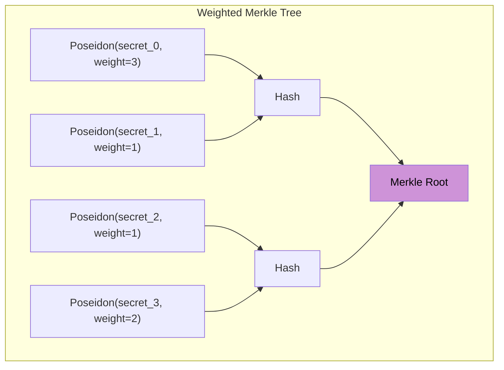

#### 8.2.2 加权评审电路

```circom title="circuits/weighted_review.circom"
pragma circom 2.1.6;

include "node_modules/circomlib/circuits/poseidon.circom";
include "./merkle_proof.circom";
include "./range_check.circom";

template WeightedReview(merkle_depth) {
    // === Private inputs ===
    signal input secret;
    signal input score;           // Raw score (1-10)
    signal input weight;          // Reviewer's weight (1-5)
    signal input pathElements[merkle_depth];
    signal input pathIndices[merkle_depth];

    // === Public inputs ===
    signal input merkle_root;
    signal input nullifier_hash;
    signal input reviewee_id;
    signal input max_score;
    signal input max_weight;
    signal input weighted_score_commitment;  // Poseidon(score * weight, blinding)

    // === Private inputs for commitment ===
    signal input blinding;        // Random blinding factor

    // 1. Commitment includes weight: leaf = Poseidon(secret, weight)
    component leaf_hasher = Poseidon(2);
    leaf_hasher.inputs[0] <== secret;
    leaf_hasher.inputs[1] <== weight;

    // 2. Verify Merkle membership (leaf includes weight)
    component merkle = MerkleProof(merkle_depth);
    merkle.leaf <== leaf_hasher.out;
    merkle.root <== merkle_root;
    for (var i = 0; i < merkle_depth; i++) {
        merkle.pathElements[i] <== pathElements[i];
        merkle.pathIndices[i] <== pathIndices[i];
    }

    // 3. Range check on score
    component score_range = RangeCheck(4);
    score_range.in <== score;
    score_range.max_value <== max_score;

    // 4. Range check on weight
    component weight_range = RangeCheck(4);
    weight_range.in <== weight;
    weight_range.max_value <== max_weight;

    // 5. Compute weighted score
    signal weighted_score;
    weighted_score <== score * weight;

    // 6. Commit to weighted score with blinding
    //    (server can aggregate commitments without seeing individual values)
    component ws_commit = Poseidon(2);
    ws_commit.inputs[0] <== weighted_score;
    ws_commit.inputs[1] <== blinding;
    weighted_score_commitment === ws_commit.out;

    // 7. Nullifier (same as before)
    component nullifier = Poseidon(2);
    nullifier.inputs[0] <== secret;
    nullifier.inputs[1] <== reviewee_id;
    nullifier_hash === nullifier.out;
}

component main { public [
    merkle_root, nullifier_hash, reviewee_id,
    max_score, max_weight, weighted_score_commitment
] } = WeightedReview(10);
```

#### 8.2.3 隐私保护的加权聚合

服务端不知道每个人的 `score * weight`，只知道 Pedersen/Poseidon commitment。如何聚合？

**方案 A：同态加密聚合（推荐用于生产）**

使用 Paillier 同态加密，服务端可以在密文上求和：

$$
\text{Enc}(s_1 \cdot w_1) \times \text{Enc}(s_2 \cdot w_2) = \text{Enc}(s_1 \cdot w_1 + s_2 \cdot w_2)
$$

```javascript title="server/utils/homomorphicAggregation.js"
import { Paillier } from 'paillier-bigint';

/**
 * Aggregate encrypted weighted scores using Paillier homomorphic addition
 *
 * Each reviewer encrypts: score * weight
 * Server can add ciphertexts without decrypting
 * Only the designated aggregator (Manager) can decrypt the sum
 */
export async function aggregateWeightedScores(encryptedScores, publicKey) {
  let aggregated = publicKey.encrypt(0n);

  for (const encScore of encryptedScores) {
    // Homomorphic addition: Enc(a) * Enc(b) = Enc(a + b)
    aggregated = publicKey.addition(aggregated, encScore);
  }

  return aggregated;
  // Manager decrypts to get: sum(score_i * weight_i)
  // Divide by sum(weight_i) to get weighted average
}
```

**方案 B：明文加权分数 + ZK 范围证明（简化版）**

如果不需要隐藏加权分数的精确值，可以让电路输出加权分数范围证明：

```javascript title="server/routes/weightedResults.js"
// 简化版：ZK proof 保证 weighted_score 在合法范围内
// Server 可以看到 weighted_score 但不知道 score 和 weight 的分解
router.get('/api/weighted-results/:cycleId/:revieweeId', async (req, res) => {
  const reviews = db.prepare(`
    SELECT weighted_score, weight_commitment
    FROM weighted_reviews
    WHERE cycle_id = ? AND reviewee_id = ? AND verified = true
  `).all(req.params.cycleId, req.params.revieweeId);

  // weighted_score could be 3 (score=3,weight=1) or (score=1,weight=3)
  // Server cannot distinguish — privacy preserved
  const totalWeightedScore = reviews.reduce(
    (sum, r) => sum + r.weighted_score, 0
  );

  // Total weight is known from Merkle tree setup
  const totalWeight = await getTotalWeight(req.params.cycleId, req.params.revieweeId);

  res.json({
    weighted_average: (totalWeightedScore / totalWeight).toFixed(2),
    review_count: reviews.length,
  });
});
```

#### 8.2.4 为什么 Server 无法分解加权分数？

| Server 看到 | 可能的分解 | Server 能区分吗？ |
|-------------|-----------|-------------------|
| weighted_score = 6 | 6\*1, 3\*2, 2\*3, 1\*6 | **不能** |
| weighted_score = 8 | 8\*1, 4\*2, 2\*4, 1\*8 | **不能** |
| weighted_score = 15 | 5\*3, 3\*5, 15\*1 | **不能** |

ZK proof 只证明了 $1 \leq \text{score} \leq 10$ 且 $1 \leq \text{weight} \leq 5$，但不泄露具体分解方式。

$$
\text{weighted\_avg} = \frac{\sum_{i=1}^{n} w_i \cdot s_i}{\sum_{i=1}^{n} w_i}
$$

#### 8.2.5 数据库扩展

```sql
-- 修改 commitments 表：leaf 现在包含 weight
CREATE TABLE weighted_commitments (
  id INTEGER PRIMARY KEY AUTOINCREMENT,
  cycle_id INTEGER REFERENCES cycles(id),
  commitment TEXT NOT NULL,        -- Poseidon(secret, weight)
  leaf_index INTEGER NOT NULL,
  -- 注意：不存储明文 weight!
  -- weight 只存在于评审者本地和 ZK 电路内
);

-- 修改 reviews 表：增加加权分数相关字段
CREATE TABLE weighted_reviews (
  id INTEGER PRIMARY KEY AUTOINCREMENT,
  cycle_id INTEGER REFERENCES cycles(id),
  nullifier TEXT NOT NULL UNIQUE,
  merkle_root TEXT NOT NULL,
  reviewee_id INTEGER NOT NULL,
  weighted_score INTEGER NOT NULL,            -- score * weight (明文，但无法分解)
  weighted_score_commitment TEXT NOT NULL,     -- Poseidon(score*weight, blinding)
  proof TEXT NOT NULL,
  verified BOOLEAN DEFAULT false,
  created_at DATETIME DEFAULT CURRENT_TIMESTAMP
);
```

---

### 8.3 链上验证

**目标**：将 ZK proof 验证器部署到以太坊，实现 Merkle root 不可篡改、验证逻辑透明可审计。

#### 8.3.1 架构对比

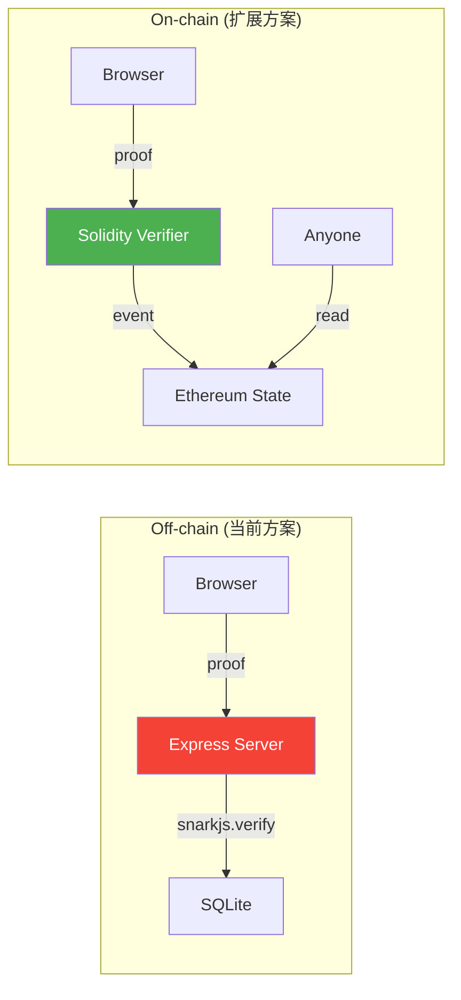

| 维度 | Off-chain | On-chain |
|------|-----------|----------|
| Merkle root 可篡改 | HR 可以偷换 | 不可篡改（区块链存储） |
| 验证逻辑 | 闭源 Express 代码 | 开源 Solidity 合约 |
| nullifier 去重 | 数据库 UNIQUE 约束 | mapping(uint256 => bool) |
| 成本 | 免费 | Gas 费（~300K gas/proof） |
| 延迟 | &lt;100ms | ~15s (出块时间) |

#### 8.3.2 导出 Solidity Verifier

snarkjs 可以直接从 zkey 文件导出 Solidity 验证合约：

```bash title="scripts/export_verifier.sh"
#!/bin/bash
set -euo pipefail

# 1. Export Solidity verifier from zkey
snarkjs zkey export solidityverifier \
  build/circuit_final.zkey \
  contracts/Groth16Verifier.sol

# 2. Fix Solidity version pragma (snarkjs exports ^0.6.11, we need >=0.8.0)
sed -i 's/pragma solidity >=0.6.11/pragma solidity ^0.8.20/' \
  contracts/Groth16Verifier.sol

echo "Verifier exported to contracts/Groth16Verifier.sol"

# 3. Export calldata helper (for testing)
snarkjs zkey export soliditycalldata \
  build/public.json build/proof.json > build/calldata.txt

echo "Sample calldata exported to build/calldata.txt"
```

#### 8.3.3 链上评审合约

```solidity title="contracts/AnonymousReview.sol"
// SPDX-License-Identifier: MIT
pragma solidity ^0.8.20;

import "./Groth16Verifier.sol";

/**
 * @title AnonymousReview
 * @notice On-chain anonymous 360 review system using ZK proofs
 * @dev Uses Groth16 verifier exported from snarkjs
 */
contract AnonymousReview is Groth16Verifier {
    // ============ State ============

    struct ReviewCycle {
        bytes32 merkleRoot;
        uint256 maxScore;
        bool active;
        uint256 reviewCount;
        uint256 totalScore;  // For computing average
    }

    // cycleId => ReviewCycle
    mapping(uint256 => ReviewCycle) public cycles;
    uint256 public nextCycleId;

    // nullifier => bool (used)
    mapping(uint256 => bool) public nullifierUsed;

    // cycleId => revieweeId => aggregated data
    mapping(uint256 => mapping(uint256 => uint256)) public reviewCounts;
    mapping(uint256 => mapping(uint256 => uint256)) public scoreSums;

    // ============ Events ============

    event CycleCreated(uint256 indexed cycleId, bytes32 merkleRoot);
    event ReviewSubmitted(
        uint256 indexed cycleId,
        uint256 indexed revieweeId,
        uint256 nullifier
        // Note: NO reviewer address, NO score!
    );

    // ============ Admin Functions ============

    /**
     * @notice Create a new review cycle with the given Merkle root
     * @param _merkleRoot The Merkle root of all reviewer commitments
     * @param _maxScore Maximum score allowed (e.g., 10)
     */
    function createCycle(bytes32 _merkleRoot, uint256 _maxScore) external returns (uint256) {
        uint256 cycleId = nextCycleId++;
        cycles[cycleId] = ReviewCycle({
            merkleRoot: _merkleRoot,
            maxScore: _maxScore,
            active: true,
            reviewCount: 0,
            totalScore: 0
        });

        emit CycleCreated(cycleId, _merkleRoot);
        return cycleId;
    }

    /**
     * @notice Close a review cycle
     */
    function closeCycle(uint256 _cycleId) external {
        require(cycles[_cycleId].active, "Cycle not active");
        cycles[_cycleId].active = false;
    }

    // ============ Review Submission ============

    /**
     * @notice Submit an anonymous review with ZK proof
     * @dev The proof verifies:
     *   1. Reviewer's commitment is in the Merkle tree
     *   2. Score is in range [1, maxScore]
     *   3. Nullifier is correctly derived from secret + revieweeId
     *
     * @param _cycleId Review cycle ID
     * @param _revieweeId Who is being reviewed
     * @param _nullifier Unique nullifier for duplicate detection
     * @param _encryptedScore AES-encrypted score (only aggregator can decrypt)
     * @param _proof Groth16 proof components [pA, pB, pC]
     * @param _pubSignals Public signals [merkle_root, nullifier, reviewee_id, max_score]
     */
    function submitReview(
        uint256 _cycleId,
        uint256 _revieweeId,
        uint256 _nullifier,
        bytes calldata _encryptedScore,
        uint256[2] calldata _pA,
        uint256[2][2] calldata _pB,
        uint256[2] calldata _pC,
        uint256[4] calldata _pubSignals
    ) external {
        ReviewCycle storage cycle = cycles[_cycleId];
        require(cycle.active, "Cycle not active");

        // Verify public signals match
        require(
            _pubSignals[0] == uint256(cycle.merkleRoot),
            "Merkle root mismatch"
        );
        require(_pubSignals[1] == _nullifier, "Nullifier mismatch");
        require(_pubSignals[2] == _revieweeId, "Reviewee ID mismatch");
        require(_pubSignals[3] == cycle.maxScore, "Max score mismatch");

        // Check nullifier hasn't been used
        require(!nullifierUsed[_nullifier], "Duplicate vote");
        nullifierUsed[_nullifier] = true;

        // Verify ZK proof
        require(
            this.verifyProof(_pA, _pB, _pC, _pubSignals),
            "Invalid proof"
        );

        // Update aggregated data
        reviewCounts[_cycleId][_revieweeId]++;

        emit ReviewSubmitted(_cycleId, _revieweeId, _nullifier);
    }

    // ============ View Functions ============

    /**
     * @notice Get the number of reviews for a reviewee in a cycle
     */
    function getReviewCount(uint256 _cycleId, uint256 _revieweeId)
        external view returns (uint256)
    {
        return reviewCounts[_cycleId][_revieweeId];
    }
}
```

#### 8.3.4 前端集成

```javascript title="client/src/utils/submitOnChain.js"
import { ethers } from 'ethers';
import * as snarkjs from 'snarkjs';

const CONTRACT_ABI = [/* ... ABI from compilation ... */];
const CONTRACT_ADDRESS = '0x...'; // Deployed contract address

/**
 * Submit a review on-chain with ZK proof
 */
export async function submitReviewOnChain({
  cycleId,
  revieweeId,
  secret,
  score,
  merkleProof,
  encryptedScore,
}) {
  // 1. Generate ZK proof in browser
  const { proof, publicSignals } = await snarkjs.groth16.fullProve(
    {
      secret: secret.toString(),
      score: score.toString(),
      pathElements: merkleProof.pathElements.map(String),
      pathIndices: merkleProof.pathIndices.map(String),
      merkle_root: merkleProof.root,
      nullifier_hash: '0',
      reviewee_id: revieweeId.toString(),
      max_score: '10',
    },
    '/circuits/review_proof.wasm',
    '/circuits/circuit_final.zkey'
  );

  // 2. Format proof for Solidity verifier
  const calldata = await snarkjs.groth16.exportSolidityCallData(
    proof,
    publicSignals
  );
  const [pA, pB, pC, pubSignals] = JSON.parse(`[${calldata}]`);

  // 3. Submit to smart contract
  const provider = new ethers.BrowserProvider(window.ethereum);
  const signer = await provider.getSigner();
  const contract = new ethers.Contract(CONTRACT_ADDRESS, CONTRACT_ABI, signer);

  const tx = await contract.submitReview(
    cycleId,
    revieweeId,
    publicSignals[1],  // nullifier
    ethers.toUtf8Bytes(encryptedScore),
    pA, pB, pC,
    pubSignals
  );

  const receipt = await tx.wait();
  console.log('Review submitted on-chain:', receipt.hash);

  return receipt;
}
```

#### 8.3.5 Hardhat 部署配置

```javascript title="hardhat.config.js"
require('@nomicfoundation/hardhat-toolbox');

module.exports = {
  solidity: {
    version: '0.8.20',
    settings: {
      optimizer: { enabled: true, runs: 200 },
    },
  },
  networks: {
    sepolia: {
      url: process.env.SEPOLIA_RPC_URL,
      accounts: [process.env.DEPLOYER_PRIVATE_KEY],
    },
    localhost: {
      url: 'http://127.0.0.1:8545',
    },
  },
};
```

```javascript title="scripts/deploy.js"
const { ethers } = require('hardhat');

async function main() {
  console.log('Deploying AnonymousReview...');

  const AnonymousReview = await ethers.getContractFactory('AnonymousReview');
  const contract = await AnonymousReview.deploy();
  await contract.waitForDeployment();

  const address = await contract.getAddress();
  console.log('AnonymousReview deployed to:', address);

  // Create initial review cycle
  const merkleRoot = '0x...'; // Computed from reviewer commitments
  const tx = await contract.createCycle(merkleRoot, 10);
  await tx.wait();
  console.log('Initial review cycle created');
}

main().catch((error) => {
  console.error(error);
  process.exitCode = 1;
});
```

```bash
# 部署命令
npx hardhat compile
npx hardhat run scripts/deploy.js --network sepolia
```

#### 8.3.6 Gas 费用分析

| 操作 | Gas 消耗 | 费用 (@ 30 gwei) |
|------|----------|-------------------|
| 部署合约 | ~2,000,000 | ~$3.00 |
| createCycle | ~80,000 | ~$0.12 |
| submitReview (含 proof 验证) | ~300,000 | ~$0.45 |
| getReviewCount (view) | 0 | 免费 |

**优化建议**：
- 使用 L2 (Arbitrum/Optimism) 可降低 Gas 费 ~10 倍
- 批量提交可使用 `multicall` 模式
- 考虑使用 PLONK/FFlonk 验证器（更低 Gas 消耗）

#### 8.3.7 链上 vs 链下混合架构

生产环境推荐混合方案：

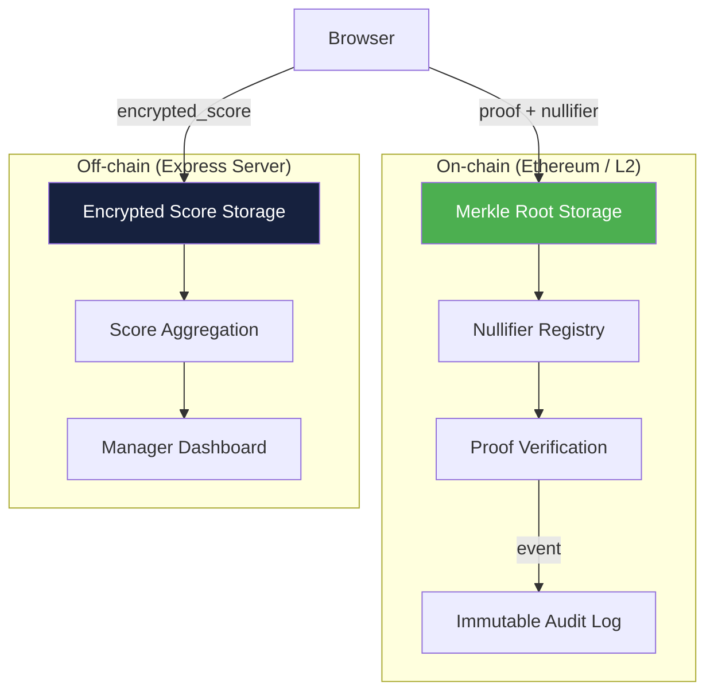

- **链上**：Merkle root、nullifier 去重、proof 验证（不可篡改）
- **链下**：加密分数存储、聚合计算（节省 Gas）

**参考**：查看 [Tornado Cash](https://github.com/tornadocash/tornado-core) 和 [Semaphore Protocol](https://github.com/semaphore-protocol/semaphore) 的类似 Merkle + nullifier 设计模式。

---

### 8.4 门限解密：没有单点信任

**目标**：当前设计中，聚合服务持有分数解密密钥 — 这是一个单点信任。如果聚合服务被入侵，所有分数都泄露。使用 Shamir's Secret Sharing 实现 **t-of-n 门限解密**，确保至少 t 个委员会成员合作才能解密。

> 关于模运算和有限域的基础知识，请参考 [密码学基础](/docs/cryptography/basics) 章节。

#### 8.4.1 Shamir's Secret Sharing 原理

将解密密钥 $K$ 拆分为 $n$ 份 share，任意 $t$ 份可恢复 $K$，少于 $t$ 份则得不到任何信息。

核心思想：构造一个 $t-1$ 次多项式，使得 $f(0) = K$：

$$
f(x) = K + a_1 x + a_2 x^2 + \cdots + a_{t-1} x^{t-1} \pmod{p}
$$

每个委员会成员 $i$ 获得 share $= f(i)$。恢复时使用拉格朗日插值：

$$
K = f(0) = \sum_{i \in S} y_i \prod_{j \in S, j \neq i} \frac{-j}{i - j} \pmod{p}
$$

其中 $S$ 是任意 $t$ 个 share 持有者的集合。

#### 8.4.2 密钥分割实现

```javascript title="server/utils/shamirSplit.js"
import { randomBytes } from 'crypto';

const PRIME = BigInt('0x30644e72e131a029b85045b68181585d2833e84879b9709143e1f593f0000001');

function modPow(base, exp, mod) {
  let result = 1n;
  base = ((base % mod) + mod) % mod;
  while (exp > 0n) {
    if (exp % 2n === 1n) result = (result * base) % mod;
    exp >>= 1n;
    base = (base * base) % mod;
  }
  return result;
}

function modInverse(a, mod) {
  return modPow(((a % mod) + mod) % mod, mod - 2n, mod);
}

/**
 * Split a secret into n shares with threshold t
 * @param {BigInt} secret - The secret to split (e.g., decryption key)
 * @param {number} n - Total number of shares
 * @param {number} t - Minimum shares needed to reconstruct
 * @returns {Array<{x: BigInt, y: BigInt}>} The shares
 */
export function splitSecret(secret, n, t) {
  // Generate random polynomial coefficients
  const coefficients = [secret];
  for (let i = 1; i < t; i++) {
    const rand = BigInt('0x' + randomBytes(32).toString('hex')) % PRIME;
    coefficients.push(rand);
  }

  // Evaluate polynomial at points 1, 2, ..., n
  const shares = [];
  for (let i = 1; i <= n; i++) {
    const x = BigInt(i);
    let y = 0n;
    for (let j = 0; j < coefficients.length; j++) {
      y = (y + coefficients[j] * modPow(x, BigInt(j), PRIME)) % PRIME;
    }
    shares.push({ x, y });
  }

  return shares;
}

/**
 * Reconstruct secret from t or more shares using Lagrange interpolation
 */
export function reconstructSecret(shares) {
  let secret = 0n;

  for (let i = 0; i < shares.length; i++) {
    let numerator = 1n;
    let denominator = 1n;

    for (let j = 0; j < shares.length; j++) {
      if (i === j) continue;
      numerator = (numerator * (PRIME - shares[j].x)) % PRIME;
      denominator = (denominator * ((shares[i].x - shares[j].x + PRIME) % PRIME)) % PRIME;
    }

    const lagrange = (numerator * modInverse(denominator, PRIME)) % PRIME;
    secret = (secret + shares[i].y * lagrange) % PRIME;
  }

  return secret;
}
```

#### 8.4.3 门限解密工作流

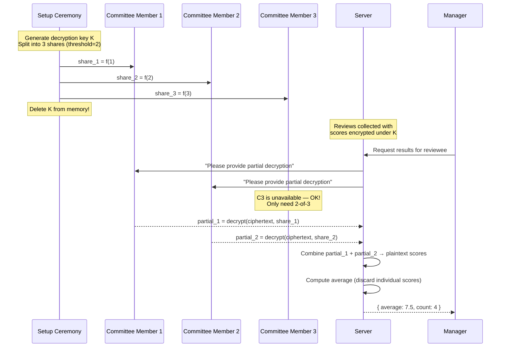

#### 8.4.4 实际应用中的角色分配

| 委员会成员 | 角色 | 为什么选他 |
|-----------|------|-----------|
| VP Engineering | 技术高管 | 独立于 HR 体系 |
| 工会代表 | 员工利益代表 | 确保员工权益 |
| 外部审计师 | 独立第三方 | 无利益关联 |
| CFO | 财务高管 | 跨部门制衡 |
| HR Director | HR 负责人 | 业务需要参与 |

**配置**：5-of-5 太严格（任一人缺席就无法解密），2-of-5 太宽松。推荐 **3-of-5**：需要跨部门合作才能解密，单个部门无法独自操作。

#### 8.4.5 安全分析

| 场景 | 2-of-5 门限下的结果 |
|------|---------------------|
| HR Director 想偷看分数 | 需要再拉拢 1 人，且留下审计日志 |
| 1 个 share 泄露 | 攻击者仍需再获取 1 个 share |
| 2 个成员同时离职 | 剩余 3 人仍可恢复（触发 re-sharing） |
| 所有 5 个 share 丢失 | 无法恢复 — 需要提前做备份 ceremony |

---

### 8.5 可撤销匿名：处理恶意评审

**目标**：匿名系统可能被滥用（如恶意诽谤、人身攻击）。设计一个"可撤销匿名"机制：在极端情况下，由多方治理委员会投票决定是否去匿名化某条评审。

> 关于 BLS 签名的基础知识，请参考 [BLS 签名](/docs/cryptography/bls) 章节。

#### 8.5.1 核心矛盾

| 需求 | 匿名性 | 问责性 |
|------|--------|--------|
| 正常情况 | 完全匿名 | 不需要 |
| 恶意评审 | 需要打破 | 需要追踪 |
| 设计目标 | **默认匿名，可选去匿名** | **多方授权才能执行** |

#### 8.5.2 加密身份托管方案

评审者在提交 proof 时，同时提交一个**加密的身份标识**，该密文只能由治理委员会联合解密：

$$
\text{encrypted\_identity} = \text{Enc}(\text{reviewer\_id}, \text{committee\_pubkey})
$$

ZK 电路增加一个约束：**证明加密身份与 secret 对应的 commitment 一致**。

```circom title="circuits/revocable_review.circom"
pragma circom 2.1.6;

include "node_modules/circomlib/circuits/poseidon.circom";
include "./review_proof.circom";

// Extends ReviewProof with encrypted identity for revocable anonymity
template RevocableReview(merkle_depth) {
    // All original inputs from ReviewProof
    signal input secret;
    signal input score;
    signal input pathElements[merkle_depth];
    signal input pathIndices[merkle_depth];
    signal input merkle_root;
    signal input nullifier_hash;
    signal input reviewee_id;
    signal input max_score;

    // === New: Revocable anonymity inputs ===
    signal input identity;           // Private: reviewer's actual ID
    signal input blinding_factor;    // Private: random blinding
    signal input identity_commitment; // Public: Poseidon(identity, blinding_factor)

    // 1. Run the standard review proof
    component review = ReviewProof(merkle_depth);
    review.secret <== secret;
    review.score <== score;
    for (var i = 0; i < merkle_depth; i++) {
        review.pathElements[i] <== pathElements[i];
        review.pathIndices[i] <== pathIndices[i];
    }
    review.merkle_root <== merkle_root;
    review.nullifier_hash <== nullifier_hash;
    review.reviewee_id <== reviewee_id;
    review.max_score <== max_score;

    // 2. Verify identity commitment
    //    Proves: "the encrypted identity corresponds to a real reviewer"
    component id_hasher = Poseidon(2);
    id_hasher.inputs[0] <== identity;
    id_hasher.inputs[1] <== blinding_factor;
    identity_commitment === id_hasher.out;

    // 3. Verify identity links to the same secret
    //    identity_link = Poseidon(secret, identity)
    //    This is stored encrypted — committee can decrypt to find identity
    component link = Poseidon(2);
    link.inputs[0] <== secret;
    link.inputs[1] <== identity;
    // link.out is a public output — encrypted before submission
}

component main { public [
    merkle_root, nullifier_hash, reviewee_id, max_score,
    identity_commitment
] } = RevocableReview(10);
```

#### 8.5.3 BLS 多签治理投票

使用 BLS 聚合签名进行治理投票 — 去匿名化需要至少 $t$ 个治理成员签名同意：

```javascript title="server/governance/revealVote.js"
import { bls12_381 as bls } from '@noble/curves/bls12-381';

/**
 * Governance process to reveal a reviewer's identity
 * Requires t-of-n BLS signatures from committee members
 */
export async function processRevealRequest({
  reviewId,
  reason,
  committeeSignatures,  // Array of { memberId, signature }
  threshold,
}) {
  // 1. Verify we have enough signatures
  if (committeeSignatures.length < threshold) {
    throw new Error(
      `Need ${threshold} signatures, got ${committeeSignatures.length}`
    );
  }

  // 2. Verify each BLS signature
  const message = new TextEncoder().encode(
    `REVEAL_IDENTITY:${reviewId}:${reason}:${Date.now()}`
  );

  const validSignatures = [];
  for (const sig of committeeSignatures) {
    const memberPubKey = await getCommitteeMemberPubKey(sig.memberId);
    const valid = bls.verify(sig.signature, message, memberPubKey);
    if (valid) validSignatures.push(sig);
  }

  if (validSignatures.length < threshold) {
    throw new Error('Not enough valid signatures');
  }

  // 3. Aggregate BLS signatures for on-chain verification / audit
  const aggregatedSig = bls.aggregateSignatures(
    validSignatures.map(s => s.signature)
  );

  // 4. Decrypt the identity using threshold decryption
  //    (combines with 8.4 Shamir's Secret Sharing)
  const encryptedIdentity = await getEncryptedIdentity(reviewId);
  const partialDecryptions = await collectPartialDecryptions(
    encryptedIdentity,
    validSignatures.map(s => s.memberId)
  );
  const revealedIdentity = combinePartialDecryptions(partialDecryptions);

  // 5. Create immutable audit log
  const auditLog = {
    reviewId,
    reason,
    revealedIdentity,
    approvedBy: validSignatures.map(s => s.memberId),
    aggregatedSignature: aggregatedSig,
    timestamp: new Date().toISOString(),
  };

  await saveAuditLog(auditLog);

  return {
    identity: revealedIdentity,
    auditLog,
  };
}
```

#### 8.5.4 治理流程

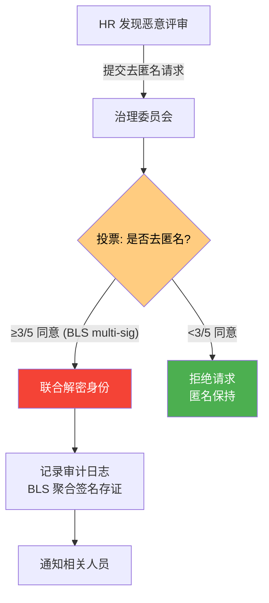

#### 8.5.5 关键设计权衡

| 设计选项 | 优势 | 劣势 |
|----------|------|------|
| **无可撤销性** | 最强匿名保证 | 无法应对恶意行为 |
| **HR 可单独撤销** | 简单实现 | 回到原始信任问题 |
| **3-of-5 委员会撤销** | 平衡匿名与问责 | 增加系统复杂度 |
| **链上投票撤销** | 透明可审计 | Gas 成本 + 延迟 |

:::caution 隐私权警告
可撤销匿名机制必须在评审开始前**明确告知所有参与者**：
- 什么情况下匿名可能被撤销
- 需要哪些人同意才能撤销
- 撤销后的处理流程

否则可能违反隐私法规（如 GDPR 知情同意原则）。
:::

---

### 8.6 跨周期不可关联性

**目标**：如果每个评审周期使用相同的 secret，HR 可能通过分析多个周期的 nullifier 模式推断身份。设计不可关联的跨周期方案。

#### 8.6.1 问题分析

当前 nullifier 设计：

$$
\text{nullifier} = \text{Poseidon}(\text{secret}, \text{reviewee\_id})
$$

如果 Alice 在 Q1 和 Q2 都评审了 Bob，她的 nullifier 相同。HR 观察到"这两个周期都出现了 `0x3a8f...`"，虽然不知道是谁，但知道是**同一个人**。

**攻击场景**：Q1 有 10 人评审 Bob，Q2 有 8 人（2 人离职）。HR 对比两个周期的 nullifier 集合，排除 2 个只出现在 Q1 的 nullifier → 缩小匿名集。

#### 8.6.2 解决方案：周期绑定 Nullifier

将 cycle_id 加入 nullifier 计算：

$$
\text{nullifier} = \text{Poseidon}(\text{secret}, \text{reviewee\_id}, \text{cycle\_id})
$$

```circom title="circuits/unlinkable_nullifier.circom"
pragma circom 2.1.6;

include "node_modules/circomlib/circuits/poseidon.circom";

// Nullifier that changes every cycle — prevents cross-cycle linkability
template UnlinkableNullifier() {
    signal input secret;
    signal input reviewee_id;
    signal input cycle_id;     // New: binds nullifier to specific cycle
    signal output nullifier;

    component hasher = Poseidon(3);
    hasher.inputs[0] <== secret;
    hasher.inputs[1] <== reviewee_id;
    hasher.inputs[2] <== cycle_id;

    nullifier <== hasher.out;
}
```

**效果**：

| | Q1 (cycle_id=1) | Q2 (cycle_id=2) |
|---|---|---|
| Alice reviews Bob | `Poseidon(42, bob, 1)` = `0x3a8f...` | `Poseidon(42, bob, 2)` = `0x7c1d...` |
| 可关联？ | **不可关联** — 两个完全不同的 nullifier | |

#### 8.6.3 但如何防止跨周期双投？

新问题：如果 nullifier 每周期不同，Alice 能不能在 Q2 用同一个 secret 投两次？

**不能**。因为同一周期内 `(secret, reviewee_id, cycle_id)` 固定 → nullifier 固定 → 被去重。跨周期投票是合法的（每个周期都应该能投票）。

#### 8.6.4 进阶：Secret 轮换

更强的方案 — 每个周期生成新的 secret，通过 ZK proof 证明"新 secret 由旧 secret 派生"：

$$
\text{secret}_{n+1} = \text{Poseidon}(\text{secret}_n, \text{cycle\_id}_{n+1})
$$

```circom title="circuits/secret_rotation.circom"
pragma circom 2.1.6;

include "node_modules/circomlib/circuits/poseidon.circom";
include "./merkle_proof.circom";

// Prove that new_commitment derives from a member of the old Merkle tree
// without revealing which member
template SecretRotation(merkle_depth) {
    // Private inputs
    signal input old_secret;
    signal input new_cycle_id;
    signal input pathElements[merkle_depth];
    signal input pathIndices[merkle_depth];

    // Public inputs
    signal input old_merkle_root;   // Previous cycle's Merkle root
    signal input new_commitment;    // New commitment for this cycle

    // 1. Verify old_secret is in the old tree
    component old_commit = Poseidon(1);
    old_commit.inputs[0] <== old_secret;

    component merkle = MerkleProof(merkle_depth);
    merkle.leaf <== old_commit.out;
    merkle.root <== old_merkle_root;
    for (var i = 0; i < merkle_depth; i++) {
        merkle.pathElements[i] <== pathElements[i];
        merkle.pathIndices[i] <== pathIndices[i];
    }

    // 2. Derive new secret
    component derive = Poseidon(2);
    derive.inputs[0] <== old_secret;
    derive.inputs[1] <== new_cycle_id;
    signal new_secret;
    new_secret <== derive.out;

    // 3. Verify new commitment
    component new_commit = Poseidon(1);
    new_commit.inputs[0] <== new_secret;
    new_commitment === new_commit.out;
}

component main { public [old_merkle_root, new_commitment] }
    = SecretRotation(10);
```

**效果**：即使 HR 在某个周期获取了数据库完整快照，也无法与其他周期的数据关联。每个周期的 commitment 树是独立的。

---

### 8.7 差分隐私：安全的统计分析

**目标**：Manager 可能只有 2-3 个下属参与评审，聚合结果（如平均分 3.0）实际上泄露了很多信息。使用差分隐私技术为小样本聚合结果添加噪声保护。

#### 8.7.1 小样本攻击

| 评审人数 | 平均分 | Manager 能推断什么？ |
|---------|--------|---------------------|
| 1 人 | 3.0 | 精确知道唯一评审者打了 3 分 |
| 2 人 | 4.5 | 如果 Manager 自己打了 6 分 → 另一人打了 3 分 |
| 3 人 | 6.0 | 如果知道两人打了 7 和 8 → 第三人打了 3 |
| 20 人 | 7.2 | 难以推断个体 |

**规律**：当评审人数 ≤ 5 时，聚合统计几乎等于公开个体分数。

#### 8.7.2 差分隐私基础

差分隐私保证：**增加或移除一个人的数据，输出分布几乎不变**。

$$
\Pr[\mathcal{M}(D) \in S] \leq e^\epsilon \cdot \Pr[\mathcal{M}(D') \in S] + \delta
$$

其中 $\epsilon$ 是隐私预算（越小越隐私），$D$ 和 $D'$ 是相差一条记录的数据集。

**Laplace 机制**：对真实统计量添加 Laplace 噪声：

$$
\tilde{f}(D) = f(D) + \text{Lap}\left(\frac{\Delta f}{\epsilon}\right)
$$

其中 $\Delta f$ 是函数的**敏感度**（一个人的数据变化最多改变结果多少）。

对于平均分（范围 1-10）：
- 单人改变最多影响平均分 $\frac{9}{n}$（分数范围 9，除以人数 n）
- 敏感度 $\Delta f = \frac{9}{n}$

#### 8.7.3 实现

```javascript title="server/utils/differentialPrivacy.js"
/**
 * Add Laplace noise to a statistic for differential privacy
 *
 * @param {number} trueValue - The real statistic
 * @param {number} sensitivity - How much one person can change the result
 * @param {number} epsilon - Privacy budget (smaller = more private)
 * @returns {number} Noisy statistic
 */
function laplaceMechanism(trueValue, sensitivity, epsilon) {
  // Laplace distribution: sample from Lap(0, b) where b = sensitivity/epsilon
  const b = sensitivity / epsilon;

  // Sample from Laplace using inverse CDF: -b * sign(u) * ln(1 - 2|u|)
  const u = Math.random() - 0.5;
  const noise = -b * Math.sign(u) * Math.log(1 - 2 * Math.abs(u));

  return trueValue + noise;
}

/**
 * Compute differentially private review statistics
 *
 * @param {number[]} scores - Array of review scores
 * @param {number} epsilon - Privacy budget (recommended: 1.0 for moderate privacy)
 * @returns {{ average, count, stddev, confidence }}
 */
export function privateStatistics(scores, epsilon = 1.0) {
  const n = scores.length;

  if (n === 0) return null;

  // True statistics
  const trueAvg = scores.reduce((a, b) => a + b, 0) / n;

  // Sensitivity of average: max_score_range / n = 9 / n
  const avgSensitivity = 9 / n;

  // Split epsilon budget: 70% for average, 30% for count
  const noisyAvg = laplaceMechanism(trueAvg, avgSensitivity, epsilon * 0.7);
  const noisyCount = Math.max(
    1,
    Math.round(laplaceMechanism(n, 1, epsilon * 0.3))
  );

  // Clamp to valid range
  const clampedAvg = Math.max(1, Math.min(10, noisyAvg));

  // Confidence indicator based on noise magnitude
  const noiseScale = avgSensitivity / (epsilon * 0.7);
  const confidence =
    noiseScale < 0.5 ? 'high' :
    noiseScale < 1.5 ? 'medium' : 'low';

  return {
    average: parseFloat(clampedAvg.toFixed(1)),
    count: noisyCount,
    confidence,
    privacyBudgetUsed: epsilon,
  };
}
```

#### 8.7.4 动态隐私预算

根据评审人数自动调整噪声级别：

```javascript title="server/routes/privateResults.js"
import { privateStatistics } from '../utils/differentialPrivacy.js';

router.get('/api/private-results/:cycleId/:revieweeId', async (req, res) => {
  const scores = await getDecryptedScores(
    req.params.cycleId,
    req.params.revieweeId
  );

  const n = scores.length;

  // Dynamic epsilon: more people → less noise needed
  // Fewer people → more noise to protect individuals
  let epsilon;
  if (n >= 20) {
    epsilon = 2.0;   // Low noise — 20+ people provides natural anonymity
  } else if (n >= 10) {
    epsilon = 1.0;   // Moderate noise
  } else if (n >= 5) {
    epsilon = 0.5;   // High noise — small group needs more protection
  } else {
    // Very small group — suppress individual statistics entirely
    return res.json({
      average: null,
      count: n,
      message: 'Too few reviewers to display results safely',
      minimumRequired: 5,
    });
  }

  const result = privateStatistics(scores, epsilon);
  res.json(result);
});
```

#### 8.7.5 噪声对结果的影响

| 评审人数 | $\epsilon$ | 噪声标准差 | 真实均值 7.5 的展示范围 |
|---------|-----------|-----------|----------------------|
| 3 人 | - | - | **不展示** (人数不足) |
| 5 人 | 0.5 | ±2.57 | 4.9 ~ 10.0 |
| 10 人 | 1.0 | ±0.64 | 6.9 ~ 8.1 |
| 20 人 | 2.0 | ±0.16 | 7.3 ~ 7.7 |
| 50 人 | 2.0 | ±0.06 | 7.4 ~ 7.6 |

**结论**：评审人数越多，噪声越小，结果越精确。这与直觉一致 — 大群体中个体贡献本来就难以辨别。

#### 8.7.6 对 Manager 的展示

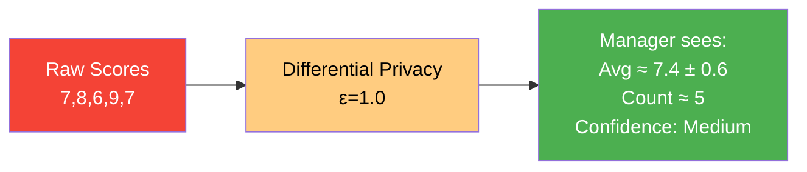

在 Manager Dashboard 上展示时，加上置信度标识：

| 置信度 | 含义 | 视觉提示 |
|--------|------|----------|
| High | 噪声 &lt; 0.5 分 | 绿色标签 |
| Medium | 噪声 0.5-1.5 分 | 黄色标签 + "仅供参考" |
| Low | 噪声 &gt; 1.5 分 | 红色标签 + "样本量不足" |

---

:::tip 项目总结
本项目综合运用了课程中学习的多项密码学技术：
- **Poseidon 哈希**：commitment + nullifier
- **Merkle 树**：成员资格证明
- **零知识证明 (Groth16)**：隐私保护的评审提交
- **椭圆曲线密码学**：Auth0 JWT 签名验证
- **ECIES 加密** (扩展 8.1)：Manager 端到端加密评语
- **同态加密** (扩展 8.2)：隐私保护的加权聚合
- **Solidity Verifier** (扩展 8.3)：链上不可篡改的审计日志
- **Shamir 秘密共享** (扩展 8.4)：门限解密消除单点信任
- **BLS 多签** (扩展 8.5)：治理委员会可撤销匿名
- **不可关联 Nullifier** (扩展 8.6)：跨周期隐私保护
- **差分隐私** (扩展 8.7)：小样本统计安全

核心设计理念：**用密码学替代对 HR 的信任**。
:::
本项目综合运用了课程中学习的多项密码学技术：
- **Poseidon 哈希**：commitment + nullifier
- **Merkle 树**：成员资格证明
- **零知识证明 (Groth16)**：隐私保护的评审提交
- **椭圆曲线密码学**：Auth0 JWT 签名验证
- **ECIES 加密** (扩展 8.1)：Manager 端到端加密评语
- **同态加密** (扩展 8.2)：隐私保护的加权聚合
- **Solidity Verifier** (扩展 8.3)：链上不可篡改的审计日志

核心设计理念：**用密码学替代对 HR 的信任**。
:::
